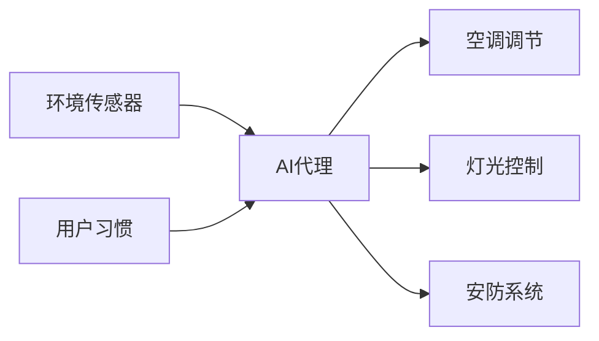

## 前言

最近总有人问我："AI代理到底是个啥？我需要开发它吗？" 🤔 说实话，这个问题就像问"我该不该学开车"——完全取决于你想去哪里！🚗💨 AI代理（AI Agent）不是万能钥匙，但在特定场景下，它能帮你打开效率大门。今天我就来聊聊哪些场景值得你投入精力开发专属代理，顺便分享些实战经验。

::: tip
AI代理的核心价值：在复杂环境中自主决策，持续优化目标达成路径
:::

## 关键应用场景

### 🏢 企业自动化流程
当你的业务涉及重复性决策时，AI代理就是救星：
- **智能客服**：处理80%的常规咨询，自动转接复杂问题
- **供应链优化**：实时调整采购计划，预测库存风险
- **财务审计**：自动识别异常交易，生成审计报告

> 我见过某电商公司用代理系统将退货处理时间从3天压缩到2小时，财务部同事终于不用天天加班了！🎉

### 🏠 智能家居控制
家庭场景最适合发挥代理的协同能力：

开发要点：多设备协议兼容性（Zigbee/蓝牙/WiFi） + 用户行为学习算法

### 🎮 游戏与虚拟世界
游戏代理正在改变行业规则：
- **动态NPC**：根据玩家行为调整剧情走向
- **AI对手**：学习玩家套路，提供真实挑战
- **关卡生成器**：根据玩家水平动态调整难度

> 开发时注意平衡：太聪明的代理会让玩家挫败感爆棚，太笨又显得假...这活儿比写剧情还难！🤣

### 📊 个性化服务系统
当用户需求千人千面时：
- **电商推荐**：结合实时行为与历史偏好
- **健康管理**：根据生理数据定制运动/饮食计划
- **教育助手**：动态调整学习路径和难度

### 🤖 科研与实验助手
实验室里的超级助手：
- 自动实验设计（参数优化）
- 数据实时分析（异常检测）
- 文献智能综述（研究趋势预测）

::: theorem
开发成功公式：明确目标 + 数据闭环 + 持续学习 = 有效AI代理
:::

## 开发决策清单

在启动项目前，先问自己三个问题：

| 问题 | 否决信号 | 推进信号 |
|------|----------|----------|
| 是否存在明确决策点？ | 流程完全标准化 | 需要综合多变量判断 |
| 数据是否可获取？ | 数据孤岛严重 | 有历史数据可学习 |
| 用户是否愿意尝试？ | 对新技术抵触 | 主动寻求效率提升 |

## 结语

开发AI代理就像培养宠物——需要耐心、数据和持续调教。🐶 不是所有场景都值得投入，但当你的业务满足：**复杂决策 + 数据基础 + 用户开放度**这三个条件时，它就会成为你的秘密武器。

记住：最好的AI代理不是最聪明的，而是最能解决你实际问题的。下次当有人问"要不要开发代理"时，先拿出这个清单看看，或许答案就在其中！💡

> 技术终将迭代，但解决问题的本质永远不变——这才是AI开发最迷人的地方 🌟