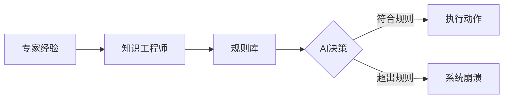
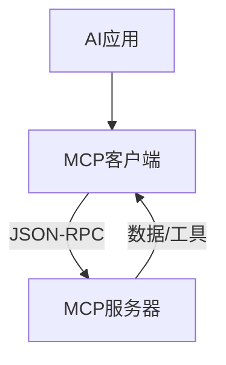
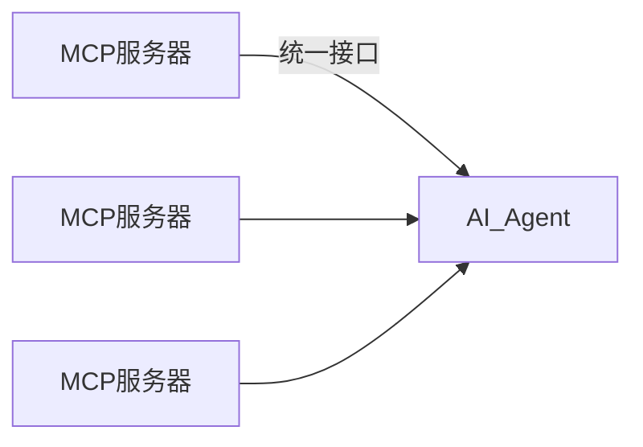

## 前言

最近在研究AI系统架构时，我遇到了一个有趣的现象：🤔 为什么同样是让AI连接外部世界，OpenAI的插件生态和Anthropic的MCP协议却像是两个平行宇宙？这让我想起十年前在开发专家系统时的困惑——当时我们拼命把人类知识塞进"if-then"规则，却始终跳不出"N×M"的魔咒。

今天，AI领域正在经历类似的架构革命。本文将带你穿越时空，从70年代的专家系统到2024年的MCP协议，看看AI如何从"技能学徒"进化成"标准公民"。🚀

::: tip
本文核心观点：AI Skills是"应用层插件"，而MCP是"数据层标准"。就像USB-C取代了各种专用接口，MCP正在终结AI生态的"巴别塔困境"。
:::

---

## 从专家系统到语音助手：AI技能的起源

### 1.1 知识工程时代的"技能"雏形

还记得那些在90年代医院里横行的专家系统吗？🏥 当时我们煞费苦心地把医生经验写成规则："如果体温>100°C且白细胞>12，则启动隔离程序"。这些"技能"本质上是硬编码的决策树——精确但脆弱，就像给AI套上了思维枷锁。



### 1.2 语音助手的"技能"觉醒

2015年左右，语音助手突然火遍全球。亚马逊Alexa的"技能"概念让我眼前一亮——这简直是AI的App Store！开发者定义"意图"（PlayMusic）和"槽位"（Jazz），AI像个接线员一样精准匹配。但~~真相是~~，它本质上还是个高级分类器，只是把"技能"包装得更性感罢了。

> "当时我们得意地认为，只要给AI装满技能插头，就能让它无所不能。结果发现，插头越多，接线越乱..." ——某语音助手架构师的自嘲

---

## 生成式AI的崛起：函数调用的革命

### 2.1 "大脑在罐子"的困境

当GPT-3们横空出世时，我们遇到了新问题：这些模型拥有百科全书般的知识，却连"1+1"都算不对！😂 它们像被关在玻璃罐里的天才，看得见世界却摸不着实物。当用户问"今天比特币价格"时，它们会一本正经地"幻觉"出答案。

### 2.2 函数调用的破局之道

转机出现在2022年——函数调用（Function Calling）横空出世！💡 开发者可以告诉模型："这里有把叫get_weather的锤子，你可以用它来敲天气"。模型会智能判断何时使用这个工具，就像人类知道"拧螺丝用螺丝刀"一样。

```python
# 函数调用的魔法时刻
def get_weather(city):
    # 真实天气API调用
    return "22°C, 晴"

# LLM输出结构化请求
{
    "tool": "get_weather",
    "params": {"city": "北京"}
}
```

但~~有趣的是~~，这个"革命"其实只是把旧技能换了个新马甲——从语音插头变成了代码插头。

---

## 术语辨析：AI技能的定义

在继续之前，必须澄清一个概念混乱：AI技能在现实中其实有两个身份：

1. **人力资本定义**：职场中说的"AI技能"是指人类的prompt工程、数据素养等能力（比如PwC报告里说的"技能缺口"）
2. **系统架构定义**：本文讨论的"技能"特指插件/工具这类功能单元（比如OpenAI插件）

> 🤷‍♂️ 就像"苹果"既是水果又是公司，AI技能也活在双重宇宙里。本文只聊技术架构的苹果！

---

## AI技能范式：应用层插座的困境

### 3.1 厂商的"命名大乱斗"

当我研究不同厂商的技能系统时，差点被术语淹死！😵‍💫

| 厂商       | 术语          | 实际含义                     |
|------------|---------------|----------------------------|
| Microsoft  | Skills/Plugins| 函数集合（Copilot Studio） |
| OpenAI     | Plugins/Actions| OpenAPI描述的REST端点      |
| Anthropic  | Tools         | 原生函数调用机制            |

### 3.2 技能的三层架构

所有技能系统都藏着三个秘密组件：

1. **Manifest（说明书）**：用JSON/YAML告诉AI"我能做什么"，比如：
   ```json
   {
     "name": "SearchKnowledge",
     "description": "在知识库中搜索信息（最关键！）",
     "parameters": {"query": "string"}
   }
   ```
   
2. **编排循环**：AI→识别意图→提取参数→生成调用→执行代码→注入结果→生成回复
   
3. **执行层**：通常是无状态HTTP服务（比如OpenAI Action就是公开API）

### 3.3 "N×M"地狱降临

当企业想把Google Drive接入AI时，噩梦开始了：
- 为ChatGPT开发插件
- 为Copilot开发技能
- 为Claude开发工具
- 为本地LangChain开发适配器...

::: theorem
**N×M困境公式**：  
`总集成成本 = N个模型 × M个数据源`  
每个组合都需要定制开发，形成指数级爆炸！
:::

> "我们团队有3个人，光维护不同AI的GitHub集成就占用了80%时间..." ——某初创CTO的哀嚎

---

## MCP范式：数据层标准的曙光

### 4.1 USB-C革命重演

2024年底，Anthropic抛出了MCP（Model Context Protocol）。当我第一次看到它的描述时，鸡皮疙瘩都起来了——这不就是AI世界的USB-C吗？🔌

就像USB-C让一个充电器通吃所有设备，MCP承诺：
- 一个服务器 → 所有AI客户端
- 无需重写代码
- 开放标准（捐献给Linux基金会）

### 4.2 MCP的三层架构

MCP重新定义了游戏规则：

1. **Host（主机）**：AI模型运行的场所（Claude桌面/VS Code）
2. **Client（客户端）**：Host内的协议翻译官
3. **Server（服务器）**：独立进程，只懂MCP语言



### 4.3 三大核心原语

MCP比传统技能多了两个神奇能力：

1. **Resources（资源）**：被动数据管道！比如`postgres://db/users`，AI可以订阅变化（不再需要轮询）
2. **Prompts（提示模板）**：服务器定义的交互模板，确保AI正确使用工具
3. **Tools（工具）**：保留传统函数调用能力

### 4.4 传输协议革命

- **本地通信**：Stdio流（安全！数据不出机）
- **远程通信**：HTTP + SSE（保持会话状态）

> 🎉 终于不用在HTTP无状态和WebSocket之间纠结了！

---

## 架构对比：技能vs.MCP的终极对决

### 5.1 技术特性对比表

| 特性                | AI技能                     | MCP协议                     |
|---------------------|---------------------------|----------------------------|
| **耦合度**          | 紧耦合（硬编码定义）       | 松耦合（动态发现）          |
| **连接状态**        | 无状态（HTTP）            | 有状态（JSON-RPC会话）      |
| **集成模式**        | N×M地狱                   | 1×1天堂（一次开发，通用）   |
| **数据访问**        | 仅主动调用                | 主动+被动（订阅）           |
| **安全模型**        | 应用级权限                | 进程级沙盒                 |
| **智能流向**        | 单向（AI→工具）           | 双向（工具可采样AI）       |

### 5.2 状态管理的革命

**技能的无状态世界**：  
每次调用都得重新传递上下文，就像每次打电话都要重新报家门。

**MCP的有状态魔法**：  
服务器可以主动推送通知！比如库存MCP服务器会在库存低于阈值时自动触发补货流程。

### 5.3 安全沙盒的救赎

传统技能的安全噩梦——" confused deputy攻击"：  
当AI被诱导执行`删除系统文件`时，技能会直接在主机权限下执行！

MCP的解决方案：  
```bash
# 启动文件系统服务器时限制权限
mcp-server --path /User/Projects --read-only
```
即使AI被欺骗，服务器进程也物理访问不了敏感目录！

### 5.4 "采样"能力的颠覆

最惊艳的是MCP的**采样（Sampling）**机制！  
当数据库优化服务器发现慢查询时，可以反过来问AI："这个SQL怎么优化？"——让AI成为工具的"外挂大脑"！

---

## 企业应用实战：从救火到预防

### 6.1 供应链管理对比

**技能方案**：  
用户问"有库存吗？" → AI调用技能 → 查询ERP → 返回结果（被动响应）

**MCP方案**：  
库存服务器作为Resource实时暴露 → AI订阅阈值 → 自动触发补货流程（主动预防）

### 6.2 医疗数据整合

传统医院系统：  
HL7系统 + SQL数据库 + 影像系统 → 每个都要开发专属技能

MCP革命：  

医院只需包装现有系统，AI就能跨模态查询！

### 6.3 智能IDE的未来

想象一下：IDE作为Host，连接Git/数据库/终端MCP服务器，AI可以：
- 读取Git历史（Resource）
- 分析数据库模式（Tool）
- 运行测试（Tool）
- 全部在统一会话中！

> 这才是真正的"智能操作系统"啊！🤯

---

## 结语：开放AI生态的黎明

回顾这场架构演进，我看到了惊人的相似性：

1. **70年代**：专家系统用规则定义技能
2. **2015年**：语音助手用意图定义技能  
3. **2022年**：LLM用函数调用定义技能
4. **2024年**：MCP用协议定义数据层

::: tip
**进化启示录**：  
技能是"应用层插件"，解决的是"如何让AI做事"；  
MCP是"数据层标准"，解决的是"如何让数据流动"。  
就像从马车到高铁，不是替代，是升维！
:::

> 🔮 未来展望：当操作系统原生集成MCP服务器（文件系统/日历/设置），任何AI应用都将像USB设备即插即用。那时，我们终于实现了"AI民主化"的终极梦想——不是每个AI都有自己的插件商店，而是所有AI共享同一个数据宇宙！

这场革命才刚刚开始，而我们是见证者，更是建设者。🌟