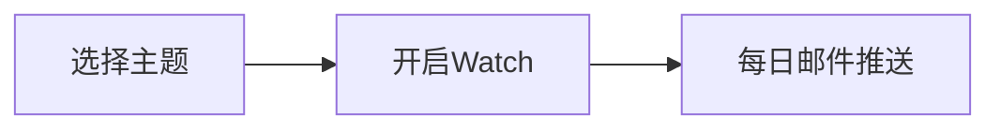

## 前言

作为一个技术爱好者，我经常陷入这样的困境：🤔 明明知道GitHub上有无数宝藏仓库，却总在重复发现那些早已被"星标轰炸"的热门项目。~~难道要每天刷到眼冒金星才能找到新大陆吗？~~

实际上，通过一些自动化工具和策略，我们完全可以建立一套高效的GitHub新仓库发现系统。今天就来分享我实践过的5个方法，帮你每天都能收获技术新知。

## 方法一：GitHub官方订阅系统

### 🔔 主题订阅
GitHub的Explore页面提供主题订阅功能，具体操作：
1. 访问 [GitHub Explore](https://github.com/explore)
2. 选择你感兴趣的主题（如"Machine Learning"、"Web3"等）
3. 点击"Watch"按钮，每日邮件会推送该主题下的新仓库



### 🏷️ 标签监控
在仓库搜索中使用`created:>YYYY-MM-DD`语法：
```bash
# 示例：查找最近30天创建的Python仓库
python language:python created:>2023-12-23
```

::: tip
建议创建多个主题订阅，避免信息过载。每个主题只关注最核心的3-5个细分领域
:::

## 方法二：第三方服务推荐

### 📡 Awesome List系列
这类精选列表是宝藏仓库的聚集地：
- [awesome](https://github.com/sindresorhus/awesome)：最全面的资源列表
- [awesome-machine-learning](https://github.com/josephmisiti/awesome-machine-learning)：AI/ML领域精选
- [awesome-selfhosted](https://github.com/Kickball/awesome-selfhosted)：开源自托管方案

### 📧 订阅服务
| 服务名称 | 特点 | 订阅方式 |
|---------|------|---------|
| [Hacker News](https://news.ycombinator.com) | 热门技术讨论 | RSS订阅 |
| [OSS Insight](https://ossinsight.io) | 仓库数据分析 | 每周报告 |
| [GitStar Ranking](https://gitstar-ranking.com) | 仓库热度排行 | 每日更新 |

::: theorem
第三方服务更适合作为补充，因为它们的更新频率通常低于24小时
:::

## 方法三：自动化监控方案

### 🤖 GitHub Action监控
创建一个自动化工作流，每天定时扫描新仓库：
```yaml
# .github/workflows/daily-repo.yml
name: Daily Repo Monitor
on:
  schedule:
    - cron: '0 8 * * *'  # 每天早上8点
jobs:
  scan:
    runs-on: ubuntu-latest
    steps:
      - uses: actions/checkout@v4
      - name: Scan new repos
        run: |
          curl -s "https://api.github.com/search/repositories?q=created:>$(date -d '1 day ago' +%Y-%m-%d)&sort=stars&order=desc" > new_repos.json
```

### 💻 自定义脚本
使用Python脚本监控特定关键词：
```python
import requests
import json

def check_new_repos(keyword):
    url = f"https://api.github.com/search/repositories?q={keyword}+created:>$(date -d '1 day ago' +%Y-%m-%d)"
    response = requests.get(url)
    return json.loads(response.text)['items']

# 示例：监控Web3领域新仓库
new_repos = check_new_repos("blockchain")
```

::: tip
自动化方案适合需要实时监控的开发者，但要注意GitHub API的调用限制（每分钟60次）
:::

## 方法四：社区资源挖掘

### 📚 开源项目导航站
- [OpenSourceGuide](https://opensource.guide)：GitHub官方开源指南
- [Libraries.io](https://libraries.io)：依赖包生态监控
- [Sourcegraph](https://sourcegraph.com)：代码搜索平台

### 🎯 开发者社区
- Reddit的/r/programming板块
- V2EX的酷工作/酷节点板块
- 掘金/思否等中文技术社区

> 关键在于建立自己的信息过滤系统，通过多个渠道交叉验证，避免错过重要项目

## 方法五：个人知识管理

### 📝 建立仓库追踪表
| 仓库名称 | 发现日期 | 核心价值 | 后续行动 |
|---------|---------|---------|---------|
| llama-index | 2023-12-20 | LLM知识库框架 | 深度研究 |
| pnpm | 2023-12-15 | 包管理器替代方案 | 试用评估 |

### 🔄 定期回顾机制
1. 每日：快速浏览新仓库列表（10分钟）
2. 每周：深入分析2-3个优质项目（1小时）
3. 每月：整理知识库，淘汰过时资源

::: right
*——来自GitHub 2023年度报告的建议*
:::

## 结语

保持对GitHub新仓库的敏感度，本质上是在构建个人的技术雷达系统。📡 通过组合使用官方订阅、第三方服务和自动化工具，我们可以在信息爆炸的时代高效筛选有价值的内容。

记住：**最好的仓库发现方法，永远是根据自己的技术栈建立个性化监控机制**。今天就开始搭建你的GitHub新仓库追踪系统吧！

> "在开源世界里，发现比创造更重要" —— Jorgen's Tech Notes