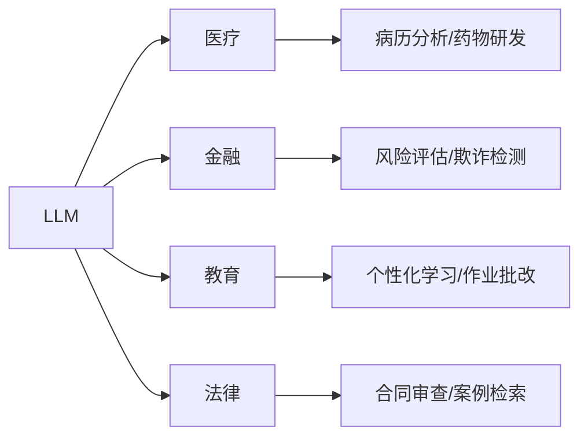

```markdown
---
title: LLM初探：大语言模型入门指南
date: 2026-01-29
tags:
  - LLM
  - 人工智能
  - 深度学习
---

## 前言

::: tip
"大语言模型正在重塑我们与技术互动的方式，就像互联网诞生时一样深刻。"
:::

🤔 还记得第一次与ChatGPT对话时的震撼吗？当我输入"帮我写一首关于量子计算的十四行诗"，AI不仅完美押韵，甚至准确融入了薛定谔的猫！这种体验让我彻底着迷，也促使我决定系统性地记录大语言模型（LLM）的探索之旅。本文将带你从零开始，揭开LLM的神秘面纱。

## 什么是大语言模型？

### 核心定义

大语言模型（Large Language Model，LLM）是指通过海量文本数据训练的深度神经网络，它们能够理解、生成和优化人类语言。**关键特征**包括：

- **参数规模**：通常拥有数十亿到数万亿参数（如GPT-4有1.8万亿参数）
- **上下文理解**：处理数千token的长文本上下文
- **零样本能力**：无需特定训练即可执行新任务
- **多模态融合**：逐步整合文本、图像、代码等数据

### 技术演进里程碑

| 年份       | 模型          | 突破性贡献                     |
|------------|---------------|------------------------------|
| 2017       | Transformer  | 引入自注意力机制               |
| 2018       | BERT          | 预训练+微调范式               |
| 2020       | GPT-3         | 1750亿参数，展现涌现能力       |
| 2022       | ChatGPT       | 对话式交互引爆应用革命         |
| 2023       | GPT-4         | 多模态理解能力突破             |

## 核心技术原理

### Transformer架构革命

🏗️ 现代LLM的基石是Transformer架构，它彻底改变了自然语言处理：

```python
# 简化的自注意力机制伪代码
def self_attention(Q, K, V):
    scores = torch.matmul(Q, K.transpose(-2, -1)) / math.sqrt(d_k)
    weights = F.softmax(scores, dim=-1)
    return torch.matmul(weights, V)
```

**关键创新**：
- 并行计算替代RNN的序列处理
- 自注意力机制捕捉长距离依赖
- 位置编码保留文本顺序信息

### 训练范式

1. **预训练阶段**：
   - 在万亿级语料上学习语言规律
   - 任务：掩码语言模型（MLM）和下一句预测（NSP）
   - 💡 耗电惊人：训练一次GPT-3≈128个美国人年用电量

2. **微调阶段**：
   - 通过指令微调（Instruction Tuning）提升任务能力
   - 人类反馈强化学习（RLHF）对齐人类价值观

## 实际应用场景

### 生产力工具革命

- **代码生成**：GitHub Copilot将开发效率提升40%+
- **内容创作**：自动生成营销文案、技术文档
- **智能助手**：24/7客服、个人助理（如Notion AI）
- **科研辅助**：论文写作、实验设计建议

### 行业应用案例



## 当前挑战与局限

### 技术瓶颈

1. **幻觉问题**：生成看似合理但错误的内容
   > 例："法国的首都是伦敦"（实际是巴黎）

2. **上下文限制**：
   - 最大上下文窗口仍有限制（GPT-4为128K tokens）
   - 长文档理解能力不足

3. **推理能力不足**：
   - 复杂数学推理错误率高达30%
   - 缺乏真正的逻辑推理能力

### 伦理与社会挑战

- **偏见放大**：训练数据中的社会偏见被模型继承
- **滥用风险**：虚假信息生成、学术不端
- **就业冲击**：部分内容创作岗位面临替代

## 未来展望

### 技术演进方向

1. **多模态融合**：
   - 文本+图像+视频的统一理解
   - 📡 实时交互能力提升

2. **效率优化**：
   - 模型小型化（如Llama 3 8B）
   - 量化压缩技术降低部署成本

3. **可解释性突破**：
   - 开发"思考过程可视化"工具
   - 建立模型行为可预测框架

### 个人建议

如果你也想探索LLM领域，我的建议是：

::: right
"不要试图理解所有参数，学会提问才是关键"
:::

1. **从实践入手**：
   - 用ChatGPT解决实际问题
   - 尝试API调用开发简单应用

2. **关注开源生态**：
   - 研究Llama、Mistral等开源模型
   - 参与Hugging Face社区

3. **保持批判思维**：
   - 验证AI生成内容的准确性
   - 理解技术边界和局限性

## 结语

大语言模型的发展正处在一个奇点时刻。当我们惊叹于它写诗、编程、创作的能力时，更要清醒认识到：**LLM是增强人类能力的工具，而非替代品**。未来十年，真正重要的不是模型参数有多大，而是我们如何将这种能力转化为解决实际问题的创造力。

> "技术终将改变世界，但决定方向的始终是人类的选择"

---
*本文为LLM探索系列第一篇，后续将深入模型训练、优化技巧等实战内容。欢迎在评论区交流你的AI体验！*
```