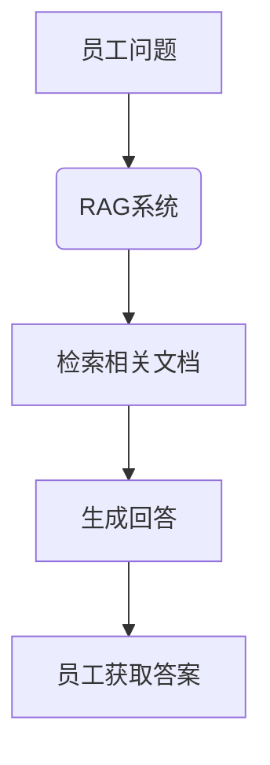

## 前言

在大型语言模型(LLM)飞速发展的今天，我们面临着知识时效性、幻觉问题以及领域适应性等多重挑战。传统的LLM依赖于预训练阶段吸收的知识，难以实时更新最新信息，也容易在生成内容时出现"一本正经地胡说八道"的情况。为了解决这些问题，检索增强生成(Retrieval-Augmented Generation, RAG)技术应运而生，它巧妙地将外部知识库与语言模型的能力相结合，为构建更加可靠、准确和实用的AI应用开辟了新路径。

::: tip
检索增强生成(RAG)是一种将检索系统与生成模型相结合的技术，通过从外部知识库中检索相关信息来增强语言模型的生成能力，从而提高回答的准确性和时效性。
:::

## RAG的基本原理

RAG的核心思想非常直观：**不把所有知识都塞进模型，而是让模型学会"如何查找知识"**。传统的LLM就像一个"行走的百科全书"，试图记住所有可能的知识；而RAG则更像一个"善于研究的学者"，它知道如何查找资料并基于这些资料进行回答。


RAG的工作流程可以简单概括为：

1. **检索阶段**：根据用户查询，从外部知识库中检索相关的信息片段
2. **增强阶段**：将检索到的信息与原始查询一起输入给语言模型
3. **生成阶段**：语言模型基于检索到的信息和查询生成最终回答

这种架构不仅解决了知识更新的问题，还显著减少了模型产生幻觉的可能性，同时降低了训练和部署的成本。

## RAG的技术架构

一个完整的RAG系统通常包含以下几个关键组件：

### 1. 文档处理与索引模块

这是RAG系统的"知识库建设"部分，负责将原始文档转化为可供检索的格式：

- **文档加载**：从各种数据源(如PDF、网页、数据库等)加载原始文档
- **文档分块**：将长文档分割成适合检索的小片段
- **文本嵌入**：使用嵌入模型将文本片段转换为向量表示
- **向量存储**：将向量及其对应的文本片段存储在向量数据库中

```python
# 文档处理与索引的简化示例
def process_documents(documents):
    chunks = []
    for doc in documents:
        # 文档分块
        text_chunks = split_text_into_chunks(doc)
        for chunk in text_chunks:
            # 文本嵌入
            embedding = get_embedding(chunk)
            # 存储到向量数据库
            vector_db.add(chunk, embedding)
            chunks.append(chunk)
    return chunks
```

### 2. 检索模块

检索模块是RAG系统的"查找引擎"，负责根据用户查询找到最相关的信息：

- **查询嵌入**：将用户查询转换为向量表示
- **相似度计算**：计算查询向量与存储向量之间的相似度
- **结果排序**：根据相似度对检索结果进行排序
- **结果截取**：选择最相关的Top-K个结果

### 3. 增强生成模块

这是RAG系统的"大脑"，负责整合检索到的信息并生成回答：

- **提示构建**：将用户查询和检索到的信息组合成增强提示
- **答案生成**：使用语言模型基于增强提示生成最终回答
- **后处理**：对生成的回答进行格式化和优化

## RAG的关键组件

### 向量数据库

向量数据库是RAG系统的核心基础设施，用于高效存储和检索向量表示的文本片段。常见的向量数据库包括：

- **FAISS**：Facebook开发的相似度搜索和聚类库
- **Pinecone**：全托管的向量数据库服务
- **Chroma**：开源的嵌入式向量数据库
- **Milvus**：高性能的向量数据库系统
- **Weaviate**：云原生的向量搜索引擎

### 嵌入模型

嵌入模型负责将文本转换为向量表示，是影响RAG系统性能的关键因素。常用的嵌入模型包括：

- **OpenAI的text-embedding-ada-002**：高精度、通用性强
- **Sentence-BERT**：专门针对句子相似度优化的BERT模型
- **GTR系列**：来自德国研究机构的文本检索模型
- **E5系列**：高效且多功能的文本嵌入模型

### 检索策略

检索策略决定了如何从知识库中找到最相关的信息：

- **向量相似度检索**：基于向量空间中的距离进行检索
- **混合检索**：结合关键词匹配和向量相似度
- **多跳检索**：通过多次迭代检索获取更全面的信息
- **语义检索**：基于语义相似性而非关键词匹配

## RAG的实现方法

从简单到复杂，RAG的实现可以分为以下几个层次：

### 基础RAG实现

基础RAG实现相对简单，主要包含文档处理、向量存储和相似度检索：

```python
import numpy as np
from sentence_transformers import SentenceTransformer
from sklearn.metrics.pairwise import cosine_similarity

class SimpleRAG:
    def __init__(self, documents):
        self.documents = documents
        self.model = SentenceTransformer('all-MiniLM-L6-v2')
        self.embeddings = self.model.encode(documents)
    
    def retrieve(self, query, top_k=3):
        query_embedding = self.model.encode([query])
        similarities = cosine_similarity(query_embedding, self.embeddings)[0]
        top_indices = np.argsort(similarities)[-top_k:][::-1]
        return [self.documents[i] for i in top_indices]
    
    def generate(self, query, context):
        prompt = f"""基于以下上下文回答问题:
        
上下文:
{context}

问题:
{query}

回答:"""
        # 这里简化了生成过程，实际应调用LLM API
        return f"基于提供的上下文，关于'{query}'的答案是..."
    
    def answer(self, query):
        relevant_docs = self.retrieve(query)
        context = "\n".join(relevant_docs)
        return self.generate(query, context)
```

### 高级RAG实现

高级RAG实现通常包含以下优化：

1. **智能文档分块**：考虑语义连贯性进行动态分块
2. **元数据过滤**：利用文档元数据缩小检索范围
3. **重排序机制**：使用更精细的模型对初步检索结果进行重排序
4. **查询改写**：优化查询以获得更好的检索效果
5. **多文档融合**：有效整合多个检索到的文档信息

### 企业级RAG实现

企业级RAG系统需要考虑更多因素：

1. **分布式架构**：支持大规模文档和高并发查询
2. **增量更新**：支持知识库的动态更新
3. **访问控制**：细粒度的权限管理
4. **监控与日志**：全面的系统监控和审计日志
5. **多租户支持**：隔离不同用户或部门的知识库

## RAG的应用场景

RAG技术已在多个领域展现出强大的应用价值：

### 企业知识库问答

企业可以将内部文档、手册、报告等构建成知识库，通过RAG系统实现智能问答，帮助员工快速获取所需信息。



### 实时信息查询

对于需要最新信息的应用场景，如新闻摘要、市场分析等，RAG系统可以实时检索最新数据并生成相关内容。

### 领域专业知识问答

在医疗、法律、金融等专业领域，RAG系统可以整合专业文献和知识，提供专业、准确的咨询服务。

### 个性化内容生成

结合用户历史和偏好数据，RAG系统可以检索相关内容并生成个性化的推荐或创作内容。

## RAG的挑战与未来展望

尽管RAG技术取得了显著进展，但仍面临一些挑战：

### 知识库构建与维护

- **文档质量**：知识库中文档的质量直接影响RAG系统的表现
- **更新频率**：如何保持知识库的及时更新是一个挑战
- **知识冲突**：处理知识库中可能存在的信息冲突

### 检索准确性

- **语义鸿沟**：查询与文档之间的语义表达差异
- **长文档检索**：有效检索长文档中的相关信息
- **多跳推理**：需要多步推理才能找到答案的复杂查询

### 生成质量

- **信息整合**：如何有效整合多个检索到的信息片段
- **引用溯源**：提供答案的来源信息
- **避免矛盾**：确保生成内容与检索信息一致

### 未来发展方向

1. **多模态RAG**：结合文本、图像、音频等多种模态的信息检索
2. **自适应检索**：根据任务特点自动调整检索策略
3. **知识图谱增强**：将知识图谱与RAG结合，提供更结构化的知识表示
4. **持续学习RAG**：系统可以从交互中不断学习和改进
5. **可解释性增强**：提供更透明的检索和决策过程

## 结语

检索增强生成(RAG)技术为解决大型语言模型的固有局限提供了创新思路，它不仅扩展了模型的知识边界，还提高了回答的准确性和可靠性。随着技术的不断成熟，RAG将在更多领域发挥重要作用，推动AI应用从"闭门造车"向"开放学习"转变。

正如著名计算机科学家Alan Kay所言："**预测未来的最好方式就是创造它**"。RAG技术正是我们创造更智能、更可靠AI未来的重要工具。通过不断优化检索算法、改进知识库管理和提升生成质量，RAG有望成为连接人类知识与AI能力的坚实桥梁，为构建更加智能、实用的AI应用铺平道路。

> 在信息爆炸的时代，不是拥有多少知识最重要，而是如何快速找到并有效利用这些知识。RAG技术正是这一理念的完美体现，它教会AI像人类一样思考——既懂得如何记忆，也懂得如何查找。

---

*本文介绍了检索增强生成(RAG)技术的基本原理、架构实现和应用前景。随着LLM技术的不断发展，RAG有望成为连接模型与知识的关键桥梁，为构建更加智能、可靠的AI应用提供新的可能。*