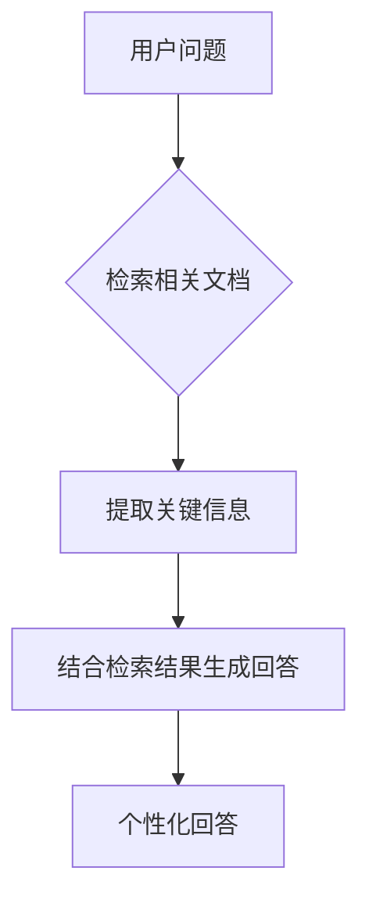

## 前言

随着大语言模型(LLM)技术的飞速发展，我们正见证着AI从通用工具向个性化助手的转变。🚀 无论是企业应用、专业领域还是个人使用，定制化的AI助手已成为趋势。然而，如何让这些通用模型真正理解并适应特定需求，却是一门需要深入探索的艺术。本文将探讨大语言模型的个性化定制技术，揭示如何打造真正懂你的专属AI助手。

::: tip
"个性化不是简单的参数调整，而是让AI模型理解并融入特定场景、风格和知识体系的过程。"
:::

## 为什么需要个性化定制？

### 通用模型的局限性

即使是像GPT-4这样强大的模型，在面对特定领域或个性化需求时也常常显得力不从心：

- **知识盲区**：专业领域术语和最新发展可能未被充分训练
- **风格不符**：无法完全匹配特定行业的沟通风格和术语体系
- **上下文理解不足**：难以理解特定组织的工作流程和决策模式
- **价值观偏差**：可能与特定组织的文化或个人价值观存在差异

### 个性化定制带来的价值

通过有效的个性化定制，我们可以获得：

- **专业精度提升**：在特定领域的准确性和专业性显著增强
- **沟通效率优化**：采用符合用户习惯的语言风格和表达方式
- **决策支持增强**：基于特定组织流程和经验提供更精准建议
- **用户体验提升**：减少用户适应成本，提高交互自然度

## 个性化定制的主要技术路径

### 1. 提示工程优化

提示工程是最直接、最灵活的个性化方法：

```markdown
// 基础提示模板
你是一个[角色]，擅长[领域]。你的沟通风格特点是[风格描述]。
在回答问题时，请遵循以下原则：
1. [原则1]
2. [原则2]
3. [原则3]
```

**高级技巧**：
- 使用角色扮演设定模型身份
- 加入示例(Example)指导输出格式
- 设置明确的约束条件和边界
- 采用链式思考(Chain of Thought)引导复杂推理

### 2. 持续预训练领域知识

对于专业领域应用，可以在领域语料上进行持续预训练：

```python
# 示例：医疗领域持续预训练流程
medical_corpus = load_medical_textbooks_and_papers()
model = load_base_llm()
model.train(medical_corpus, epochs=3, learning_rate=2e-5)
```

**优势**：
- 深度融入领域专业知识
- 理解专业术语和表达方式
- 掌握领域特定的推理模式

**挑战**：
- 需要大量高质量领域数据
- 计算资源消耗较大
- 可能导致通用能力下降

### 3. 指令微调(Instruction Tuning)

通过精心设计的指令-响应对数据进行微调：

```json
// 医疗咨询微调数据示例
{
  "instruction": "作为一名医疗助手，请解释什么是高血压",
  "response": "高血压是指动脉血压持续升高的慢性疾病...",
  "category": "医疗咨询"
}
```

**关键点**：
- 数据质量至关重要
- 涵盖多种场景和问题类型
- 保持输出一致性和专业性

### 4. 检索增强生成(RAG)

结合外部知识库实现个性化：



**优势**：
- 实时更新知识库
- 可解释性强
- 减少模型幻觉

### 5. 参数高效微调(PEFT)

如LoRA、Prefix-tuning等技术，以较低成本实现个性化：

```python
# LoRA微调示例
from peft import LoraConfig, get_peft_model

lora_config = LoraConfig(
    r=8, 
    lora_alpha=32, 
    lora_dropout=0.1,
    target_modules=["q", "v"]
)
peft_model = get_peft_model(base_model, lora_config)
```

**特点**：
- 仅微调少量参数
- 保存多个个性化适配器
- 快速切换不同定制版本

## 个性化定制的实践方法

### 企业级个性化方案

1. **知识库构建**
   - 整合企业文档、手册和案例
   - 建立结构化知识图谱
   - 实现智能检索和关联

2. **风格适配**
   - 分析企业沟通风格和用语习惯
   - 创建风格模板和示例库
   - 实现风格一致性检查

3. **流程集成**
   - 嵌入企业工作流程
   - 实现自动化任务触发
   - 建立反馈优化机制

### 个人化助手定制

1. **个人偏好学习**
   - 记录交互历史和反馈
   - 分析语言风格和表达习惯
   - 建立个性化知识图谱

2. **情境感知**
   - 整合日历、位置等信息
   - 理解当前任务和目标
   - 提供情境相关建议

3. **持续进化**
   - 定期更新个人偏好
   - 适应新知识和技能需求
   - 保持与用户同步成长

### 行业专业定制

1. **术语体系构建**
   - 建立专业术语库和解释
   - 定义行业标准表达方式
   - 创建专业问答对

2. **决策支持系统**
   - 集成行业数据和指标
   - 实现专业分析框架
   - 提供决策建议和备选方案

3. **合规与安全**
   - 确保输出符合行业规范
   - 实施敏感信息过滤
   - 建立审计和追溯机制

## 挑战与解决方案

### 挑战一：数据质量与隐私

**问题**：
- 高质量领域数据获取困难
- 个人和企业数据隐私保护
- 数据偏见和公平性

**解决方案**：
- 采用合成数据生成技术
- 实施联邦学习和差分隐私
- 建立数据审核和清洗流程

### 挑战二：评估与反馈机制

**问题**：
- 个性化效果难以量化评估
- 用户反馈收集和分析困难
- 优化方向不明确

**解决方案**：
- 建立多维度评估指标体系
- 实施交互式反馈机制
- 采用A/B测试验证优化效果

### 挑战三：计算资源与成本

**问题**：
- 个性化训练资源消耗大
- 实时推理延迟问题
- 长期维护成本高

**解决方案**：
- 采用模型压缩和量化技术
- 实现智能缓存和预计算
- 建立资源优化调度系统

## 未来发展趋势

### 1. 自适应个性化系统

未来的LLM将能够：
- 自动感知用户需求和偏好变化
- 动态调整个性化策略
- 实现无监督的持续学习

### 2. 多模态个性化融合

结合文本、图像、音频等多种模态：
- 理解用户的多模态表达习惯
- 生成符合偏好的多模态内容
- 实现跨模态的个性化交互

### 3. 社群化知识共享

构建个性化定制社区：
- 共享高质量的定制模板和提示
- 交流个性化最佳实践
- 协作构建领域知识库

## 结语

个性化定制是大语言模型从通用工具向专属助手转变的关键一步。🎯 通过提示工程、持续预训练、指令微调、检索增强和参数高效微调等多种技术路径，我们可以打造真正理解并适应特定需求的AI助手。

然而，个性化定制不是一次性的工作，而是一个持续演进的过程。它需要我们不断收集反馈、评估效果、优化策略，才能让AI助手真正成为我们工作和生活中的得力伙伴。

> "最好的AI不是最聪明的AI，而是最懂你的AI。个性化定制技术的核心，是让AI从工具变为伙伴。"

随着技术的不断进步，我们有理由相信，未来的大语言模型将不再是千篇一律的通用工具，而是能够深度融入我们工作和生活的个性化智能助手。让我们一起期待并推动这一变革的到来！

---

*本文由Jorgen原创，如需转载请注明出处*