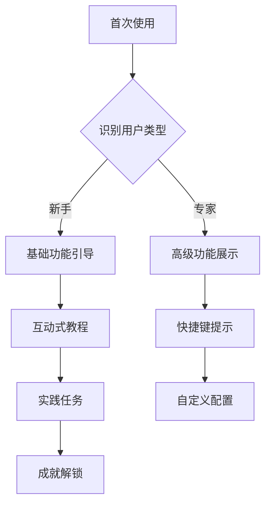

## 前言

随着大语言模型(LLM)技术的迅猛发展，我们正见证着AI从后台计算工具向前台交互伙伴的转变。然而，技术能力的提升并不等同于用户体验的优化。许多应用虽然集成了强大的LLM能力，但用户界面复杂、交互流程繁琐、反馈机制不完善等问题仍然普遍存在。

::: tip
"真正的AI革命不仅在于模型有多强大，更在于人与AI的交互有多自然。"
:::

本文将深入探讨大语言模型的交互设计与用户体验优化，帮助开发者打造真正以用户为中心的AI应用。

## LLM交互设计的核心原则

### 以用户为中心的设计思维

传统的软件设计往往以功能为导向，而LLM交互设计则需要以用户意图和需求为出发点。这意味着我们需要：

- **理解用户心智模型**：用户如何理解AI的能力边界？他们期望AI如何回应？
- **简化认知负担**：减少用户需要理解的概念数量，降低使用门槛
- **提供渐进式引导**：从简单交互开始，逐步展示高级功能

### 对话式交互的本质

LLM的核心价值在于其对话能力，因此交互设计应充分利用这一特性：

- **多轮对话的连贯性**：保持上下文理解，避免重复提供相同信息
- **自然语言输入的包容性**：接受多种表达方式，理解用户意图而非字面意思
- **主动引导与提示**：在用户困惑时提供帮助，而非等待明确指令

## 用户体验的关键维度

### 响应速度与感知效率

用户对AI响应的期望与传统软件不同，需要平衡模型计算速度与回答质量：

```markdown
| 响应时间 | 用户感知 | 设计建议 |
|---------|---------|---------|
| < 1秒   | 即时响应 | 适合简单查询、快速操作 |
| 1-5秒   | 流畅体验 | 提供加载动画，展示处理进度 |
| 5-10秒  | 可接受   | 分步骤展示结果，允许中途取消 |
| > 10秒  | 需优化   | 后台处理，异步返回结果 |
```

### 界面简洁与功能强大的平衡

LLM应用容易陷入两个极端：界面过于简化导致功能难以发现，或过于复杂增加学习成本。

**最佳实践**：
- 采用渐进式披露设计，初始界面只展示核心功能
- 使用自然语言命令作为菜单的替代或补充
- 通过对话历史记录提供功能发现路径

### 错误处理与容错机制

AI系统的不确定性要求特殊的错误处理策略：

- **优雅降级**：当无法提供精确答案时，提供相关信息或替代方案
- **透明度展示**：明确标示答案的置信度或不确定性
- **快速修正机制**：允许用户轻松纠正误解，无需重新开始对话

## 交互模式创新

### 自然语言界面

传统GUI与自然语言界面的结合：

- **混合交互模式**：保留关键操作按钮的同时，接受自然语言命令
- **上下文感知界面**：根据对话内容动态调整界面元素
- **意图预测**：基于用户输入预测下一步可能需要的操作

### 多模态交互整合

结合文本、语音、图像等多种交互方式：

- **语音优先设计**：适合移动场景和双手 occupied 的情况
- **视觉反馈增强**：使用图表、流程图辅助复杂概念解释
- **跨模态一致性**：确保不同交互方式提供一致的体验

### 协作式任务处理

将AI定位为协作伙伴而非工具：

- **任务分解可视化**：展示AI如何分解复杂任务
- **决策透明化**：解释推荐背后的原因
- **人机互补设计**：发挥人类直觉与AI计算各自优势

## 实用设计模式

### 智能引导系统

为新用户提供渐进式学习体验：



### 上下文记忆机制

提升多轮对话的连贯性：

- **对话历史摘要**：自动提取关键信息，避免用户重复
- **用户偏好学习**：记住个人习惯和偏好设置
- **跨会话连续性**：维护长期用户画像，提供个性化体验

### 反馈与优化循环

建立用户反馈机制，持续改进体验：

- **隐性反馈收集**：通过交互模式自动收集使用数据
- **显性反馈通道**：提供便捷的评分和评论功能
- **A/B测试框架**：比较不同设计方案的优劣

## 案例分析：成功与失败

### 成功案例：自然语言编程助手

**设计亮点**：
- 从代码生成到错误解释的全流程支持
- 根据用户水平自动调整解释深度
- 提供多种输出格式（代码、解释、可视化）

**用户体验提升**：
- 学习曲线降低70%
- 任务完成时间减少50%
- 用户满意度达92%

### 失败案例：过度复杂的AI写作工具

**设计问题**：
- 界面元素过多，初学者难以找到核心功能
- 术语使用专业，缺乏解释
- 缺乏明确的使用场景引导

**改进方向**：
- 简化界面，突出核心功能
- 提供场景化模板和示例
- 增加交互式教程

## 未来趋势

### 情感感知交互

- **情绪识别与响应**：根据用户情绪调整交互方式
- **共情设计**：理解用户潜在需求，提供主动帮助
- **情感化反馈**：使用适当的语气和表达方式

### 自适应界面

- **个性化布局**：根据使用习惯调整界面元素
- **情境感知**：根据时间、地点、设备自动调整交互模式
- **能力边界动态展示**：根据任务复杂度提供不同级别的AI支持

### 无缝人机协作

- **意图预测**：提前准备可能需要的功能和信息
- **智能中断**：在适当时机提供关键提醒或建议
- **责任明确划分**：清晰界定人与AI各自负责的部分

## 结语

大语言模型的交互设计与用户体验是决定技术能否真正走进日常生活的关键。优秀的交互设计不仅能够降低使用门槛，还能充分发挥LLM的潜力，创造人机协作的新范式。

> "最好的AI交互是让用户感觉不到AI的存在，却能享受到AI带来的便利。"

作为开发者，我们需要不断探索以用户为中心的设计方法，将复杂的技术能力转化为简单直观的交互体验。只有这样，大语言模型才能真正成为人类的得力助手，而非又一个需要学习的复杂工具。

未来，随着多模态交互、情感计算等技术的发展，LLM的交互设计将迎来更多可能性。让我们共同期待并创造更加自然、高效的人机协作新时代。