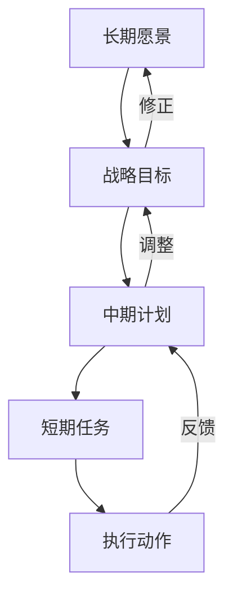

## 前言

随着大语言模型(LLM)技术的飞速发展，我们见证了这些系统从简单的文本生成到复杂问题解决的惊人进步。然而，大多数LLM仍然局限于即时响应和短期任务处理，缺乏真正的长期规划与战略决策能力。这种能力差距是当前AI从"工具"向"智能体"转变过程中面临的关键挑战。

> 🤔 我们是否曾思考过：为什么LLM能够回答"明天天气如何"，却难以回答"我应该如何规划未来五年的职业发展"？这背后正是长期规划能力的缺失。

本文将深入探讨大语言模型的长期规划与决策能力，分析其重要性、实现路径以及未来发展方向。

## 长期规划与决策能力的核心价值

### 超越即时响应的局限

当前大多数LLM在处理问题时倾向于基于已有信息给出即时回应，缺乏对问题未来发展的系统性思考。例如，当被问及"如何提高公司业绩"时，模型可能提供一些通用建议，但无法根据公司历史数据、市场趋势和长期目标制定系统性的战略规划。

### 从被动响应到主动规划

真正的智能系统应当具备主动规划能力，能够：
- 分析长期目标与短期任务的关系
- 制定分阶段执行计划
- 预测不同决策路径的长期影响
- 根据环境变化动态调整策略

### 决策复杂性的提升

长期规划与决策需要处理更复杂的问题，包括：
- 多目标优化
- 资源分配与优先级排序
- 风险评估与不确定性管理
- 多方利益平衡

## 实现长期规划与决策的关键技术

### 思维链与树状推理

传统的思维链(Chain-of-Thought)方法主要关注线性推理，而长期规划需要更复杂的树状推理结构：

```python
# 树状推理示例
def tree_reasoning(goal, current_state, depth=0, max_depth=5):
    if depth > max_depth:
        return evaluate_goal(goal, current_state)
    
    possible_actions = generate_actions(current_state)
    best_outcome = None
    best_score = -float('inf')
    
    for action in possible_actions:
        next_state = apply_action(current_state, action)
        future_outcomes = []
        
        # 递归探索未来状态
        for future_step in range(1, 5):  # 预测未来几步
            future_state = simulate_state_transition(next_state, future_step)
            score = evaluate_goal(goal, future_state)
            future_outcomes.append(score)
        
        # 综合评估当前行动
        action_score = evaluate_action(action, future_outcomes)
        
        if action_score > best_score:
            best_score = action_score
            best_outcome = (action, next_state)
    
    return best_outcome
```

### 记忆与经验积累

长期规划依赖于对过去经验的总结与学习：

::: theorem
长期规划记忆系统应包含三个关键组件：
1. 事件记忆：记录重要决策及其结果
2. 程序记忆：存储成功的规划策略
3. 元记忆：对自身规划能力的评估与改进
:::

### 多时间尺度建模

有效的长期规划需要在不同时间尺度上建立模型：

- **短期规划**（小时/天）：任务执行与资源分配
- **中期规划**（周/月）：目标分解与进度跟踪
- **长期规划**（年/十年）：战略方向与愿景设定

## 案例分析：从文本生成到战略规划

### 传统LLM的局限性

传统LLM在处理战略规划问题时往往表现出以下局限：

1. **缺乏连贯性**：无法保持长期目标的一致性
2. **忽视时间维度**：难以考虑决策的长期影响
3. **资源意识不足**：无法有效评估资源限制与分配

### 增强型LLM的规划能力

新一代具备长期规划能力的LLM能够：

- **制定多阶段计划**：将长期目标分解为可执行的短期任务
- **预测未来趋势**：基于历史数据和市场动态预测发展
- **动态调整策略**：根据执行结果和环境变化优化规划

## 实现长期规划的技术路径

### 1. 分层规划架构



### 2. 强化学习与规划结合

将强化学习(RL)与LLM结合，通过环境交互学习规划策略：

```python
class LLMPlanner:
    def __init__(self, llm_model, rl_agent):
        self.llm = llm_model
        self.rl_agent = rl_agent
        
    def plan(self, goal, context):
        # 1. LLM生成初步规划
        initial_plan = self.llm.generate_plan(goal, context)
        
        # 2. RL评估并优化规划
        optimized_plan = self.rl_agent.optimize_plan(initial_plan)
        
        # 3. 执行并获取反馈
        result = self.execute_plan(optimized_plan)
        
        # 4. 学习并更新策略
        self.rl_agent.update(result)
        
        return optimized_plan
```

### 3. 多智能体协作规划

通过多个专业化智能体协作实现复杂规划：

- **目标分解智能体**：将复杂目标分解为子任务
- **资源分配智能体**：优化资源分配策略
- **风险评估智能体**：评估不同路径的风险与收益
- **执行监控智能体**：跟踪计划执行情况

## 挑战与未来方向

### 当前面临的主要挑战

1. **计算复杂度**：长期规划需要大量计算资源
2. **数据稀疏性**：长期决策缺乏足够的历史数据
3. **评估困难**：难以准确评估长期规划的效果
4. **目标一致性**：确保各阶段规划目标的一致性

### 未来发展方向

1. **神经符号整合**：结合神经网络的学习能力与符号推理的逻辑性
2. **因果推理增强**：更好地理解因果关系，提高规划准确性
3. **元认知能力**：让模型能够反思和改进自身的规划过程
4. **人机协作规划**：人类与AI优势互补，共同制定长期规划

## 结语

大语言模型的长期规划与决策能力是实现真正智能的关键一步。从简单的文本生成到复杂的战略思考，这不仅是技术上的飞跃，更是AI从"工具"向"伙伴"转变的重要标志。

> 💡 随着这些技术的不断成熟，我们将看到LLM不再只是被动响应我们的问题，而是能够主动帮助我们思考未来、规划人生、解决复杂挑战的智能伙伴。

未来，随着计算能力的提升、算法的优化和多模态数据的融合，我们有理由相信，大语言模型将在长期规划与决策领域取得突破性进展，为人类社会带来更多可能性。

---

*本文探讨了LLM长期规划与决策能力的重要性、实现路径及未来方向，这一领域的研究将推动AI从简单工具向智能伙伴的关键转变。*