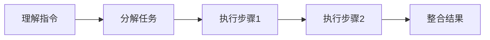
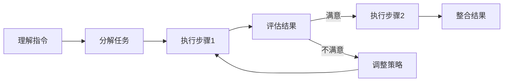
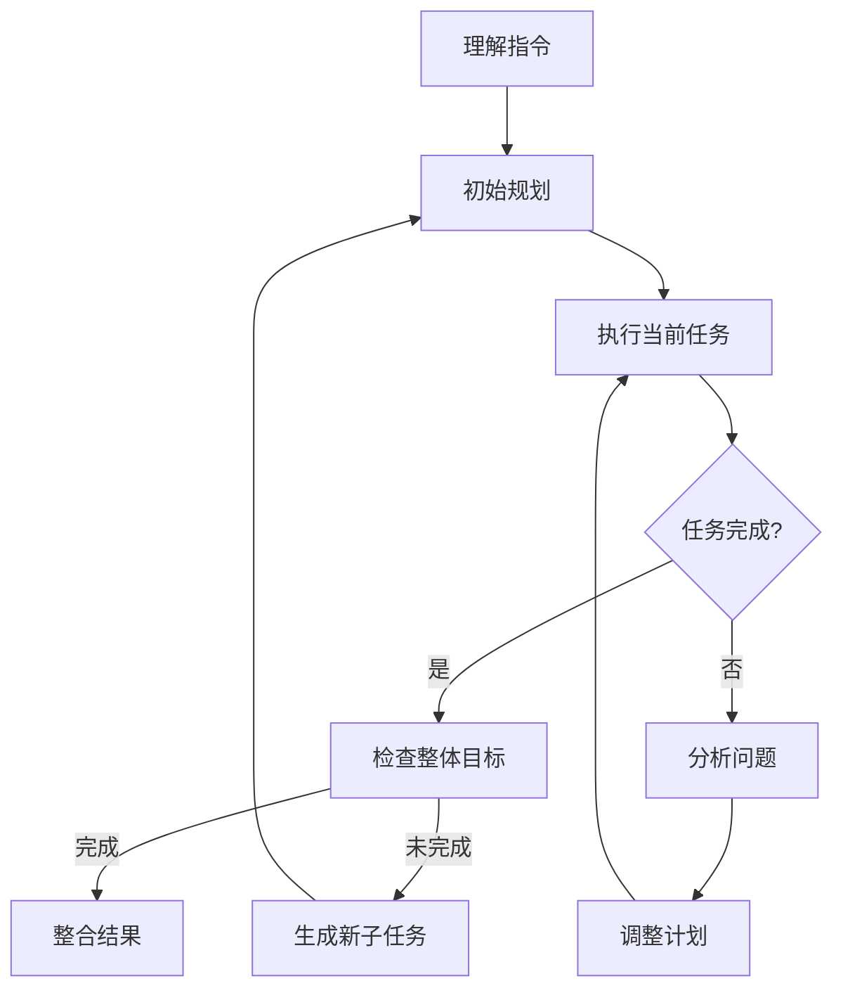

## 前言

作为一名长期关注大语言模型技术发展的从业者，我常常思考一个问题：为什么有些模型能够准确理解并执行复杂指令，而另一些模型却连简单的多步骤任务都难以完成？🤔 这个问题背后，隐藏着大语言模型从"文本生成器"向"智能助手"进化的关键能力——指令跟随与任务执行。

在过去的几年中，我们见证了LLM从简单的问答工具逐步演变为能够执行复杂任务的AI代理。然而，要真正实现这一转变，模型不仅需要理解语言，还需要具备将复杂指令分解为可执行步骤的能力，并能够按照合理的顺序执行这些步骤。

今天，我想和大家深入探讨大语言模型的指令跟随能力与任务执行框架，这一领域虽然已经有了"提示工程"和"工具使用"等相关讨论，但尚未有系统性的分析。让我们一起揭开这一关键能力的神秘面纱！🚀

## 指令跟随能力的本质

### 什么是指令跟随能力？

指令跟随能力（Instruction Following）是指大语言模型理解和执行人类指令的能力。这不仅仅是简单地回答问题，而是能够将用户的目标转化为一系列可执行的步骤，并按照合理的顺序完成这些步骤。

::: tip
指令跟随能力是评估LLM实用性的核心指标，它决定了模型能否从"玩具"转变为真正的工具。
:::

### 指令跟随能力的层次结构

根据复杂程度，我们可以将指令跟随能力分为三个层次：

1. **简单指令层**：直接回答问题或执行单一任务
   - 例如："什么是机器学习？"
   - "写一首关于春天的诗"

2. **多步骤指令层**：需要分解任务并按顺序执行
   - 例如："帮我写一封邮件，主题是会议邀请，内容包括时间、地点和议程"
   - "分析这份销售报告，找出三个关键趋势并制作可视化图表"

3. **复杂任务层**：需要自主规划、执行和调整
   - 例如："帮我规划一次为期五天的日本旅行，包括交通、住宿和景点推荐"
   - "创建一个个人理财应用，具有收支记录、预算规划和投资建议功能"

## 任务执行框架的核心组件

要实现高效的指令跟随和任务执行，我们需要构建一个完整的框架。这个框架通常包含以下几个核心组件：

### 1. 指令理解与解析

这是任务执行的起点。模型需要准确理解用户的意图，识别任务的关键要素。

```markdown
示例指令：
"帮我分析最近三个月的销售数据，找出增长最快的三个产品类别，并预测下个季度的趋势"
```

模型需要解析出：
- 任务类型：数据分析
- 时间范围：最近三个月
- 目标：找出增长最快的产品类别，预测趋势
- 输出要求：分析和预测结果

### 2. 任务分解与规划

将复杂任务分解为更小的、可管理的子任务，并确定执行顺序。

```markdown
任务分解示例：
1. 收集最近三个月的销售数据
2. 按产品类别分类数据
3. 计算各类别的增长率
4. 识别增长最快的三个类别
5. 分析历史趋势
6. 建立预测模型
7. 生成下季度预测
```

### 3. 工具选择与调用

根据子任务的需求，选择合适的工具或API来执行特定操作。

```markdown
工具选择示例：
- 数据收集：使用数据库查询API
- 数据处理：使用Python的pandas库
- 数据可视化：使用matplotlib或plotly
- 预测建模：使用scikit-learn或专门的预测API
```

### 4. 执行监控与调整

在执行过程中，持续监控进展，处理异常情况，并根据需要调整计划。

### 5. 结果整合与输出

将各个子任务的结果整合为最终的、有意义的输出。

## 提升指令跟随能力的技术方法

### 1. 指令工程与提示设计

高质量的提示是确保模型正确理解指令的关键。有效的提示设计包括：

- **明确指令**：使用清晰、具体的语言描述任务
- **提供示例**：通过few-shot或few-shot learning帮助模型理解期望
- **结构化提示**：使用模板或格式化提示，提高一致性
- **约束条件**：明确输出格式、长度和风格要求

```markdown
优质提示示例：
"""
请按照以下步骤分析销售数据：
1. 收集2023年第一季度至2023年第三季度的销售数据
2. 按产品类别分组计算总销售额和增长率
3. 识别增长率最高的三个产品类别
4. 分析这些类别的历史趋势
5. 使用线性回归预测第四季度的销售额
6. 以Markdown表格形式呈现结果，包括实际数据和预测值
"""
```

### 2. 思维链（Chain-of-Thought）技术

思维链技术鼓励模型在回答之前展示推理过程，这有助于提高复杂指令的执行质量。

```markdown
思维链示例：
用户指令："比较Python和JavaScript在Web开发中的优缺点"

模型思维链：
1. 首先，我需要理解用户要求的是比较两种编程语言
2. 用户关注的是Web开发场景，所以我应该聚焦于Web应用开发
3. 我需要从多个维度进行比较：性能、生态系统、学习曲线、应用场景等
4. 对于Python，我可以提到Django、Flask等框架
5. 对于JavaScript，我可以提到React、Vue等框架
6. 最后，我应该根据不同场景给出建议
```

### 3. 工具增强型提示

通过将外部工具与提示结合，模型可以执行超出其原生能力的任务。

```markdown
工具增强示例：
"""
你需要使用以下工具来完成任务：
1. 数据库查询工具：query_database(sql_query)
2. 数据分析工具：analyze_data(data)
3. 可视化工具：create_visualization(data, type)

任务：分析用户行为数据并生成报告
执行步骤：
1. 使用query_database获取最近30天的用户行为数据
2. 使用analyze_data分析用户活跃度和留存率
3. 使用create_visualization生成趋势图表
4. 整合分析结果和图表生成报告
"""
```

## 任务执行框架的架构设计

### 1. 简单框架：线性执行

最简单的执行框架是线性执行，按照预定义的顺序执行任务。



优点：
- 实现简单
- 执行路径清晰
- 易于调试

缺点：
- 缺乏灵活性
- 无法处理意外情况
- 难以适应复杂任务

### 2. 反馈循环框架：迭代优化

引入反馈机制，允许模型在执行过程中根据结果调整后续步骤。



优点：
- 能够处理不确定性
- 可以根据结果调整策略
- 提高任务完成质量

缺点：
- 可能陷入循环
- 执行时间增加
- 需要额外的评估机制

### 3. 自主规划框架：动态决策

让模型能够根据执行情况动态调整计划，甚至自主生成新的子任务。



优点：
- 高度灵活
- 能够处理复杂、开放性任务
- 接近人类的问题解决方式

缺点：
- 实现复杂
- 需要强大的决策能力
- 可能产生不可预测的行为

## 实际应用案例

### 案例1：智能写作助手

一个能够帮助用户完成复杂写作任务的AI助手，需要具备以下指令跟随能力：

```markdown
用户指令：
"帮我写一篇关于气候变化对农业影响的研究报告，包括引言、三个主要论点、数据支持和结论，要求学术严谨，引用至少5篇最新研究。"
```

执行框架：
1. 理解任务类型和结构要求
2. 搜索相关最新研究
3. 提取关键数据和论点
4. 组织报告结构
5. 撰写各部分内容
6. 检查学术严谨性和引用完整性
7. 生成最终报告

### 案例2：数据分析助手

一个能够帮助用户分析数据的AI助手：

```markdown
用户指令：
"分析这份销售数据，找出影响销售额的关键因素，并预测下个季度的销售趋势，制作可视化图表。"
```

执行框架：
1. 加载和预处理销售数据
2. 进行探索性数据分析
3. 识别与销售额相关的因素
4. 构建预测模型
5. 生成可视化图表
6. 解释分析结果和预测
7. 提供 actionable insights

### 案例3：项目管理助手

一个能够帮助用户管理项目的AI助手：

```markdown
用户指令：
"帮我规划一个网站开发项目，包括需求分析、设计、开发、测试和部署五个阶段，每个阶段设置里程碑和交付物，并创建甘特图。"
```

执行框架：
1. 分析项目需求
2. 分解为可管理的任务
3. 确定任务依赖关系
4. 估算时间和资源
5. 创建项目计划
6. 生成甘特图
7. 设置提醒和监控机制

## 指令跟随能力的评估方法

评估大语言模型的指令跟随能力需要系统化的方法。以下是一些常用的评估指标：

### 1. 任务完成率

模型能够成功完成指定任务的比例。

```markdown
评估示例：
给模型10个复杂指令，记录成功完成的数量
任务完成率 = 成功完成的任务数 / 总任务数
```

### 2. 指令理解准确度

模型对指令理解与预期一致的程度。

```markdown
评估方法：
- 人工评估：专家评估模型理解与预期的一致性
- 自动评估：使用预定义的评估标准自动计算分数
```

### 3. 输出质量

模型输出的质量评估，包括准确性、完整性、相关性等。

```markdown
评估维度：
- 内容准确性：信息是否准确无误
- 结构完整性：是否覆盖所有要求的部分
- 逻辑一致性：内部逻辑是否一致
- 语言质量：表达是否清晰、流畅
```

### 4. 效率指标

模型完成任务所需的资源消耗。

```markdown
评估指标：
- 响应时间：从接收到指令到完成输出的时间
- token消耗：完成任务所需的token数量
- 工具调用次数：调用外部工具的频率
```

## 未来发展方向

### 1. 多模态指令跟随

随着多模态模型的发展，未来的指令将不仅限于文本，还包括图像、音频等多种模态。

```markdown
未来指令示例：
"分析这张销售趋势图，找出异常点，并解释可能的原因，同时用语音描述你的发现。"
```

### 2. 长期任务执行

模型将能够执行持续数天或数周的长周期任务，保持上下文和目标的一致性。

### 3. 自主学习与适应

模型将在执行任务过程中不断学习和适应，提高特定领域的指令跟随能力。

### 4. 人机协作框架

未来的任务执行框架将更加注重人机协作，人类可以随时干预和指导任务执行过程。

## 结语

大语言模型的指令跟随能力与任务执行框架，是从"文本生成器"向"智能助手"进化的关键一步。🎯 这一能力不仅决定了模型的实用性，也影响着AI与人类交互的方式和深度。

随着技术的不断发展，我们有理由相信，未来的大语言模型将能够更准确地理解我们的意图，更有效地执行复杂任务，甚至能够预测我们的需求并主动提供帮助。这不仅是一场技术革命，更是人机关系的一次深刻变革。

作为开发者和使用者，我们需要关注这一领域的发展，积极参与到构建更强大、更可靠的指令跟随系统和任务执行框架中。只有这样，我们才能真正释放大语言模型的潜力，创造一个AI赋能的美好未来。💪

> 正如Alan Kay所言："预测未来的最好方式就是创造它。"让我们共同参与这场创造未来的旅程！