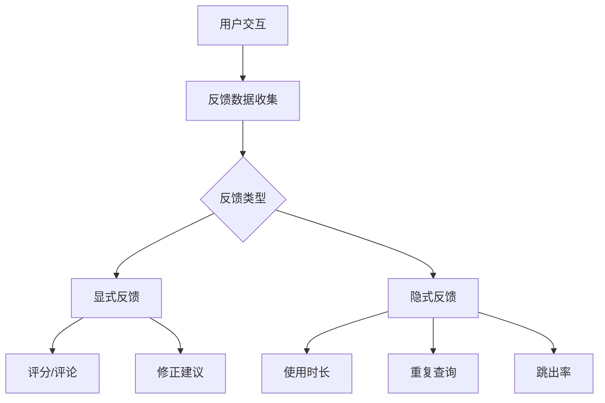
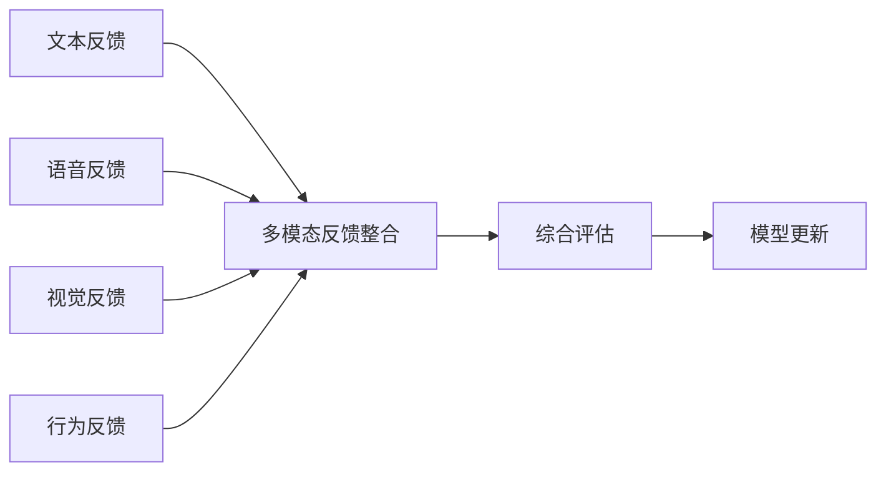

## 前言

随着大语言模型(LLM)的广泛应用，我们逐渐意识到，静态训练的模型难以应对不断变化的需求和场景。🔄 想象一下，一个医生使用医疗咨询模型，模型的知识停留在训练时的水平，无法反映最新的医学研究成果；一个法律助手，无法跟进最新的法规变化。这些场景都凸显了一个关键问题：如何让大语言模型持续进化，保持知识更新和能力提升？

在现有研究中，虽然有一些关于持续学习和适应性的讨论，但缺少对**反馈循环机制**的系统分析。本文将深入探讨大语言模型的反馈循环架构、实现方法、挑战与解决方案，以及如何构建真正自适应的AI系统。

::: tip
"反馈循环是连接模型与用户需求的桥梁，是LLM从'静态知识库'向'动态学习系统'转变的关键。"
:::

## 反馈循环的架构设计

一个完整的LLM反馈循环系统通常包含以下几个核心组件：

### 1. 数据收集与标注

反馈循环的第一步是收集高质量的用户反馈数据：



**显式反馈**包括用户直接给出的评分、评论和修正建议，而**隐式反馈**则通过用户行为数据推断，如使用时长、重复查询和跳出率等。

### 2. 质量评估机制

收集到的反馈需要经过严格的质量评估，以确保用于模型更新的数据质量：

- **一致性检查**：确保反馈内容与模型输出的一致性
- **多样性评估**：确保反馈覆盖各种使用场景和用户群体
- **时效性验证**：确保反馈反映的是当前需求和场景
- **可信度评分**：根据用户历史行为和反馈质量进行评分

### 3. 反馈整合与模型更新

将高质量反馈整合到模型更新过程中：

```python
def feedback_integration(feedback_data, model):
    # 1. 数据预处理
    processed_data = preprocess_feedback(feedback_data)
    
    # 2. 反馈权重计算
    weights = calculate_feedback_weights(processed_data)
    
    # 3. 模型微调
    updated_model = model.fine_tune(
        data=processed_data,
        weights=weights,
        learning_rate=adaptive_learning_rate(processed_data)
    )
    
    # 4. 知识蒸馏
    distilled_model = knowledge_distillation(
        teacher_model=model,
        student_model=updated_model,
        temperature=distillation_temperature
    )
    
    return distilled_model
```

### 4. 部署与监控

模型更新后需要部署到生产环境，并持续监控性能变化：

- **A/B测试**：比较新模型与旧模型在不同场景下的表现
- **性能指标监控**：准确率、响应时间、用户满意度等
- **异常检测**：及时发现模型性能下降或异常行为
- **回滚机制**：在模型性能严重下降时能够快速回退到稳定版本

## 技术实现

### 1. 人类反馈强化学习(RLHF)

RLHF是目前最成熟的反馈循环技术之一，其核心流程如下：

1. **收集人类偏好数据**：让人类对模型生成的多个输出进行排序
2. **训练奖励模型**：基于偏好数据训练一个奖励模型，预测人类对输出的偏好
3. **强化学习优化**：使用PPO等算法，以奖励模型为指导，优化语言模型

```python
class RLHFTrainer:
    def __init__(self, model, reward_model):
        self.model = model
        self.reward_model = reward_model
        self.optimizer = Adam(model.parameters(), lr=1e-5)
        
    def train_step(self, prompts, responses):
        # 1. 计算奖励
        rewards = self.reward_model(prompts, responses)
        
        # 2. 计算策略梯度
        log_probs = self.model.log_probabilities(prompts, responses)
        policy_loss = -(log_probs * rewards).mean()
        
        # 3. 更新模型
        self.optimizer.zero_grad()
        policy_loss.backward()
        self.optimizer.step()
        
        return policy_loss.item()
```

### 2. 自动反馈生成与验证

完全依赖人类反馈成本高昂，因此需要开发自动反馈生成技术：

- **自我评估**：模型自我评估输出质量
- **一致性检查**：验证输出与输入的一致性
- **事实性验证**：检查输出的事实准确性
- **多样性评估**：评估输出的多样性和创造性

```python
class AutoFeedbackGenerator:
    def generate_feedback(self, prompt, response):
        feedback = {
            'self_evaluation': self._self_evaluate(prompt, response),
            'consistency': self._check_consistency(prompt, response),
            'factuality': self._verify_facts(response),
            'diversity': self._assess_diversity(response)
        }
        return feedback
    
    def _self_evaluate(self, prompt, response):
        # 使用另一个模型评估响应质量
        evaluation_prompt = f"请评估以下回答的质量，从1-10分打分:\n\n问题: {prompt}\n回答: {response}"
        return self.evaluation_model(evaluation_prompt)
```

### 3. 模型蒸馏与知识迁移

为了将新知识高效迁移到现有模型中，可以采用模型蒸馏技术：

1. **教师-学生架构**：使用更新后的模型作为教师模型，训练一个更小的学生模型
2. **知识蒸馏**：将教师模型的"软标签"（概率分布）作为监督信号
3. **参数高效微调**：只更新模型的部分参数，如LoRA、Prefix-tuning等方法

```python
class KnowledgeDistiller:
    def __init__(self, teacher_model, student_model):
        self.teacher = teacher_model
        self.student = student_model
        self.temperature = 2.0
        
    def distill(self, dataloader, epochs=5):
        for epoch in range(epochs):
            for batch in dataloader:
                prompts, responses = batch
                
                # 教师模型输出
                with torch.no_grad():
                    teacher_logits = self.teacher(prompts, temperature=self.temperature)
                
                # 学生模型输出
                student_logits = self.student(prompts, temperature=self.temperature)
                
                # 计算蒸馏损失
                loss = self._distillation_loss(teacher_logits, student_logits)
                
                # 更新学生模型
                self._update_student(loss)
```

## 挑战与解决方案

### 1. 反馈偏差问题

**问题**：用户反馈可能存在各种偏差，如确认偏差、近期效应等。

**解决方案**：
- 多样化反馈收集：确保反馈来源多样化
- 反馈加权：根据反馈质量和来源进行加权
- 对抗性训练：针对常见偏差进行专门训练

### 2. 模型稳定性

**问题**：频繁更新可能导致模型性能不稳定，甚至"灾难性遗忘"。

**解决方案**：
- 弹性权重固化(EWC)：保护重要参数不被过度修改
- 知识回放：定期回顾旧数据，防止遗忘
- 多版本管理：维护多个模型版本，根据场景切换

### 3. 计算效率

**问题**：频繁的全模型微调计算成本高昂。

**解决方案**：
- 参数高效微调：只更新少量参数
- 增量学习：基于已有模型进行增量更新
- 分布式训练：利用多GPU/TPU加速训练

## 实际应用案例

### 案例1：医疗咨询系统的反馈循环

某医疗咨询平台实施了以下反馈循环机制：

1. **用户反馈收集**：
   - 用户对回答的满意度评分(1-5星)
   - 医生专家对回答的专业性评估
   - 用户补充的问题和修正建议

2. **反馈处理**：
   - 专家验证：由医疗专家验证用户反馈的准确性
   - 优先级排序：根据影响范围和紧急性排序反馈
   - 批处理更新：每周进行一次模型更新

3. **效果评估**：
   - 准确率提升：从初始的78%提升到92%
   - 用户满意度：从65%提升到88%
   - 专业认可度：获得85%的医生专家认可

### 案例2：法律助手的持续改进

某法律助手公司构建了多层次的反馈循环系统：

1. **多层次反馈**：
   - 普通用户：基础满意度评分
   - 法律从业者：专业准确性评估
   - 法学专家：深度案例分析

2. **自动化反馈生成**：
   - 法律条文一致性检查
   - 判例匹配度评估
   - 专业术语准确性验证

3. **持续更新机制**：
   - 实时更新：对紧急法律变更进行快速响应
   - 季度大更新：全面更新法律知识库
   - 年度架构优化：优化模型结构和参数

## 未来展望

### 1. 更智能的反馈机制

未来的反馈循环将更加智能化：

- **自适应反馈收集**：根据用户行为自动调整反馈策略
- **多模态反馈整合**：结合文本、语音、视觉等多种反馈形式
- **主动反馈请求**：模型主动请求特定类型的反馈

### 2. 多模态反馈整合

随着多模态大语言模型的发展，反馈也将更加多样化：



### 3. 自主反馈系统

最理想的反馈循环是能够自主运行的系统：

- **自动反馈生成**：模型自动生成自己的反馈
- **自我评估与改进**：模型能够评估自己的表现并主动改进
- **闭环学习**：完全自动化的从反馈到更新的闭环

## 结语

大语言模型的反馈循环与持续改进机制是实现真正自适应AI系统的关键。通过构建有效的反馈循环，我们能够让模型不断学习、进化，更好地满足用户需求。🚀

在未来的发展中，我们需要更加注重反馈的质量和多样性，开发更加智能的反馈处理机制，并确保模型更新的稳定性和效率。只有这样，我们才能构建真正能够持续学习和进化的AI系统。

> "反馈循环不仅是技术问题，更是连接AI与人类需求的桥梁。通过有效的反馈机制，我们能够打造真正服务于人类的AI伙伴。"

---

*本文探讨了LLM反馈循环机制的设计、实现与挑战，希望能为构建更智能、更自适应的大语言模型系统提供参考。*