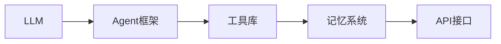

```markdown
---
title: AI Agent入门：从概念到实践
date: 2026-01-30
permalink: /pages/a1b2c3d/
tags: ["AI", "agent", "入门"]
author:
  name: Jorgen
  link: https://github.com/jorgen-zhao
---

## 前言
最近AI领域最让人兴奋的突破是什么？🤔 不是更大的模型，而是**智能体（Agent）**的崛起！这些能自主思考、决策和行动的AI系统，正在重新定义人机交互的边界。本文将带你从零开始，探索AI Agent的核心概念、技术架构和实战应用。准备好开启这段奇妙旅程了吗？🚀

::: tip
"智能体不是简单的工具，而是能理解目标、规划路径、自主行动的AI伙伴。"
:::

## 什么是AI Agent？

想象一下：你告诉AI“帮我规划一次日本旅行”，传统AI会返回信息列表，而智能体会：
1. 分析你的偏好（预算/兴趣/时间）
2. 查询实时航班和酒店
3. 制定详细行程
4. 预订并生成旅行指南

这就是AI Agent的核心魅力——**自主性（Autonomy）**！🤖

### Agent vs 传统AI的区别
| 特性       | 传统AI         | AI Agent         |
|------------|----------------|------------------|
| 交互方式   | 被动响应       | 主动规划         |
| 目标导向   | 单任务执行     | 多步骤协作       |
| 持续性     | 无记忆         | 长期上下文       |
| 决策能力   | 预设规则       | 动态推理         |

## AI Agent的核心架构

### 1. 大脑：LLM驱动推理 🧠
现代Agent的核心是大型语言模型，负责：
- **理解目标**：解析模糊的人类指令
- **规划任务**：分解复杂目标为子任务
- **反思优化**：评估执行结果并调整策略

```python
# 伪代码示例
def agent_loop(user_request):
    while not task_complete:
        plan = llm.plan(user_request, context)
        action = llm.select_tool(plan)
        result = execute(action)
        llm.refine_plan(result)  # 自我修正
```

### 2. 工具箱：外部能力集成 🛠️
Agent需要调用外部工具完成实际工作：
- 🔍 **搜索工具**：获取实时信息（如DuckDuckGo）
- 📊 **计算工具**：处理数据分析（如Python计算器）
- 🎨 **创作工具**：生成图像/代码（如DALL-E）
- 📡 **API集成**：连接第三方服务（如Slack/邮件）

### 3. 记忆系统：长期上下文管理 🧠💾
Agent需要记住：
- **短期记忆**：当前对话上下文
- **长期记忆**：用户偏好/历史交互
- **经验库**：成功/失败案例（类似人类经验）

::: theorem
记忆系统是Agent实现个性化服务的关键，类似人类的海马体功能。
:::

## 实战应用场景

### 1. 个人助理Agent 🤖
> "帮我安排下周一的日程，优先考虑客户会议，避开下午3点后的时间"

- 自动同步日历
- 分析邮件优先级
- 智能安排交通时间

### 2. 科研助手Agent 🔬
- 自动检索最新论文
- 提取关键数据
- 生成实验建议

### 3. 游戏智能体 🎮
《Dota 2》中的OpenAI Five通过：
- 实时战场分析
- 团队策略协同
- 动态技能组合
击败了人类冠军队伍！

## 构建你的第一个Agent

### 技术栈推荐


### 快速开始（Python示例）
```python
from langchain import OpenAI, AgentExecutor
from langchain.agents import load_tools

# 初始化组件
llm = OpenAI(temperature=0)
tools = load_tools(["google-search", "llm-math"])
agent = initialize_agent(tools, llm, agent="zero-shot-react-description")

# 执行任务
agent.run("计算2023年全球AI市场规模增长率，并分析主要驱动因素")
```

## 未来展望 🚀

AI Agent正朝着更强大的方向发展：
1. **多模态能力**：融合文本/图像/语音理解
2. **群体协作**：多个Agent组成"AI团队"
3. **情感智能**：理解用户情绪并调整交互方式

> "未来十年，我们不会与AI对话，而是与AI协作生活。" —— Jorgen

## 结语
AI Agent不是遥不可及的黑科技，而是触手可及的新工具。从简单的任务自动化到复杂的决策支持，它们正在成为我们的"数字分身"。🤝

::: right
"最好的AI不是替代人类，而是放大人类的能力"
:::

**行动建议**：
1. 尝试使用LangChain构建简单Agent
2. 观察Agent在日常工作中的潜力应用
3. 关注AutoGPT等开源项目进展

记住：AI Agent时代，最重要的不是技术本身，而是**想象力**！💡

---
*本文基于2026年最新技术趋势编写，欢迎在评论区分享你的Agent实践案例！*
```