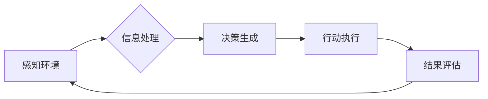

## 前言

在上一篇《00.intro.md》中，我们初步探讨了AI Agent的基本定义和应用场景。今天我想和大家深入聊聊构成AI Agent的核心概念——这些基础要素就像搭建乐高积木的原始模块，理解它们才能构建出真正智能的系统。🧱

::: tip
> "AI Agent不是魔法，而是由感知、思考、行动和记忆四大支柱精心构建的工程奇迹。"  
> —— 摘自《智能体系统设计原理》
:::

## 什么是AI Agent？

AI Agent本质上是一个能够**自主感知环境、做出决策并采取行动**的计算实体。与传统程序不同，Agent具有以下关键特征：

- **自主性**：无需人类持续干预即可运行 🤖
- **反应性**：能及时响应环境变化 📡
- **主动性**：能主动目标导向的行为 🎯
- **社交能力**：能与其他Agent或人类交互 🤝

## 核心组件解析

### 1. 感知模块（Perception Module）

这是Agent的"感官系统"，负责从环境中获取信息。常见实现方式包括：

```python
class PerceptionModule:
    def __init__(self, sensors):
        self.sensors = sensors  # 传感器列表
        
    def gather_data(self):
        # 从传感器收集原始数据
        pass
        
    def preprocess(self, raw_data):
        # 数据清洗与标准化
        pass
```

> 💡 实际应用中，感知模块可能融合计算机视觉、自然语言处理等多种技术。

### 2. 决策模块（Decision Module）

Agent的"大脑"，负责基于感知信息做出行动决策。主流架构包括：

| 架构类型       | 特点                          | 适用场景               |
|----------------|-----------------------------|----------------------|
| 规则引擎        | 基于预定义规则决策               | 结构化环境            |
| 强化学习        | 通过试错学习最优策略              | 动态环境              |
| 大语言模型      | 基于语义理解生成决策              | 复杂对话场景          |

### 3. 行动模块（Action Module）

将决策转化为实际操作的"执行系统"，包含：

- 动作规划（Action Planning）
- 资源分配（Resource Allocation）
- 执行监控（Execution Monitoring）

### 4. 记忆模块（Memory Module）

Agent的"经验库"，分为三种记忆类型：

1. **瞬时记忆**：当前会话的短期信息
2. **工作记忆**：任务相关的中间状态
3. **长期记忆**：持久化存储的知识与经验

## 工作流程示例

一个典型的Agent决策循环如下：



这个循环被称为**感知-行动循环**（Perceive-Act Cycle），是所有智能体的基础工作模式。

## 挑战与局限

虽然概念清晰，但实际构建Agent仍面临诸多挑战：

- **可解释性问题**：深度学习模型的"黑盒"特性 🤔
- **安全与对齐**：确保目标与人类价值观一致 🛡️
- **资源消耗**：复杂模型的高计算成本 💸
- **泛化能力**：在未见场景的适应性 🌍

## 结语

理解这些基础概念后，我们才能更深入地探讨Agent的架构设计、技术实现和实际应用。在后续文章中，我们将基于这些核心要素，逐步构建一个完整的AI Agent系统。

> "记住，每个伟大的AI系统都始于对基础概念的深刻理解。这些概念不是终点，而是通往真正智能的起点。" 🚀

---

*下期预告：《AI Agent技术栈：从感知到行动的全链路实现》*