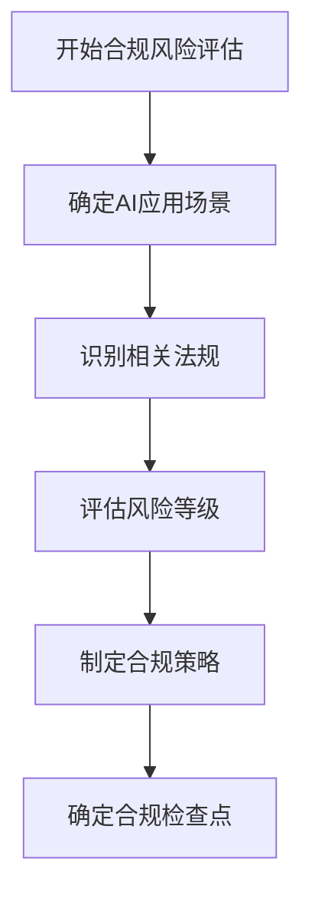

## 前言

随着人工智能技术的迅猛发展，AI-Agent已经从实验室走向各行各业，成为推动数字化转型的重要力量。然而，随之而来的监管挑战也日益凸显。欧盟的《人工智能法案》、中国的《生成式人工智能服务管理暂行办法》等法规相继出台，为AI系统的开发和应用划定了明确的边界。

作为一名AI开发者，我深知构建一个功能强大的AI-Agent只是第一步，确保它在法律和监管框架内合规运行，才是长期成功的关键。本文将深入探讨AI-Agent的监管与合规框架，帮助开发者构建既强大又合法的智能系统。

## 全球AI监管格局概览

AI监管正在全球范围内形成复杂而多元的格局。不同国家和地区基于各自的价值观、法律传统和产业需求，制定了各具特色的AI监管框架。

### 欧盟《人工智能法案》(AI Act)

欧盟的AI Act是全球首个全面的AI监管框架，它采用了风险分级的方法：

- **不可接受风险**：如社会评分、潜意识操作等，被完全禁止
- **高风险**：如关键基础设施、医疗、招聘等领域的AI系统，需满足严格的要求
- **有限风险**：如聊天机器人等，需明确告知用户正在与AI交互
- **最小风险**：如游戏AI、垃圾邮件过滤等，基本不受监管

对于AI-Agent开发者而言，如果您的系统涉及高风险应用，就需要特别注意数据质量、技术文档、人类监督等方面的合规要求。

### 中国的AI监管体系

中国采取了更加分类分级的监管方式：

- 《生成式人工智能服务管理暂行办法》针对生成式AI服务提出了内容安全、数据安全等要求
- 《个人信息保护法》对AI系统中个人信息的收集、使用、存储提出了严格规定
- 各行业主管部门也出台了针对特定领域的AI监管规定

中国的监管框架特别强调内容安全和意识形态安全，这对于开发面向中国市场的AI-Agent尤为重要。

### 美国的监管路径

美国目前采用的是行业特定和基于风险的监管方式，尚未出台全面的AI联邦立法：

- NIST AI RMF（人工智能风险管理框架）提供了自愿性的指导
- 各州正在制定自己的AI法规，如纽约市的AI招聘工具审计法
- 行业自律和行业标准也在发展中

美国的监管环境相对灵活，但企业仍需关注各州法规差异和行业标准。

## AI-Agent合规的关键要素

无论在哪个司法管辖区，AI-Agent的合规都需要关注以下几个关键要素：

### 数据治理与隐私保护

数据是AI-Agent的"燃料"，但数据的收集和使用必须符合隐私法规要求：

- **数据来源合法性**：确保训练数据和使用数据的获取有合法依据
- **数据最小化原则**：仅收集和使用必要的数据
- **用户知情同意**：明确告知用户数据收集的目的和范围
- **数据安全措施**：采取适当的技术和管理措施保护数据安全

```python
# 示例：数据收集合规检查代码片段
def collect_data(user_id, data_type, purpose):
    """
    合规数据收集函数
    参数:
        user_id: 用户标识
        data_type: 数据类型
        purpose: 收集目的
    返回:
        合规的数据收集结果
    """
    # 检查用户是否已同意数据收集
    if not user_consent_exists(user_id, data_type, purpose):
        raise ValueError("用户未同意数据收集")
    
    # 检查数据类型是否在允许范围内
    if data_type not in ALLOWED_DATA_TYPES:
        raise ValueError("不允许收集此类型数据")
    
    # 实际数据收集逻辑
    data = perform_data_collection(user_id, data_type)
    
    # 记录数据收集日志
    log_data_collection(user_id, data_type, purpose)
    
    return data
```

### 算法透明度与可解释性

监管机构越来越关注AI决策的透明度和可解释性：

- **文档记录**：详细记录AI系统的设计、训练和部署过程
- **决策解释**：能够以用户可理解的方式解释AI的决策过程
- **偏见检测**：定期检测和减轻算法中的偏见
- **性能监控**：持续监控AI系统的性能和决策质量

### 人类监督与控制机制

大多数AI监管框架都强调人类在AI系统中的最终决定权：

- **明确责任归属**：明确AI决策中人类和机器的责任边界
- **干预机制**：设计有效的人类干预机制，能够在必要时接管AI控制
- **错误纠正**：建立AI错误决策的纠正机制和流程

### 安全与鲁棒性

AI-Agent的安全性是监管的重点关注领域：

- **对抗性攻击防御**：防范针对AI系统的对抗性攻击
- **故障安全**：确保系统在异常情况下能够安全降级
- **持续安全评估**：定期进行安全评估和漏洞修复

## 构建合规AI-Agent的实践路径

### 第一步：合规风险评估

在AI-Agent开发初期，进行全面的风险评估：



### 第二步：合规设计

将合规要求融入AI-Agent的设计和开发过程：

- **隐私保护设计**：采用隐私增强技术，如差分隐私、联邦学习等
- **公平性设计**：在算法设计阶段就考虑公平性问题
- **透明度设计**：设计清晰的决策解释界面和流程
- **安全设计**：从架构层面考虑安全性，采用安全开发最佳实践

### 第三步：合规测试与验证

开发过程中和上线前，进行全面的合规测试：

- **隐私影响评估**：评估AI系统对个人隐私的影响
- **公平性测试**：测试AI系统在不同群体间的表现差异
- **安全测试**：进行渗透测试和安全评估
- **合规性验证**：验证系统是否符合相关法规要求

### 第四步：持续合规管理

AI-Agent上线后，需要建立持续的合规管理机制：

- **合规监控**：持续监控AI系统的合规表现
- **定期审计**：定期进行合规审计和评估
- **更新响应**：及时响应法规变化，更新合规措施
- **事件响应**：建立合规事件响应机制，及时处理合规问题

## 行业特定合规考量

不同行业的AI-Agent面临特定的合规要求：

### 医疗健康行业

- **医疗数据保护**：遵循HIPAA等医疗数据保护法规
- **临床验证**：需要严格的临床验证和审批
- **责任明确**：明确AI辅助诊断中的责任边界

### 金融行业

- **金融数据保护**：遵循金融行业数据保护规定
- **反洗钱合规**：确保AI系统符合反洗钱要求
- **风险管理**：建立AI系统的风险管理框架

### 自动驾驶领域

- **安全标准**：满足自动驾驶系统的安全标准
- **责任认定**：明确事故中的责任认定机制
- **数据记录**：建立完整的数据记录和回放系统

## 合规工具与资源

为帮助开发者构建合规AI-Agent，以下工具和资源可能有所帮助：

### 合规管理工具

- **ComplianceCheck**：开源的AI合规检查工具
- **RegTech AI**：AI监管技术平台
- **DataGovernance Studio**：数据治理和合规管理平台

### 标准与框架

- **NIST AI RMF**：美国国家人工智能风险管理框架
- **EU AI Act**：欧盟人工智能法案
- **ISO/IEC 42001**：AI管理体系标准

### 社区与支持

- **AI伦理与合规社区**：提供最新法规解读和合规实践
- **法律顾问服务**：专业AI法律咨询服务
- **行业联盟**：如Partnership on AI等提供行业最佳实践

## 未来展望

AI监管仍在快速发展中，未来可能出现以下趋势：

### 更加精细化的监管

随着AI技术的演进，监管框架将变得更加精细化，针对不同类型、不同应用场景的AI系统制定更加具体的监管要求。

### 国际协调与合作

各国监管机构之间的协调将加强，可能形成国际性的AI监管标准和框架，减少企业合规的复杂性。

### 技术驱动的合规

监管技术(RegTech)将发展，利用AI技术本身来监管AI系统，实现更高效、更智能的合规管理。

### 企业主动合规

随着合规意识的提高，企业将从被动应对监管转向主动合规，将合规视为竞争优势而非负担。

## 结语

构建合规的AI-Agent不仅是法律要求，更是企业社会责任的体现。在AI技术飞速发展的今天，合规不再是创新的障碍，而是确保AI技术健康、可持续发展的保障。

作为AI开发者，我们需要将合规思维融入AI生命周期的每一个环节，从设计、开发、部署到运维，始终将合规作为核心考量。只有这样，我们才能构建出既强大又负责任的AI-Agent，真正发挥人工智能技术的潜力，造福人类社会。

> "合规不是创新的终点，而是负责任创新的起点。在AI时代，合规能力将成为企业的核心竞争力。"