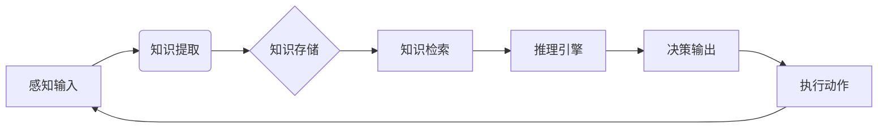

## 前言

大家好，我是Jorgen！最近在研究AI-Agent的过程中，我发现了一个有趣的现象：大多数文章都在讨论AI-Agent的架构设计、实现方法或应用场景，但很少有人深入探讨AI-Agent的"大脑"——知识管理与推理能力。🤔

想象一下，如果我们把AI-Agent比作一个人，那么知识管理就像是他的记忆系统，而推理能力则相当于他的思维过程。没有这两者，AI-Agent就只是一个空有外壳的"行尸走肉"罢了。今天，我想和大家聊聊这个被忽视但却至关重要的主题！

## 知识管理：AI-Agent的记忆系统

### 什么是知识管理？

知识管理是指AI-Agent如何获取、组织、存储、检索和应用知识的过程。简单来说，就是AI-Agent如何"记住"信息并在需要时找到它们。

::: tip
知识管理不是简单的数据存储，而是构建一个结构化、可查询、可推理的知识体系。
:::

### 知识表示方法

AI-Agent中常用的知识表示方法包括：

1. **符号表示**：使用逻辑、语义网络等符号系统表示知识
2. **向量表示**：将知识嵌入到高维向量空间中
3. **图表示**：使用知识图谱表示实体及其关系
4. **神经网络表示**：通过神经网络隐式编码知识

| 表示方法 | 优点 | 缺点 | 适用场景 |
|---------|------|------|---------|
| 符号表示 | 可解释性强，逻辑清晰 | 难以处理不确定性 | 规则明确的领域 |
| 向量表示 | 能捕捉语义相似性 | 可解释性差 | 大规模语义检索 |
| 图表示 | 结构直观，关系明确 | 构建复杂 | 实体关系丰富的领域 |
| 神经网络表示 | 能自动学习特征 | 黑盒问题 | 复杂模式识别 |

### 知识获取与更新

AI-Agent的知识不是一成不变的，它需要不断地获取新知识并更新现有知识：

- **从结构化数据中提取**：如数据库、API返回的结构化数据
- **从非结构化文本中学习**：使用NLP技术从文档、网页中抽取知识
- **通过与用户交互获取**：通过问答、对话获取领域知识
- **从多模态数据中学习**：结合文本、图像、音频等多种数据源

## 推理能力：AI-Agent的思维引擎

### 什么是推理？

推理是指AI-Agent基于已有知识推导出新知识或结论的过程。这是AI-Agent展现智能的关键所在。

::: theorem
推理能力是AI-Agent区别于传统程序的核心特征，它使AI-Agent能够处理未见过的情境并做出合理决策。
:::

### 推理类型

AI-Agent中常见的推理类型包括：

1. **演绎推理**：从一般规则推导出具体结论
   - 例如：所有鸟都会飞，企鹅是鸟，所以企鹅会飞（虽然这个结论不正确，但推理形式正确）

2. **归纳推理**：从具体实例中总结一般规律
   - 例如：见过的天鹅都是白色的，因此所有天鹅都是白色的

3. **溯因推理**：从结果推断可能的原因
   - 例如：草地湿了，可能是下雨了

4. **类比推理**：基于相似性进行推理
   - 例如：太阳系类似于原子，太阳类似于原子核

### 推理机制实现

实现AI-Agent推理机制的方法主要有：

1. **基于规则的推理**：使用专家系统和规则引擎
2. **基于统计的推理**：使用概率图模型、贝叶斯网络
3. **基于神经网络的推理**：使用神经网络模拟推理过程
4. **混合推理**：结合多种推理方法的优势

## 知识管理与推理的协同工作

知识管理和推理能力不是孤立的，它们需要协同工作才能发挥最大效能：

这种循环使AI-Agent能够不断学习和改进自己的知识库和推理能力。

## 实践案例：知识驱动的客服AI-Agent

让我们来看一个实际案例：一个智能客服AI-Agent如何利用知识管理和推理能力解决问题。

### 知识库构建

首先，我们需要构建一个包含以下内容的知识库：

1. **产品知识**：产品特性、规格、价格等
2. **常见问题解答**：用户常见问题及标准回答
3. **解决方案库**：历史问题的解决方案
4. **流程规则**：服务流程、升级规则等

### 推理流程

当用户提出问题时，AI-Agent的推理流程如下：

1. **问题理解**：使用NLP技术理解用户意图
2. **知识检索**：从知识库中相关信息
3. **推理匹配**：将用户问题与知识库中的模式匹配
4. **解决方案生成**：基于推理结果生成回答
5. **反馈学习**：根据用户反馈调整知识库和推理规则

### 优化策略

为了提高客服AI-Agent的性能，我们可以采用以下优化策略：

- **知识图谱构建**：构建产品知识图谱，增强实体关系理解
- **多轮对话推理**：支持上下文相关的推理
- **不确定性处理**：对不确定的推理结果给出置信度
- **持续学习**：从用户交互中不断更新知识库

## 挑战与未来展望

尽管知识管理与推理能力对AI-Agent至关重要，但仍面临诸多挑战：

1. **知识获取的瓶颈**：如何高效获取高质量知识
2. **推理的可解释性**：如何使推理过程透明化
3. **知识的时效性**：如何确保知识的及时更新
4. **常识推理**：如何让AI-Agent具备人类级别的常识推理能力

::: right
"未来的AI-Agent不仅是知识的容器，更是智慧的源泉。"
::未来，我认为AI-Agent的知识管理与推理能力将朝着以下方向发展：

- **神经符号融合**：结合神经网络的学习能力和符号系统的可解释性
- **自组织知识库**：AI-Agent能够自主构建和维护知识结构
- **跨领域推理**：在不同知识领域间建立联系并进行推理
- **元认知能力**：AI-Agent能够反思自己的推理过程并进行优化

## 个人建议

在构建具有强大知识管理和推理能力的AI-Agent时，我建议大家：

1. **从小处着手**：不要试图构建一个无所不包的知识库，而是专注于特定领域
2. **持续迭代**：知识库和推理机制需要不断优化和更新
3. **人机协作**：让人类专家参与知识库构建和验证
4. **重视可解释性**：确保推理过程能够被理解和解释

## 结语

知识管理与推理能力是AI-Agent的"大脑"，决定了AI-Agent的智能水平和应用价值。随着技术的不断发展，我们有理由相信，未来的AI-Agent将拥有更强大的知识管理和推理能力，成为真正的智能伙伴。

希望今天的分享能让大家对AI-Agent的知识管理与推理能力有更深入的理解。如果你有任何想法或问题，欢迎在评论区交流！让我们一起探索AI-Agent的无限可能！🚀

> "知识是AI-Agent的基础，推理是AI-Agent的灵魂，两者的结合将创造出真正的智能。"