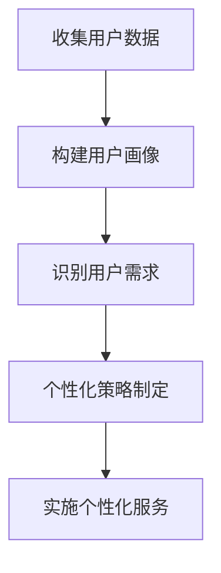

## 前言

在AI技术飞速发展的今天，我们见证了从通用AI到专用AI的转变历程。作为一名长期关注AI-Agent发展的技术爱好者，我常常思考：为什么有些AI-Agent能够迅速融入我们的工作流，而另一些则显得格格不入？~~答案可能不是技术不够先进，而是它们缺少了一点"人情味"~~。没错，我说的就是个性化与定制化能力！

::: tip
"真正的智能不在于知道所有答案，而在于理解每个问题的独特之处。"
:::

在本文中，我将深入探讨AI-Agent的个性化与定制化能力，这一常常被忽视却至关重要的特性。🚀

## 个性化与定制化的概念与重要性

### 什么是AI-Agent的个性化与定制化？

AI-Agent的个性化与定制化是指系统能够根据不同用户的需求、偏好、使用习惯和特定场景，自动调整其行为、交互方式和功能输出，提供更加贴合用户需求的智能服务。

在我看来，这就像是为每位用户量身定制的"数字管家"：
- **个性化**：理解用户的独特需求、偏好和风格
- **定制化**：根据用户反馈和使用场景调整功能和服务

### 为什么个性化如此重要？

1. **提升用户体验** 🌟
   - 个性化的AI-Agent能够提供更符合用户期望的服务
   - 减少用户适应新系统的学习成本

2. **增强用户黏性** 📈
   - 当AI-Agent能够记住用户偏好并提供一致体验时，用户更愿意长期使用
   - 个性化是提高用户留存率的关键因素

3. **提高工作效率** ⚡
   - 定制化的工作流程可以减少重复性操作
   - 适应特定行业和岗位的需求，提供专业化的辅助

## 实现个性化的技术方法

### 用户画像与需求分析

构建精准的用户画像是实现个性化的第一步：



我在实践中发现，有效的用户画像应该包括：
- 基本信息（职业、技能水平等）
- 使用习惯（常用功能、使用时间等）
- 偏好设置（界面风格、交互方式等）
- 历史行为（操作记录、反馈等）

### 动态适应机制

AI-Agent需要具备动态适应能力，这包括：

1. **实时学习** 🧠
   - 在用户使用过程中持续学习用户偏好
   - 根据新的使用数据调整行为模式

2. **情境感知** 🌐
   - 理解当前使用场景（工作、休闲、学习等）
   - 根据场景调整交互方式和内容推荐

3. **反馈循环** 🔄
   - 建立有效的用户反馈机制
   - 根据用户反馈快速调整和优化

> "最好的个性化不是猜测用户想要什么，而是让用户告诉系统他们想要什么，然后系统学会倾听。"

## 定制化能力的关键组件

### 可配置的模块化架构

一个支持高度定制化的AI-Agent应该采用模块化设计：

```yaml
定制化组件:
  - 功能模块:
      - 可插拔的功能组件
      - 按需启用/禁用
  - 界面定制:
      - 布局调整
      - 主题切换
      - 显示内容控制
  - 交互方式:
      - 语音/文本切换
      - 交互风格选择
      - 响应速度调整
```

### 用户自定义工作流

允许用户根据自己的工作习惯创建自定义工作流是高级定制化的体现：

1. **工作流设计器** 🎨
   - 可视化拖拽界面
   - 预设模板库
   - 保存和分享工作流

2. **自动化规则引擎** ⚙️
   - 条件-动作规则设置
   - 定时任务配置
   - 触发机制定义

3. **个性化推荐** 💡
   - 基于用户行为的功能推荐
   - 智能提示和引导
   - 情境相关的内容推荐

### 多层次定制策略

我认为有效的定制化应该提供多层次的选择：

| 层级 | 描述 | 示例 |
|------|------|------|
| 基础层 | 界面和基本功能设置 | 主题选择、布局调整 |
| 中间层 | 工作流程和交互方式 | 自定义命令、快捷键 |
| 高级层 | 逻辑和行为模式 | 自定义规则、算法选择 |
| 专家层 | 底层参数和模型配置 | 模型微调、参数调整 |

## 挑战与解决方案

### 数据隐私与个性化平衡

**挑战**：个性化需要收集用户数据，但用户越来越关注隐私保护。

**解决方案**：
- 采用本地计算和边缘计算减少数据传输
- 实施差分隐私技术保护用户数据
- 提供透明的数据使用说明和用户控制选项

### 个性化算法的公平性

**挑战**：个性化算法可能强化偏见或造成"信息茧房"。

**解决方案**：
- 定期审计算法决策过程
- 引入多样性指标确保推荐多样性
- 提供多种视角和选项，避免单一化

### 定制化复杂度管理

**挑战**：过度定制化可能增加用户认知负担。

**解决方案**：
- 采用渐进式引导，简化定制流程
- 提供智能推荐和预设模板
- 设计直观的撤销和重做功能

## 未来展望

### AI-Agent的个性化演进

我相信AI-Agent的个性化将朝着以下方向发展：

1. **超个性化** 🌟
   - 基于深度用户理解的定制化
   - 预测性服务，在用户提出需求前主动提供帮助

2. **情感智能融合** 💝
   - 理解和适应用户的情绪状态
   - 提供情感共鸣的交互体验

3. **跨平台一致性** 🔄
   - 在不同设备和场景间保持一致的个性化体验
   - 无缝切换，不丢失个性化设置

### 行业应用前景

个性化AI-Agent在各行业的应用前景广阔：

- **医疗健康**：根据患者病史和生活习惯提供个性化健康建议
- **教育培训**：适应不同学习风格和进度的个性化学习路径
- **金融服务**：基于用户财务状况和目标的个性化理财建议
- **零售电商**：根据购买历史和偏好提供个性化推荐

## 结语

在AI-Agent日益普及的今天，个性化与定制化能力不再是锦上添花，而是核心竞争力。它不仅关乎用户体验，更决定了AI-Agent能否真正融入我们的工作和生活。

作为开发者和使用者，我们需要认识到：最好的AI-Agent不是功能最强大的，而是最能理解并适应我们独特需求的。未来的AI-Agent将不再是冷冰冰的工具，而是能够与我们共同成长、不断学习的智能伙伴。

::: right
"技术的终极目标不是取代人类，而是放大人类的潜能。"
::>

希望本文能够帮助大家更好地理解和实现AI-Agent的个性化与定制化能力。如果你有任何想法或经验分享，欢迎在评论区留言交流！让我们一起探索AI-Agent的无限可能！🚀