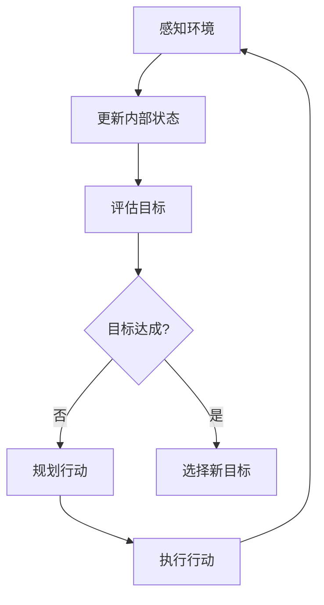
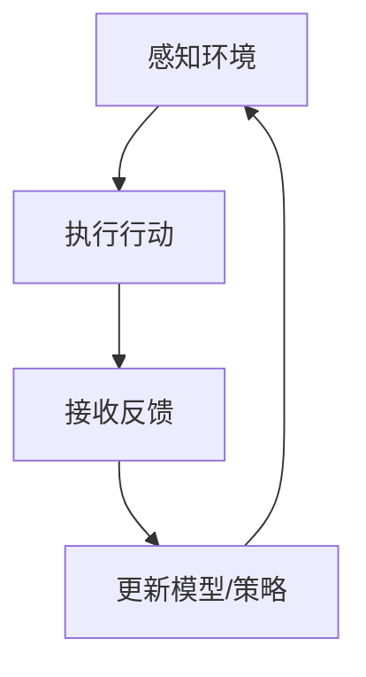
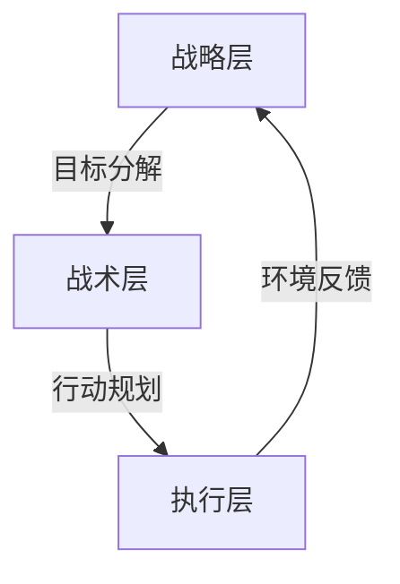
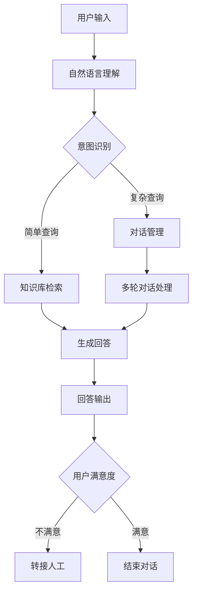

## 前言

大家好，我是Jorgen！在之前的文章中，我们已经了解了AI Agent的基础概念和构建智能体的核心要素。今天，我想和大家深入探讨另一个关键话题——AI Agent的架构设计。🏗

想象一下，如果我们把AI Agent比作一座建筑，那么核心要素就是砖瓦、水泥等建筑材料，而架构设计则是这座建筑的蓝图和结构。没有合理的架构，即使有最好的材料，也难以建造出稳固而高效的智能体。

::: tip
"架构是AI Agent的灵魂，它决定了智能体如何思考、感知和行动。"
:::

## 什么是AI Agent的架构？

AI Agent的架构是指定义智能体如何组织其组件、处理信息和执行决策的结构化框架。它就像是智能体的"神经系统"，连接感知、思考、学习和行动等各个部分。

一个良好的架构设计应该具备以下特点：

- **模块化**：各组件职责明确，便于维护和扩展
- **可扩展性**：能够适应新的环境和任务需求
- **鲁棒性**：在面对不确定性和噪声时仍能保持稳定性能
- **效率**：优化计算资源使用，实现实时响应

## 主流AI Agent架构类型

### 1. 反应式架构

反应式架构是最简单的Agent架构类型，它基于"感知-行动"循环，不包含复杂的内部状态表示。


**优点**：
- 响应速度快
- 实现简单
- 计算资源需求低

**缺点**：
- 适应性有限
- 无法处理复杂决策
- 缺乏学习和记忆能力

**适用场景**：简单环境、实时性要求高的任务

### 2. 基于目标的架构

这种架构在反应式基础上增加了目标管理组件，Agent能够根据目标规划行动序列。



**优点**：
- 具有目标导向行为
- 能够规划多步行动
- 更好的适应性

**缺点**：
- 规划过程可能消耗大量计算资源
- 目标设定可能不够灵活

**适用场景**：需要规划的任务、复杂环境导航

### 3. 基于效用的架构

基于效用的架构引入了效用评估机制，Agent能够量化不同行动的价值，从而做出最优决策。


**优点**：
- 能够在不确定性下做出最优决策
- 可以权衡多个目标和约束
- 更灵活的决策机制

**缺点**：
- 效用函数设计复杂
- 评估过程可能计算密集

**适用场景**：资源受限环境、多目标优化问题

### 4. 基于学习的架构

这类架构结合了机器学习技术，Agent能够从经验中学习和改进。



**优点**：
- 具有自学习和适应能力
- 能够处理复杂和高维环境
- 随着时间推移性能提升

**缺点**：
- 需要大量训练数据
- 学习过程可能不稳定
- "黑盒"特性导致可解释性差

**适用场景**：动态环境、长期任务、需要持续优化的场景

## 混合架构设计

实际应用中，单一的架构往往难以满足所有需求，因此混合架构设计变得越来越流行。混合架构结合了多种架构的优点，例如：

- **反应式+基于目标**：快速响应紧急情况，同时保持长期目标
- **基于效用+基于学习**：利用学习优化效用函数，提高决策质量
- **分层架构**：高层进行战略规划，低层执行具体行动

### 分层架构示例



在这种架构中：
- **战略层**：负责长期规划和目标设定
- **战术层**：将战略目标分解为可执行的子任务
- **执行层**：直接与环境交互，执行具体行动

## 架构设计最佳实践

### 1. 明确需求与场景

在设计架构前，首先要明确：
- Agent需要完成什么任务？
- 工作环境的特点是什么？
- 有哪些资源和约束？
- 期望的性能指标是什么？

### 2. 模块化设计

将Agent划分为清晰的模块，每个模块负责特定功能：

| 模块 | 功能 | 示例技术 |
|------|------|---------|
| 感知模块 | 环境信息获取 | 计算机视觉、自然语言处理 |
| 决策模块 | 制定行动计划 | 规划算法、强化学习 |
| 执行模块 | 行动实施 | 控制系统、API调用 |
| 学习模块 | 知识获取与更新 | 监督学习、无监督学习 |
| 记忆模块 | 信息存储与检索 | 数据库、向量存储 |

### 3. 接口标准化

确保模块间接口清晰、标准化，便于替换和升级：

```python
class AgentInterface:
    def perceive(self, environment_data):
        """感知环境"""
        pass
    
    def decide(self):
        """做出决策"""
        pass
    
    def act(self, action):
        """执行行动"""
        pass
```

### 4. 容错与恢复机制

设计健壮的错误处理和恢复机制，确保系统在异常情况下仍能正常运行：

```python
def execute_action(action):
    try:
        result = action.execute()
        return result
    except Exception as e:
        log_error(e)
        # 执行恢复操作或备选方案
        return execute_fallback_action()
```

## 实际案例：智能客服系统架构

让我们以一个智能客服系统为例，看看架构设计在实际中的应用：

### 系统需求
- 理解用户自然语言查询
- 提供准确、有帮助的回答
- 处理复杂、多轮对话
- 在无法回答时优雅转接人工

### 架构设计



### 关键组件

1. **自然语言理解模块**：
   - 使用预训练语言模型（如BERT）进行文本理解
   - 实现意图识别和实体提取

2. **对话管理模块**：
   - 维护对话状态
   - 管理对话流程
   - 处理上下文信息

3. **知识库模块**：
   - 结构化知识存储
   - 语义检索系统
   - 答案生成组件

4. **学习模块**：
   - 记录用户反馈
   - 持续优化回答质量
   - 扩充知识库

## 结语

AI Agent的架构设计是构建智能系统的核心环节，它直接决定了Agent的能力边界和性能表现。今天，我们了解了不同类型的架构设计及其适用场景，也探讨了混合架构和分层设计的优势。

在实际项目中，没有"一刀切"的完美架构，最适合的架构取决于具体的需求和环境条件。记住，架构设计是一个迭代过程，随着需求变化和技术进步，我们需要不断调整和优化Agent的架构。

> "好的架构不是一蹴而就的，而是随着系统成长而演化的艺术。"

希望这篇文章能够帮助大家在构建AI Agent时做出更好的架构决策。如果你有任何问题或想法，欢迎在评论区留言交流！我们下次再见！👋

---

*注：本文仅代表个人观点，欢迎讨论与指正。*