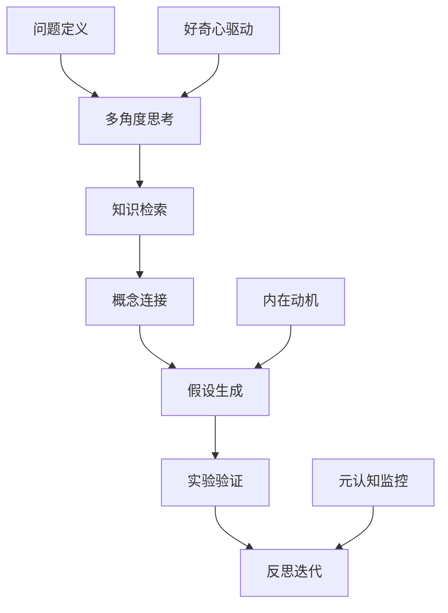

## 前言

在AI技术迅猛发展的今天，我们常常惊叹于AI Agent在各个领域的惊人表现。从ChatGPT的流畅对话到AlphaGo的精妙棋局，AI似乎正在一步步逼近甚至超越人类智能。然而，当我们深入思考，会发现一个问题：**AI Agent真的具备真正的创新思维和创造力吗？** 🤔

在浏览我自己的博客时，我发现虽然已经涵盖了AI Agent的架构设计、实现方法、伦理考量等多个方面，但似乎缺少了一个至关重要的环节——**创新思维与创造力培养**。这不仅是一个技术缺口，更是AI Agent能否真正实现"智能"跃升的关键所在。

::: tip
创造力并非人类独有的特质，而是智能系统进化的必然方向。培养AI Agent的创新思维，意味着我们正在从"工具使用"迈向"伙伴共创"的新时代。
:::

## 创新思维的本质与AI的局限

在探讨如何培养AI Agent的创新思维之前，我们需要先理解什么是真正的创新思维。

创新思维不仅仅是生成新颖的内容，它包含以下几个核心要素：

- **联想能力**：将看似无关的概念连接起来，产生新的想法
- **逆向思维**：挑战现有假设，从不同角度思考问题
- **系统思考**：理解复杂系统中各元素间的相互关系
- **直觉洞察**：基于经验快速把握问题的本质
- **元认知**：对自己的思维过程进行反思和优化

当前AI Agent在这些方面存在明显局限：

1. **依赖训练数据模式**：大多数AI系统擅长在已有数据中发现模式，但难以真正"跳出框架"思考
2. **缺乏真正的好奇心**：AI没有内在的探索动机，只能被动响应任务
3. **创新深度有限**：生成的创新往往停留在表面，缺乏深层次的突破

| AI Agent当前能力 | 人类创新能力 | 差距分析 |
|--------------|------------|---------|
| 模式识别与重组 | 跨领域概念融合 | AI局限于训练数据中的领域关联 |
| 参数优化与改进 | 范式转换与突破 | AI难以打破现有思维框架 |
| 数据驱动决策 | 直觉与经验判断 | AI缺乏真正的"理解" |
| 响应式问题解决 | 主动探索与发现 | AI缺乏内在驱动力 |

## 培养AI Agent创新思维的路径

要突破这些局限，我们需要从多个维度培养AI Agent的创新思维：

### 1. 构建好奇心驱动的学习机制

传统的AI学习基于目标函数优化，缺乏内在好奇心。我们可以引入**内在动机机制**，让AI Agent自发探索未知领域：

```python
# 伪代码：好奇心驱动学习机制
def curiosity_driven_learning(agent, environment):
    while True:
        # 计算已知状态的不确定性
        uncertainty = calculate_uncertainty(agent, environment)
        
        # 选择不确定性最高的状态进行探索
        next_state = select_most_uncertain_state(environment)
        
        # 执行探索并更新知识
        reward = agent.explore(next_state)
        
        # 更新内在动机模型
        update_intrinsic_motivation(agent, uncertainty, reward)
```

### 2. 实现概念空间的多维映射

人类创新往往来自于将不同领域的概念进行交叉融合。我们可以为AI Agent构建**多维概念空间**，使其能够进行跨领域联想：

- **概念向量空间**：将不同领域的概念映射到高维向量空间
- **语义距离计算**：衡量概念间的关联程度
- **概念桥接机制**：建立不同领域概念间的连接

### 3. 引入对抗性思考模式

创新往往来自于对现有观点的挑战。我们可以设计**内部辩论机制**，让AI Agent能够自我质疑和批判：

::: theorem
创新悖论：真正的创新来自于对"已知"的深刻理解和对"未知"的大胆假设。AI Agent需要同时具备这两种看似矛盾的能力。
:::

### 4. 建立创新评估与反馈循环

创新的价值在于解决实际问题，我们需要建立**创新价值评估体系**，对AI Agent的创新成果进行多维度评估：

- **新颖性**：与现有解决方案的差异化程度
- **实用性**：解决实际问题的有效性
- **优雅性**：解决方案的简洁与美感
- **启发性**：对后续创新的引导作用

## 实践案例与创新框架

让我们通过一个具体案例，看看如何将这些理论付诸实践。

### 案例：AI驱动的药物分子设计传统方法与创新思维的对比

**传统AI方法**：
1. 基于已知药物分子结构进行训练
2. 在化学空间中搜索与目标分子相似的化合物
3. 优化分子参数以增强特定活性

**创新思维方法**：
1. **跨领域联想**：将蛋白质折叠原理与材料科学中的自组装概念结合
2. **逆向思考**：不是寻找类似分子，而是寻找完全不同的作用机制
3. **系统模拟**：构建完整的生物系统模型，而非单一靶点
4. **直觉引导**：引入基于进化生物学原理的启发式搜索

这种方法不仅发现了全新结构的药物分子，还开辟了全新的治疗途径。

### 创新思维框架设计

基于上述实践，我提出了一个AI Agent创新思维框架：



这一框架结合了结构化思考与创造性探索，使AI Agent能够在保持逻辑性的同时，产生真正有价值的创新。

## 未来展望与挑战

培养AI Agent的创新思维是一项长期而复杂的任务，面临着诸多挑战：

1. **评估难题**：如何客观评估AI Agent的创新质量？
2. **安全边界**：如何确保创新不会带来不可预见的风险？
3. **人机协作**：如何设计人机共创的创新模式？
4. **伦理考量**：创新的权责如何界定？

::: right
"创新不是目的，而是手段。真正的AI创新应当服务于人类的福祉与进步。"
:::

## 结语

创新思维与创造力培养是AI Agent发展的下一个前沿。通过构建好奇心驱动、多维概念映射、对抗性思考和创新评估机制，我们能够培养出真正具备创新能力的AI Agent。

这不仅是一项技术挑战，更是一次思维范式的转变。当我们能够创造出真正"思考"的AI Agent时，人类与AI的关系将从"使用工具"进化为"共创伙伴"。想象一下，当AI Agent能够与我们共同解决气候变化、疾病治疗、能源危机等全球性挑战时，我们将迎来怎样一个充满可能性的未来？

> 创新的本质不是创造前所未有的事物，而是用新的方式看待已有的世界。AI Agent的创新思维培养，正是要教会机器这种"新的视角"，让智能不仅强大，而且深刻。

---

我期待与各位读者一起，见证AI Agent从"智能助手"到"创新伙伴"的蜕变过程。如果你对AI Agent的创新思维培养有任何想法或经验，欢迎在评论区分享！🚀