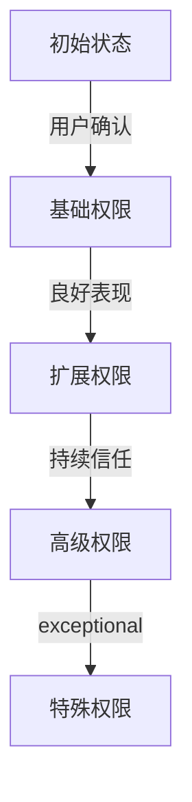

## 前言

随着AI-Agent技术的飞速发展，我们见证了一个个智能体从概念走向现实，从实验室走向应用场景。从简单的任务助手到复杂的决策支持系统，AI-Agent正在逐步改变我们的工作与生活方式。然而，随着能力的增强，一个至关重要的问题浮出水面：**如何确保这些日益强大的智能体在安全、可控的边界内运行？**

> "智能体的能力越强，其边界管理的重要性就越突出。没有边界控制的强大AI，就像没有方向盘的赛车，潜力无限却也危险无限。"

在本文中，我将深入探讨AI-Agent的边界管理与控制机制，这一确保智能体安全可控运行的核心保障。

## 什么是AI-Agent的边界管理

AI-Agent的边界管理是指通过技术手段和策略设计，明确并限制智能体的行为范围、能力边界和决策权限，确保其在预设的安全框架内运作的一系列机制。

### 边界管理的核心要素

::: theorem
边界管理包含三个核心要素：**能力边界**、**行为边界**和**伦理边界**。
:::

- **能力边界**：限制智能体可以执行的操作类型和复杂度，防止其超出设计能力范围
- **行为边界**：定义智能体在特定情境下的允许行为，防止不当或危险操作
- **伦理边界**：确保智能体的决策和行为符合人类价值观和伦理准则

## 为什么边界管理至关重要

### 1. 安全保障

随着AI-Agent能力的增强，缺乏边界控制可能导致严重的安全风险。例如，一个金融决策Agent如果没有明确的边界限制，可能会做出超出风险承受能力的投资决策。

### 2. 信任建立

用户只有相信AI-Agent会在安全边界内工作，才会放心使用。明确的边界管理是建立这种信任的基础。

### 3. 合规要求

在许多行业和地区，AI应用都有严格的合规要求。边界管理确保AI-Agent符合这些法规和标准。

### 4. 责任明确

当AI-Agent的行为受到明确边界限制时，其决策责任也更加清晰，有助于在出现问题时进行追责和改进。

## 边界管理的技术实现

### 1. 策略定义层

策略定义层是边界管理的基础，负责明确设定各类边界规则。

```python
# 边界策略示例
class BoundaryPolicy:
    def __init__(self):
        self.capability_boundary = {
            "max_operations": 10,
            "allowed_operations": ["query", "analyze", "suggest"],
            "max_complexity": "medium"
        }
        
        self.behavior_boundary = {
            "user_data_access": "read_only",
            "financial_decisions": "prohibited",
            "autonomous_actions": "limited"
        }
        
        self.ethical_boundary = {
            "fairness_threshold": 0.95,
            "privacy_protection": "strict",
            "transparency_level": "high"
        }
```

### 2. 实时监控层

实时监控层负责持续跟踪AI-Agent的行为，检测可能的边界违规。

```python
# 边界监控示例
class BoundaryMonitor:
    def __init__(self, policy):
        self.policy = policy
        self.violation_count = 0
        
    def check_operation(self, operation):
        if operation not in self.policy.capability_boundary["allowed_operations"]:
            self.violation_count += 1
            return False
        return True
    
    def check_complexity(self, complexity):
        max_complexity = self.policy.capability_boundary["max_complexity"]
        # 复杂度比较逻辑
        return complexity <= max_complexity
```

### 3. 动态调整层

动态调整层根据监控结果和上下文变化，实时调整边界限制。

```python
# 动态调整示例
class DynamicAdjuster:
    def __init__(self, base_policy):
        self.base_policy = base_policy
        self.current_policy = base_policy
        
    def adjust_boundaries(self, context, user_trust_level):
        # 根据上下文和用户信任级别动态调整边界
        if user_trust_level > 0.8 and context == "emergency":
            self.current_policy.behavior_boundary["autonomous_actions"] = "expanded"
        else:
            self.current_policy.behavior_boundary["autonomous_actions"] = "limited"
```

## 边界管理的最佳实践

### 1. 分层边界设计

采用分层边界设计，从基础到应用，层层递进：

- **系统层边界**：定义AI-Agent的基本运行环境限制
- **功能层边界**：针对特定功能模块的能力和行为限制
- **任务层边界**：针对具体任务场景的临时边界调整

### 2. 渐进式授权

采用渐进式授权机制，根据用户信任度和场景需求，逐步扩展Agent的边界权限：



### 3. 边界可视化

设计直观的边界可视化界面，让用户清晰了解AI-Agent当前的能力和行为限制：

```
[能力边界]
✓ 信息查询
✓ 数据分析
✓ 建议生成
✗ 系统操作
✗ 金融决策

[行为边界]
✓ 日常任务协助
✓ 信息提供
✗ 自动执行关键操作
✗ 代表用户做重大决定
```

### 4. 边界例外处理

设计合理的边界例外处理机制，在特殊情况下能够临时扩展边界，同时确保安全：

```python
class BoundaryExceptionHandler:
    def __init__(self, policy):
        self.policy = policy
        self.exceptions = []
        
    def request_exception(self, reason, duration, scope):
        # 评估例外请求
        if self._evaluate_exception_request(reason, duration, scope):
            self.exceptions.append({
                "reason": reason,
                "duration": duration,
                "scope": scope,
                "granted_time": datetime.now()
            })
            return True
        return False
    
    def _evaluate_exception_request(self, reason, duration, scope):
        # 例外评估逻辑
        return True  # 简化示例
```

## 边界管理的挑战与解决方案

### 1. 挑战：边界过于严格限制能力发挥

**解决方案**：采用自适应边界机制，根据Agent的表现和用户反馈动态调整边界宽度。初始设置较严格边界，随着信任建立和能力验证逐步放宽。

### 2. 挑战：边界过于宽松导致安全隐患

**解决方案**：实施"默认拒绝"原则，所有操作默认被禁止，只有明确允许的操作才能执行。同时建立多层次的边界检查机制。

### 3. 挑战：复杂场景下的边界定义困难

**解决方案**：采用基于场景的边界管理，针对不同应用场景定义专门的边界规则集，并通过机器学习不断优化这些规则。

### 4. 挑战：边界与用户体验的平衡

**解决方案**：设计透明的边界解释机制，让用户理解为什么某些操作被限制，并提供明确的升级路径，让用户能够根据需要主动扩展边界。

## 边界管理的未来趋势

### 1. 自适应边界系统

未来的边界管理系统将更加智能化，能够根据环境变化、用户需求和Agent表现自动调整边界设置，实现真正的动态平衡。

### 2. 跨平台边界互操作

随着AI-Agent生态系统的发展，不同平台和系统之间的边界互操作将成为关键，确保Agent在不同环境中保持一致的安全行为。

### 3. 边界即服务(Boundary-as-a-Service)

边界管理功能可能将作为一种独立服务提供给开发者，简化边界管理的实现复杂度，提高安全性和一致性。

## 结语

AI-Agent的边界管理与控制机制，是确保智能体安全可控运行的核心保障。随着AI技术的不断发展，边界管理的重要性将日益凸显。我们需要从技术实现、用户体验、伦理考量等多个维度，构建全面、灵活、智能的边界管理体系。

~~有人担心边界管理会限制AI-Agent的潜力，但事实恰恰相反，合理的边界管理是释放AI-Agent真正潜力的前提。~~ 只有在安全可控的框架内，AI-Agent才能真正发挥其价值，成为人类可靠的智能伙伴。

> "边界不是限制，而是AI与人类和谐共处的基础。正如风筝需要线才能飞得更高，AI-Agent需要边界才能真正展现其价值。"

通过本文的探讨，希望能为AI-Agent的边界管理提供一些思路和参考，共同推动AI技术的健康发展。

---

*本文由Jorgen原创，如需转载请注明出处*