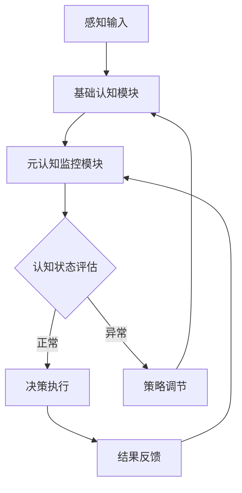

## 前言

在人工智能领域，我们常常关注AI-Agent的学习能力、推理能力和决策能力，却很少深入探讨一个更为本质的问题：AI-Agent如何"思考自己的思考"？随着AI系统变得越来越复杂和自主，元认知（metacognition）和自我反思能力正逐渐成为构建真正智能的关键要素。本文将深入探讨AI-Agent的元认知与自我反思能力，揭示这一前沿研究方向如何为智能系统带来质的飞跃。

::: tip
元认知，即"对认知的认知"，是指智能体对自身认知过程的理解、监控和调节能力。这种能力使AI-Agent能够意识到自己的知识状态、识别局限性、评估决策质量，并据此调整行为策略。
:::

## 元认知的概念与理论基础

### 什么是AI元认知？

AI元认知是指AI系统对自身认知过程进行监控、评估和调节的能力。与传统认知能力不同，元认知关注的是智能体如何"了解自己知道什么"、"知道自己不知道什么"，以及"如何改进自己的认知过程"。

### 元认知的理论基础

元认知的概念源于人类认知心理学，由Flavell在1979年首次提出。在AI领域，元认知理论基础包括：

1. **认知监控理论**：智能体能够监控自己的认知过程，识别认知偏差和错误。
2. **信念修正理论**：智能体能够根据新信息更新自己的信念模型。
3. **自主学习理论**：智能体能够根据自身表现调整学习策略和目标。

::: theorem
元认知能力是高级智能系统的标志，它使AI-Agent从"被动执行"转变为"主动思考"，从"固定程序"转变为"动态进化"。
:::

## AI-Agent元认知能力的架构设计

### 元认知架构的核心组件

一个具备元认知能力的AI-Agent通常包含以下核心组件：

1. **认知状态监控器**：实时监控智能体的内部状态，包括知识库、信念集、目标状态等。
2. **不确定性评估器**：评估智能体对特定问题的信心程度和不确定性水平。
3. **自我评估模块**：评估智能体决策和行动的质量，识别成功和失败的原因。
4. **策略调节器**：根据自我评估结果调整认知策略和学习方法。
5. **知识整合器**：整合新知识与现有知识，识别知识冲突和矛盾。

### 元认知架构的实现模式

目前，元认知架构主要有三种实现模式：

1. **分层式元认知架构**：将元认知功能与基础认知功能分离，形成两个层次。
2. **嵌入式元认知架构**：将元认知功能嵌入到基础认知过程中，形成统一的认知系统。
3. **混合式元认知架构**：结合分层式和嵌入式架构的优点，形成灵活的元认知系统。



## 自我反思机制的技术实现

### 自我反思的核心技术

自我反思是元认知能力的重要体现，主要涉及以下技术：

1. **内部状态可视化**：将智能体的内部状态（如知识表示、推理过程）转化为可理解的格式。
2. **决策轨迹分析**：记录和分析智能体的决策过程，识别关键决策点和影响因素。
3. **错误模式识别**：从历史数据中识别常见的错误模式和认知偏差。
4. **置信度估计**：量化智能体对特定决策或判断的信心程度。

### 自我反思的算法实现

以下是几种常见的自我反思算法：

#### 1. 贝叶斯自我评估

基于贝叶斯理论，智能体可以评估自身决策的后验概率：

```python
def bayesian_self_assessment(prior_belief, evidence, likelihood):
    """
    贝叶斯自我评估算法
    :param prior_belief: 先验信念
    :param evidence: 新证据
    :param likelihood: 似然函数
    :return: 更新后的信念和置信度
    """
    posterior = (likelihood * prior_belief) / sum(likelihood * prior_belief)
    confidence = max(posterior) - min(posterior)
    return posterior, confidence
```

#### 2. 元学习强化学习

元学习强化学习使智能体能够学习如何学习：

```python
class MetaCognitiveRL:
    def __init__(self):
        self.base_learner = BaseLearner()
        self.meta_learner = MetaLearner()
    
    def learn(self, state, action, reward, next_state):
        # 基础学习
        self.base_learner.update(state, action, reward, next_state)
        
        # 元认知评估
        performance = self.evaluate_performance()
        
        # 元学习调整
        self.meta_learner.adjust(performance)
        
        # 应用元学习结果
        self.apply_meta_learning()
```

## 元认知能力的评估与优化

### 评估指标

评估AI-Agent的元认知能力需要多维度指标：

1. **自我监控精度**：智能体对自身认知状态评估的准确性。
2. **错误识别率**：智能体识别自身错误的效率和准确性。
3. **策略调整有效性**：智能体调整策略后性能提升的程度。
4. **知识整合能力**：智能体整合新知识与现有知识的能力。
5. **不确定性量化能力**：智能体量化自身不确定性的准确性。

### 优化方法

提升AI-Agent元认知能力的方法包括：

1. **多任务元学习**：通过多样化任务训练元认知能力。
2. **人类反馈强化学习**：利用人类反馈指导元认知过程。
3. **认知偏差纠正**：识别和纠正常见的认知偏差。
4. **知识图谱增强**：构建结构化的知识表示，支持更精细的元认知。

## 应用场景与案例分析

### 智能医疗诊断

在医疗诊断领域，具备元认知能力的AI-Agent可以：

- 识别自身知识盲区，主动请求专家意见
- 评估诊断结果的不确定性，提供置信度指标
- 从诊断错误中学习，不断改进诊断模型

**案例**：某医院部署的元认知AI诊断系统，通过自我反思机制，将误诊率降低了32%，同时将需要人工复核的案例减少了45%。

### 自动驾驶系统

在自动驾驶领域，元认知能力可以帮助：

- 识别感知系统的不确定性，采取更保守的驾驶策略
- 从边缘案例中学习，提高系统鲁棒性
- 评估自身决策质量，持续优化驾驶策略

### 教育智能辅导系统

在教育领域，元认知AI-Agent可以：

- 评估学生对知识点的掌握程度
- 识别学生的学习困难和认知障碍
- 调整教学策略，提供个性化学习路径

## 挑战与未来展望

### 当前面临的挑战

1. **计算复杂度**：元认知过程增加了计算负担，需要高效的算法和硬件支持。
2. **评估标准**：缺乏统一的元认知能力评估标准和方法。
3. **知识表示**：如何有效表示和推理元认知知识仍是技术难点。
4. **伦理考量**：元认知系统的决策透明度和责任归属问题。

### 未来发展方向

1. **神经符号结合**：将神经网络与符号推理结合，实现更强大的元认知能力。
2. **群体元认知**：研究多个AI-Agent之间的元认知协作机制。
3. **跨域元认知**：开发能够跨领域应用的通用元认知框架。
4. **人机协同元认知**：探索人类与AI系统在元认知层面的协作模式。

## 结语

元认知与自我反思能力是AI-Agent从"工具"向"伙伴"转变的关键。通过赋予AI-Agent"思考自己思考"的能力，我们不仅能构建更加可靠、透明的智能系统，还能为AI的长期自主进化奠定基础。未来的AI-Agent，将不再是被动执行任务的程序，而是能够理解自己、评估自己、改进自己的智能伙伴。

> 正如著名认知科学家Donald Hoffman所言："意识不是大脑的副产品，而是宇宙中最基本的现实之一。"在AI领域，元认知能力或许正是我们迈向真正通用人工智能的关键一步。

---

希望这篇关于AI-Agent元认知与自我反思能力的博客能够为读者带来新的思考角度，也期待这一领域的研究能够取得更多突破性进展！