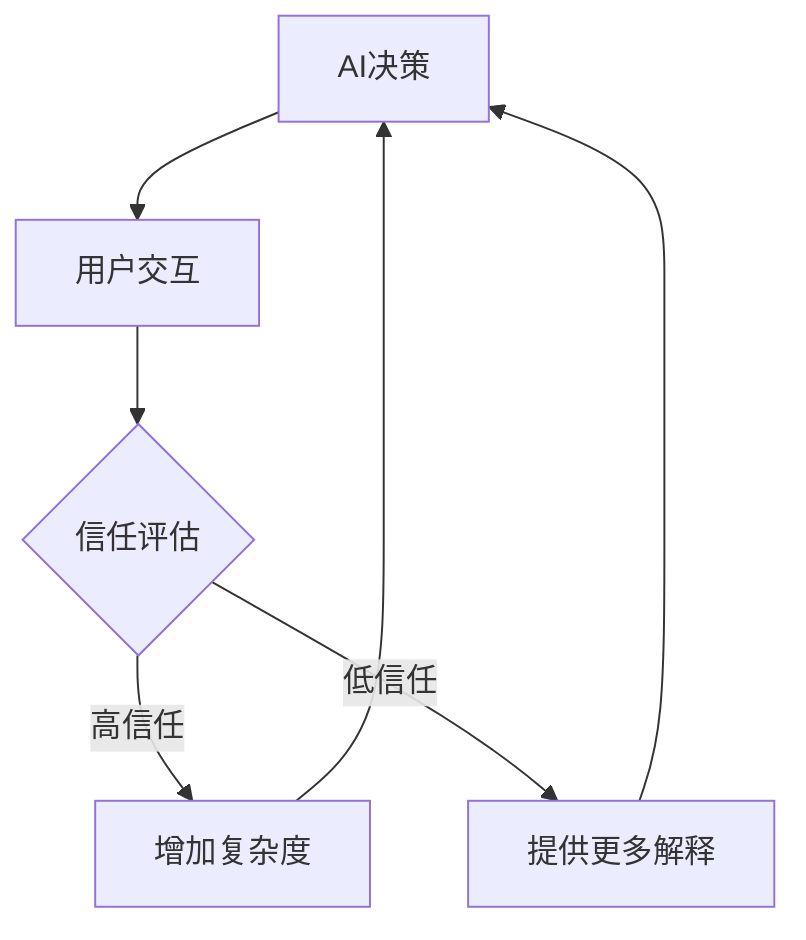

## 前言

随着AI-Agent越来越深入我们的生活和工作，我们不禁要问：我们真的能够信任这些智能系统吗？当我们的健康、财务甚至安全都依赖于AI决策时，信任问题变得尤为重要。🤔

> 信任是AI与人类之间最脆弱的纽带，也是最强大的桥梁。

在AI-Agent技术飞速发展的今天，我们常常过于关注其技术能力，却忽视了如何让用户真正信任这些系统。本文将探讨AI-Agent的信任建立机制以及如何理解用户心理模型，构建真正的人机互信关系。

## 信任：AI-Agent的基石

### 什么是AI-Agent的信任？

AI-Agent的信任是指用户对智能系统在特定情境下能够可靠、安全、符合预期地完成任务的信心。这种信任不是简单的"相信或不相信"，而是一个多维度、动态变化的复杂心理过程。

::: theorem
信任的三个维度：
1. **能力信任**：对AI系统技术能力的信任
2. **意图信任**：对AI系统动机和价值观的信任
3. **过程信任**：对AI系统决策过程的信任
:::

### 为什么信任如此重要？

缺乏信任的AI-Agent即使功能强大，也很难被用户广泛接受。研究表明，用户对AI系统的信任度直接影响其使用意愿、接受度以及长期依赖性。


## 用户心理模型：理解人类认知

### 什么是用户心理模型？

用户心理模型是用户对AI-Agent如何工作、如何做决策的内在理解和表征。这些模型可能基于用户过往经验、直觉或对AI技术的了解。

::: tip
用户心理模型往往与AI的实际工作机制存在差距，这种差距是导致误解和不信任的重要原因。
:::

### 常见的用户心理模型误区

1. **拟人化误区**：将AI视为有情感、意图的"人"
2. **透明度期望**：期望完全理解AI的决策过程
3. **控制幻觉**：高估自己对AI行为的控制能力
4. **能力边界误解**：不清楚AI能力的边界和限制

## 建立信任的策略与实践

### 提升透明度与可解释性

透明度是建立信任的第一步。AI-Agent应该：

- 明确告知用户其能力边界和限制
- 在做出重要决策时提供解释
- 承认不确定性，避免过度自信的表述

```python
# 透明度示例代码
class TransparentAI:
    def __init__(self):
        self.confidence_threshold = 0.8
        
    def make_decision(self, input_data):
        # 分析输入数据
        analysis = self.analyze(input_data)
        confidence = analysis['confidence']
        
        # 提供决策解释
        if confidence < self.confidence_threshold:
            explanation = f"我对这个决策的信心是{confidence:.0%}，因为{analysis['reasoning']}"
            return {
                'decision': None,
                'explanation': explanation,
                'confidence': confidence
            }
        else:
            return {
                'decision': analysis['result'],
                'explanation': f"基于{analysis['factors']}，我建议...",
                'confidence': confidence
            }
```

### 设计渐进式信任建立机制

信任不是一蹴而就的，而是需要时间培养：

1. **初始阶段**：提供简单、确定性的任务，建立基础信任
2. **发展阶段**：逐步增加任务复杂度，同时提供更多解释
3. **成熟阶段**：允许用户在监督下使用AI进行关键决策

### 适应不同用户的信任需求

不同用户对AI的信任需求各不相同：

- **技术专家**：关注技术细节和性能指标
- **普通用户**：关注易用性和结果可靠性
- **决策者**：关注风险控制和责任归属

::: right
"理解用户差异是建立有效信任的第一步。"
- 用户研究专家
:::

## 信任评估与持续改进

### 信任度量指标

如何量化用户对AI-Agent的信任度？可以考虑以下指标：

1. **使用频率**：用户使用AI-Agent的频率和持续时间
2. **依赖程度**：用户在多大程度上依赖AI的决策
3. **反馈质量**：用户提供的反馈质量和详细程度
4. **推荐意愿**：用户向他人推荐该AI-Agent的意愿

### 建立信任反馈循环



## 未来展望：人机互信的新范式

随着AI技术的发展，我们需要重新思考人机信任的本质：

1. **双向信任**：不仅用户信任AI，AI也需要"信任"用户
2. **情境化信任**：根据不同情境动态调整信任度
3. **集体信任**：建立社会层面的AI信任机制

## 结语

AI-Agent的信任建立与用户心理模型研究是一个跨学科的复杂领域，它结合了人工智能、心理学、人机交互等多个学科的知识。只有真正理解用户的心理需求，建立有效的信任机制，AI-Agent才能成为人类真正的智能伙伴，而非仅仅是工具。

> 信任不是技术问题，而是关系问题。AI-Agent的未来，取决于我们能否构建起人机之间真诚、可靠的关系。

---

**思考题**：在你使用AI-Agent的过程中，哪些因素增强了你的信任？哪些因素降低了你的信任？欢迎在评论区分享你的想法。