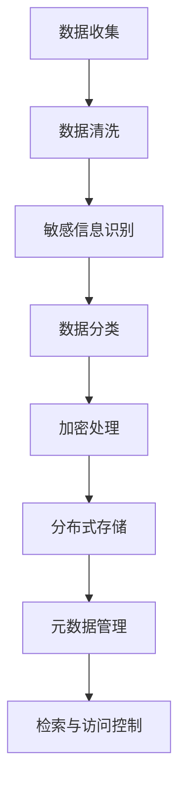

## 前言

在AI-Agent的开发与部署过程中，我们往往过于关注其"出生"（设计与开发）和"成长"（训练与优化），却很少思考它们的"退休"问题。🤔 就像人类一样，AI-Agent也有生命周期，当它们完成任务、性能下降或被新一代取代时，如何优雅地退役并妥善处理其产生的数据，是一个常常被忽视但至关重要的议题。

::: tip
"AI-Agent的退役不是终点，而是数据价值延续的新起点"
:::

随着AI技术的快速发展，企业和组织面临着日益增长的智能系统数量，这些系统在运行过程中积累了海量数据。如何确保这些数据在智能体退役后仍能合规使用、安全存储并发挥潜在价值，已成为AI治理的重要组成部分。今天，我想和大家聊聊这个既专业又实际的话题。

## AI-Agent退役的必要性

### 1. 技术迭代与系统更新

AI技术日新月异，新的模型、算法和架构不断涌现。就像我的智能手机一样，三年前的旗舰机型现在可能已经跟不上时代的步伐了。📱

```
AI-Agent生命周期曲线：
    ^
性能 |      /\
    |     /  \
    |    /    \___
    |___/
    +---------------->
      设计  成熟  退役
         使用期
```

当新一代AI-Agent出现，性能显著提升时，旧版本智能体就面临着退役的压力。不及时退役不仅会浪费计算资源，还可能因为技术过时而带来安全风险。

### 2. 成本控制与资源优化

AI-Agent的运行需要消耗大量计算资源，包括GPU/TPU、内存、存储空间等。根据我的经验，一个中等规模的AI-Agent每月的云服务成本可能高达数千甚至数万美元。💰

::: theorem
退役策略的经济效益
- 直接成本降低：减少计算资源占用，节省云服务费用
- 间接成本降低：减少维护工作量，降低安全风险
- 资源再利用：释放的计算资源可用于新项目
:::

### 3. 合规与法律要求

随着数据保护法规的日益严格，如GDPR、CCPA等，AI-Agent产生的数据需要在特定时间内妥善保存，之后则需安全销毁。不合规的数据处理可能导致严重的法律后果。⚖️

## 数据归档管理的核心挑战

### 1. 数据分类与敏感度评估

AI-Agent产生的数据种类繁多，包括：
- 训练数据
- 模型参数
- 交互日志
- 决策记录
- 用户反馈
- 性能指标

这些数据中，有些可能包含敏感信息，如个人身份信息、商业机密等。在归档前，必须进行准确分类和敏感度评估。

| 数据类型 | 敏感度 | 归档要求 | 保留期限 |
|---------|-------|---------|---------|
| 训练数据 | 高 | 加密存储 | 5-10年 |
| 模型参数 | 中 | 版本控制 | 永久 |
| 交互日志 | 中高 | 脱敏处理 | 3-7年 |
| 性能指标 | 低 | 结构化存储 | 1-3年 |

### 2. 技术实现与架构设计

构建一个高效的数据归档系统需要考虑多个技术层面：



### 3. 长期存储与可读性

数据归档不仅仅是存储，更重要的是确保未来能够正确读取和理解。这涉及到：
- 文档格式的标准化
- 元数据的完整性
- 读取工具的维护
- 技术债务的预防

## 实施AI-Agent退役与数据归档的最佳实践

### 1. 制定明确的退役策略

在AI-Agent设计之初，就应该考虑其退役计划。这包括：

- 明确的退役触发条件（性能指标、业务需求等）
- 预留的退役过渡期
- 数据归档的具体要求
- 相关人员的职责分工

### 2. 建立数据生命周期管理框架

一个完整的数据生命周期管理框架应包含以下阶段：

1. **数据创建**：明确数据来源和用途
2. **数据存储**：选择合适的存储介质和格式
3. **数据使用**：定义访问权限和使用规范
4. **数据共享**：控制数据共享的范围和方式
5. **数据归档**：长期保存策略
6. **数据销毁**：安全删除机制

### 3. 技术实现方案

#### 3.1 数据分类与标记系统

```
数据分类树：
├── 敏感数据
│   ├── 个人身份信息(PII)
│   ├── 商业机密
│   └── 法律相关数据
├── 半敏感数据
│   ├── 脱敏后的用户数据
│   ├── 模型参数
│   └── 性能指标
└── 公开数据
    ├── 公共模型
    ├── 学术数据
    └── 开源项目数据
```

#### 3.2 分布式归档存储架构

采用分层存储策略，根据数据访问频率和重要性选择不同的存储介质：

- 热数据：高性能SSD，快速访问
- 温数据：标准SSD/HDD，平衡性能与成本
- 冷数据：磁带或云归档存储，低成本长期保存

#### 3.3 版本控制与元数据管理

为每个AI-Agent及其数据建立完整的版本控制体系，记录：
- 模型版本历史
- 数据变更记录
- 归档操作日志
- 访问权限变更历史

### 4. 合规性与审计机制

建立完善的合规性检查和审计机制，确保：

- 定期合规性审查
- 自动化合规检查
- 异常访问监测
- 完整的操作日志

## 案例分析：某金融机构AI-Agent退役实践

让我们来看一个实际案例，某金融机构如何实施AI-Agent退役与数据归档管理。

### 背景

该机构部署了一个信用评估AI-Agent系统，运行5年后需要退役，代之以新一代基于深度学习的系统。

### 挑战

1. 处理超过10TB的历史交互数据
2. 确保符合金融行业监管要求
3. 保留必要数据用于未来审计
4. 在不中断服务的情况下完成过渡

### 解决方案

1. **数据分类**：将数据分为客户信息、交易记录、模型决策三类
2. **敏感处理**：对客户信息进行脱敏，保留必要的聚合统计
3. **分层归档**：热数据保留1年，温数据保留5年，冷数据永久保存
4. **版本控制**：建立完整的模型版本历史，支持回溯分析

### 成果

- 成功迁移100%必要数据
- 归档成本低于预期30%
- 完成时间比计划提前2周
- 通过了所有合规性审查

## 未来展望

随着AI技术的不断发展，AI-Agent的退役与数据归档管理将面临新的挑战和机遇：

### 1. 自动化归档系统

未来，我们可以期待更智能的自动化归档系统，能够：
- 自动识别数据类型和敏感度
- 智能推荐存储策略
- 自动执行合规检查

### 2. 区块链技术在数据归档中的应用

区块链技术可以为数据归档提供：
- 不可篡改的记录
- 完整的审计追踪
- 智能合约自动执行归档策略

### 3. 跨组织数据共享框架

随着AI协作的增多，建立跨组织的数据共享框架将成为趋势，这需要：
- 统一的数据标准
- 安全的数据交换机制
- 透明的使用追踪

## 个人建议

基于我的经验，以下是实施AI-Agent退役与数据归档管理的几点建议：

1. **提前规划**：在AI-Agent设计阶段就考虑退役计划，不要等到最后一刻才匆忙处理。

2. **技术投资**：投资建立专门的数据归档系统，不要简单地使用文件系统存储。

3. **人员培训**：确保团队成员理解数据归档的重要性和正确操作流程。

4. **定期审查**：建立定期审查机制，确保归档策略的有效性和合规性。

5. **持续改进**：根据技术和法规变化，持续优化归档策略和流程。

## 结语

AI-Agent的退役与数据归档管理，是AI生命周期管理中不可或缺的一环。它不仅关系到技术债务的管理，更涉及到合规性、安全性和数据价值的延续。通过建立完善的退役策略和数据归档框架，我们可以确保AI系统在全生命周期内的健康运行，为企业和组织创造持续价值。

> "优秀的AI治理不仅关注智能体的现在，更要规划它们的未来，包括它们的'退休'。"

希望今天的分享能为大家在AI-Agent的全生命周期管理中提供一些思路和启发。如果你有任何问题或经验分享，欢迎在评论区交流讨论！👇

---

*注：本文提到的案例和数据均为示例，实际实施时请根据具体情况进行调整。*