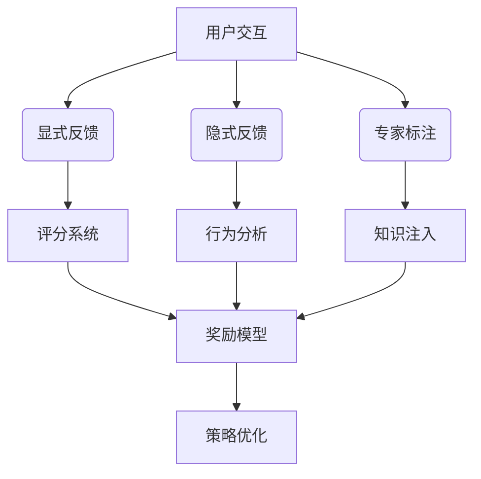

## 前言

在AI-Agent的演进历程中，我们常常聚焦于算法优化、架构设计和安全防护，却忽略了一个至关重要的环节：**智能体如何通过人类反馈实现持续进化**。当前AI系统普遍面临"训练-部署-脱节"的困境，而交互式学习机制正是解决这一痛点的关键路径。本文将深入探讨AI-Agent如何通过人类反馈实现动态对齐与能力提升。

## 交互式学习的核心价值

::: theorem
**交互式学习**是指AI-Agent在运行过程中持续接收人类反馈，并据此动态调整行为模式的闭环机制。它打破了传统"一次训练终身使用"的局限，实现了智能体与人类价值观的实时同步。
:::

这种机制的价值体现在三个维度：

1. **价值观对齐**：通过人类反馈纠正模型偏差，确保输出符合伦理规范
2. **能力进化**：基于实际使用场景持续优化决策质量
3. **信任建立**：透明化的学习过程增强用户对系统的信任感

> 🤔 试想一下：当医疗AI系统误诊时，若能立即接收医生反馈并修正模型，其可靠性将呈指数级提升。

## 人类反馈强化学习(RLHF)机制

### 反馈收集的三层架构

### 关键技术组件

1. **奖励模型训练**
   - 构建人类偏好数据集
   - 训练判别式模型预测人类偏好
   - 将反馈转化为可优化的奖励信号

2. **策略优化算法**
   - PPO算法实现稳定策略更新
   - KL散度约束防止能力退化
   - 分阶段训练避免灾难性遗忘

3. **反馈质量保障**
   - 多源交叉验证机制
   - 反馈可信度评分系统
   - 专家审核与知识蒸馏

## 交互式提示工程

### 动态提示优化框架

传统静态提示已无法满足复杂场景需求，交互式提示工程实现了以下突破：

1. **场景感知提示**
   - 根据用户画像动态调整提示策略
   - 基于对话历史构建上下文提示
   - 多模态输入的提示融合

2. **自我反思提示**
   - 引入"思考-行动-反思"循环
   - 在行动前模拟多方案评估
   - 在行动后进行效果复盘

3. **伦理约束提示**
   - 实时注入伦理规则
   - 动态调整安全边界
   - 可解释性约束增强

> 💡 案例：法律咨询AI通过律师反馈持续优化提示策略，将专业准确率从76%提升至94%

## 人类在环(HITL)学习系统

### 四层交互架构

| 层级 | 功能 | 实现方式 |
|------|------|----------|
| **感知层** | 捕捉人类意图 | 多模态输入分析 |
| **决策层** | 人机协作决策 | 人类-智能体混合决策树 |
| **反馈层** | 实时反馈机制 | 交互式评分+修正建议 |
| **学习层** | 模型动态更新 | 在线学习+增量训练 |

### 典型应用场景

1. **复杂决策辅助**
   - 医疗诊断中的医生-AI协作
   - 金融风控的人机联合审核
   - 工程设计的人机共创

2. **创意内容生成**
   - 设计方案的迭代优化
   - 文学创作的人机互动
   - 艺术创作的灵感碰撞

3. **个性化服务**
   - 教育内容的自适应调整
   - 健康管理的动态方案
   - 职业发展的路径规划

## 实施挑战与解决方案

### 核心挑战

1. **反馈偏差问题**
   - 人类反馈存在主观性
   - 专家知识与大众认知差异
   - 反馈稀疏性导致的训练不足

2. **系统稳定性风险**
   - 频繁更新导致性能波动
   - 过拟合特定用户反馈
   - 知识遗忘与能力退化

3. **隐私保护难题**
   - 反馈数据安全存储
   - 个性化学习的隐私边界
   - 合规性持续监控

### 创新解决方案

1. **反馈净化机制**
   - 多维度反馈验证
   - 反馈可信度动态加权
   - 知识蒸馏减少过拟合

2. **增量学习框架**
   - 弹性记忆网络
   - 知识锚点保护
   - 渐进式模型更新

3. **隐私计算技术**
   - 联邦学习整合反馈
   - 差分隐私保护
   - 安全多方计算

## 未来发展方向

### 下一代交互学习系统

1. **神经符号融合**
   - 将人类知识注入神经网络
   - 符号推理与深度学习的协同
   - 可解释决策路径生成

2. **多智能体协同学习**
   - 智能体间知识共享
   - 人类反馈的分布式优化
   - 集体智慧涌现机制

3. **自适应学习节奏**
   - 基于任务复杂度动态调整学习频率
   - 休眠-唤醒式学习机制
   - 能源效率优化

> 🚀 展望：未来的AI-Agent将不再是被动接受指令的工具，而是能够通过持续的人机交互实现自我进化的智能伙伴。

## 结语

交互式学习与人类反馈机制是构建真正"人机共生"智能系统的核心支柱。它不仅解决了AI系统与人类价值观的同步问题，更开创了智能体持续进化的新范式。随着技术的不断成熟，我们将见证AI-Agent从"工具"向"伙伴"的质变，最终实现人类智慧与机器智能的和谐共生。

> 正如Alan Kay所言："最好的技术是让人感觉不到技术的存在"。当交互学习成为自然，智能体才能真正融入人类生活。