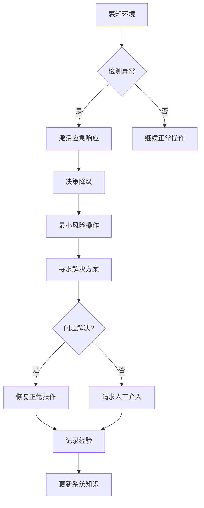

## 前言

作为一名长期关注AI-Agent技术发展的研究者，我一直对智能系统在面对突发状况时的表现感到既好奇又担忧。🤔 当我们的AI助手、自动驾驶汽车或医疗诊断系统遇到前所未见的异常情况时，它们会如何反应？是优雅降级，还是彻底崩溃？今天，我想和大家探讨一个在AI-Agent发展中至关重要但常被忽视的话题——应急响应与危机处理能力。

在过去的几年里，我们见证了AI技术的飞速发展，从简单的聊天机器人到能够自主决策的复杂系统。然而，大多数研究都集中在如何让AI变得更"聪明"，却很少关注它们如何在"犯错"时保持安全可控。事实上，一个真正可靠的智能系统，不仅要在正常情况下表现出色，更要在危机时刻展现出非凡的韧性。

> 正如航空安全领域的理念："安全不是没有事故，而是当事故发生时，系统能够最大限度地减少损害。"

## 为什么应急响应对AI-Agent至关重要？

### AI系统的脆弱性

我们常常被AI系统的强大能力所震撼，却忽视了它们内在的脆弱性。与人类不同，AI-Agent缺乏常识和直觉，在面对训练数据范围之外的情境时，可能会做出令人匪夷所思的决策。

想象一下，一个自动驾驶系统遇到从未见过的极端天气，或者一个医疗AI面对罕见的并发症，又或者一个金融交易算法遭遇市场闪崩。在这些情况下，如果没有适当的应急机制，后果可能是灾难性的。

### 风险的放大效应

AI-Agent通常不是孤立运行的，它们往往是复杂系统的一部分。一个小的故障可能会通过系统间的相互连接被迅速放大，引发连锁反应。例如，一个智能电网中的故障可能导致大面积停电，一个社交媒体推荐算法的异常可能引发信息传播的失控。

### 信任的建立与维护

用户对AI系统的信任不是建立在它们永远正确的基础上，而是建立在它们能够负责任地处理错误的基础上。一个能够在出错时透明地承认问题并采取有效措施的AI-Agent，比一个试图掩盖错误的系统更容易获得用户的信任。

## AI-Agent应急响应的核心机制

### 异常检测与识别

构建有效的应急响应系统，首先需要能够准确识别异常情况。这包括：

- **数据异常检测**：监控输入数据的质量和一致性，识别偏离预期的模式。
- **行为异常检测**：实时监控AI-Agent的行为，检测与预期轨迹的偏差。
- **环境异常检测**：感知外部环境的变化，识别可能影响系统性能的因素。

```python
# 伪代码：异常检测框架
def detect_anomalies(agent_state, environment_data):
    # 检测内部状态异常
    if agent_state.deviation_from_normal > THRESHOLD:
        return "internal_state_anomaly"
    
    # 检测输入数据异常
    if environment_data.quality_score < MIN_QUALITY:
        return "input_data_anomaly"
    
    # 检测环境变化异常
    if environment_data.unexpected_change:
        return "environmental_anomaly"
    
    return "normal"
```

### 决策降级策略

当检测到异常时，AI-Agent需要有明确的降级策略，从复杂决策模式切换到更保守、更安全的操作模式：

- **功能降级**：暂时禁用非核心功能，专注于基本任务。
- **简化决策**：使用更简单、更保守的决策算法。
- **人工介入请求**：在无法安全处理的情况下，请求人类专家介入。

### 恢复与学习机制

危机过后，系统需要能够从事件中学习并恢复：

- **根因分析**：确定导致危机的根本原因。
- **系统修复**：修复或绕过导致问题的组件。
- **知识更新**：将新经验整合到系统的知识库中，提高未来应对类似情况的能力。

## 实践案例：自动驾驶系统的应急响应

### 场景描述

想象一辆自动驾驶汽车在高速公路上行驶，突然遇到前方道路因事故完全封闭，而导航系统显示的唯一替代路线是一条狭窄的单行乡村道路，宽度不足以让车辆通过。

### 应急响应流程

1. **异常检测**：
   - 车辆传感器检测到前方道路被障碍物完全阻塞
   - 导航系统提供的替代路线与车辆尺寸不匹配
   - 系统判定为"无法执行导航指令"的异常状态

2. **决策降级**：
   - 暂停自动驾驶模式，切换到"最小风险操作"
   - 寻找最近的紧急停车区域
   - 向乘客发出明确指示和解释

3. **恢复措施**：
   - 停车后，重新评估周围环境
   - 尝试联系远程操作中心获取人工指导
   - 在无法获取帮助的情况下，等待救援

4. **学习与改进**：
   - 记录此次异常情况
   - 更新导航算法，增加对道路宽度限制的检查
   - 改进异常检测机制，提前识别潜在问题

### 技术实现要点



## 构建AI-Agent应急响应系统的挑战

### 预测未知未知

最大的挑战在于，我们无法预测所有可能的异常情况。与"已知未知"（我们知道我们不知道什么）不同，"未知未知"（我们不知道我们不知道什么）尤其难以应对。

### 平衡安全与功能

过于保守的应急响应可能导致系统在大多数情况下无法充分发挥其功能。如何在安全性和功能性之间取得平衡，是一个持续的挑战。

### 人类协作的复杂性

在需要人工介入的情况下，如何有效地将上下文信息传达给人类操作者，并理解人类的意图，仍然是一个开放的研究问题。

## 未来发展方向

### 自适应应急框架

未来的AI-Agent应该能够根据具体情境动态调整其应急响应策略，而不是依赖预定义的规则。这意味着系统需要具备更高的元认知能力，能够评估自身状态和外部环境，并选择最合适的应对策略。

### 多智能体协同应急

在复杂系统中，多个AI-Agent可以协同工作，共同应对危机。例如，在智能城市中，交通、能源和公共安全系统可以共享信息，协调应对大规模突发事件。

### 人机共生的应急系统

未来的应急系统将更加注重人机协作，AI-Agent负责快速处理常规异常，而人类专家专注于处理最复杂和最关键的情况。这种人机共生模式将充分发挥各自的优势。

## 结语

构建具备强大应急响应能力的AI-Agent，不是锦上添花，而是雪中送炭。随着AI系统在关键领域的应用日益广泛，确保它们能够在危机时刻保持安全可控，变得前所未有的重要。

我们追求的不仅是让AI变得更聪明，更是让它们变得更可靠、更值得信赖。应急响应与危机处理能力，正是实现这一目标的关键所在。

正如航空业通过不断完善安全系统，使飞行成为最安全的出行方式一样，我们也需要通过不断改进AI-Agent的应急机制，让智能系统成为人类可信赖的伙伴。

> "真正的智能不是永不犯错，而是在犯错时能够优雅地应对，并从中学习成长。" —— 这或许应该是我们设计AI-Agent应急系统的座右铭。

---

*本文仅代表个人观点，欢迎在评论区分享您的想法和经验！*