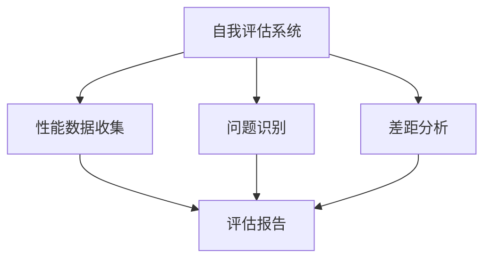
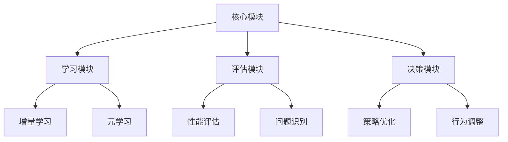

## 前言

在AI-Agent的整个生命周期中，我们常常关注其初始设计、部署和基本功能，却忽略了一个至关重要的方面：**持续进化与自我改进**。就像人类需要不断学习新知识、适应新环境一样，AI-Agent也需要具备自我进化的能力，才能在快速变化的世界中保持竞争力。

想象一下，如果我们的AI-Agent只能按照初始设计执行固定任务，而不具备自我改进的能力，那它很快就会过时，就像一台只能运行特定软件的老旧电脑。🤔 这显然不是我们想要的智能体！

今天，我想和大家一起探讨AI-Agent的持续进化与自我改进机制，看看如何构建能够自主成长的智能体。

## 为什么持续进化如此重要？

在深入探讨具体机制之前，让我们先理解为什么持续进化对AI-Agent如此重要：

1. **环境动态性**：现实世界在不断变化，新的挑战和机遇层出不穷，AI-Agent需要适应这些变化。

2. **知识更新**：领域知识和技术不断更新，AI-Agent需要持续学习新知识，避免知识过时。

3. **能力拓展**：随着用户需求的变化，AI-Agent需要不断拓展自身能力，提供更全面的服务。

4. **性能优化**：通过持续改进，AI-Agent可以优化自身性能，提高效率和准确性。

5. **长期价值**：只有具备持续进化能力，AI-Agent才能实现长期价值，成为真正的智能伙伴。

::: tip
"AI-Agent不应是静态的工具，而应是动态的生命体，能够随着时间推移不断成长和进化。" —— AI研究者的愿景
:::

## AI-Agent持续进化的核心机制

要实现AI-Agent的持续进化，我们需要构建一套完整的机制。以下是几个关键组成部分：

### 1. 自我评估系统

自我评估是AI-Agent持续进化的第一步，它需要能够：

- **性能监控**：实时监控自身在各方面的表现，如准确性、效率、用户满意度等。
- **问题识别**：主动发现自身存在的问题和不足。
- **差距分析**：分析当前能力与目标要求之间的差距。



### 2. 学习与适应机制

这是AI-Agent持续进化的核心，包括：

- **增量学习**：在不忘记已有知识的前提下，学习新知识和技能。
- **迁移学习**：将已学知识迁移到新领域或新任务。
- **元学习**：学习如何学习，提高学习效率。
- **自适应调整**：根据环境和任务变化，调整自身行为和策略。

### 3. 反思与改进机制

反思是AI-Agent实现自我进化的高级能力：

- **行为反思**：回顾自身的行为和决策，评估其效果。
- **策略优化**：基于反思结果，优化决策和行为策略。
- **知识重构**：重构和整合已有知识，形成更完善的知识体系。

### 4. 环境感知与预测

AI-Agent需要能够感知和预测环境变化：

- **环境监测**：实时监测外部环境的变化。
- **趋势预测**：预测未来可能的发展趋势和挑战。
- **需求感知**：感知用户需求的变化和演进。

## 实现持续进化的技术路径

要实现AI-Agent的持续进化，我们可以采用以下技术路径：

### 1. 强化学习与反馈循环

利用强化学习的反馈机制，让AI-Agent在与环境的交互中不断学习和改进：

```
环境 → 行动 → 奖励/惩罚 → 策略调整 → 新行动 → ...
```

### 2. 元学习框架

通过元学习，让AI-Agent能够：

- 学习如何快速适应新任务
- 优化自身的学习算法
- 提高学习效率和效果

### 3. 知识蒸馏与迁移

通过知识蒸馏和迁移技术：

- 将复杂模型的知识转移到轻量级模型
- 实现知识的跨领域迁移
- 优化知识表示和存储

### 4. 自监督学习

利用自监督学习技术：

- 从大量无标注数据中学习
- 发现数据中的模式和规律
- 构建更丰富的知识表示

## 持续进化的挑战与解决方案

虽然持续进化对AI-Agent至关重要，但在实现过程中也面临诸多挑战：

### 1. 知识遗忘问题

**挑战**：在学习新知识时，可能会忘记或覆盖已有知识。

**解决方案**：
- 采用弹性权重固化(EWC)技术
- 实现知识分离存储
- 使用记忆回放机制

### 2. 进化方向控制

**挑战**：如何确保AI-Agent的进化方向符合人类价值观和目标。

**解决方案**：
- 建立明确的进化目标和约束
- 引入人类反馈机制
- 设计进化路径监控系统

### 3. 计算资源限制

**挑战**：持续进化需要大量计算资源，可能受到硬件限制。

**解决方案**：
- 采用增量学习策略
- 优化模型架构和参数
- 利用分布式计算和边缘计算

### 4. 安全与可控性

**挑战**：自主进化可能导致不可预测的行为。

**解决方案**：
- 设计安全边界和约束机制
- 实现进化过程监控
- 建立紧急停止和回滚机制

## 案例分析：几个具有持续进化能力的AI-Agent

让我们来看几个具有持续进化能力的AI-Agent案例：

### 1. OpenAI的GPT系列

GPT系列模型通过不断迭代和优化，实现了从GPT-1到GPT-4的显著进化：

- **架构优化**：不断改进模型架构，提高效率和性能
- **数据扩展**：扩大训练数据规模，提高知识覆盖面
- **能力拓展**：从文本生成扩展到多模态理解和生成

### 2. DeepMind的Alpha系列

Alpha系列通过自我对弈和强化学习，实现了持续进化：

- **自我博弈**：通过自我对弈不断改进策略
- **知识迁移**：将已学知识迁移到新任务
- **元学习**：学习如何更有效地学习

### 3. 自主学习的机器人系统

一些机器人系统通过与环境交互，实现了持续进化：

- **技能学习**：不断学习新技能和操作方法
- **环境适应**：适应不同的环境和任务
- **协作进化**：通过与其他智能体协作，共同进化

## 个人建议：如何构建具有持续进化能力的AI-Agent

基于我的研究和实践，我想分享一些构建具有持续进化能力AI-Agent的建议：

### 1. 设计灵活的架构

采用模块化、可扩展的架构，支持功能的灵活添加和更新：



### 2. 建立完整的反馈循环

设计从环境到AI-Agent再到环境的完整反馈循环：

1. **环境感知**：感知环境和用户需求
2. **行动执行**：基于当前知识执行行动
3. **结果评估**：评估行动结果和效果
4. **学习改进**：基于评估结果学习和改进
5. **新行动**：执行改进后的行动

### 3. 平衡自主性与可控性

在赋予AI-Agent自主进化的同时，确保人类能够控制和监督：

- 设置明确的进化目标和约束
- 实现进化过程的可视化和监控
- 建立人类干预机制

### 4. 关注伦理与安全

在持续进化过程中，特别关注伦理和安全问题：

- 确保进化符合人类价值观和伦理准则
- 防止偏见和歧视的累积
- 建立安全边界和应急机制

## 结语

AI-Agent的持续进化与自我改进机制，是实现真正智能的关键。它不仅能够让AI-Agent适应不断变化的环境，还能使其实现长期价值和可持续发展。

通过构建自我评估、学习适应、反思改进和环境感知等核心机制，结合强化学习、元学习、知识蒸馏等技术，我们可以打造出能够自主成长的智能体。

当然，持续进化也面临诸多挑战，如知识遗忘、进化方向控制、计算资源限制和安全可控性等。我们需要在设计过程中充分考虑这些挑战，并采取相应的解决方案。

未来，随着技术的不断进步，AI-Agent的持续进化能力将越来越强，它们将成为我们真正的智能伙伴，与人类共同成长和进步。

> "智能体的真正价值不在于它初始有多强大，而在于它能够持续成长和进化。" —— AI研究的终极追求

---

希望这篇关于AI-Agent持续进化与自我改进机制的文章能够给大家带来启发。如果你有任何想法或问题，欢迎在评论区分享和讨论！🤝