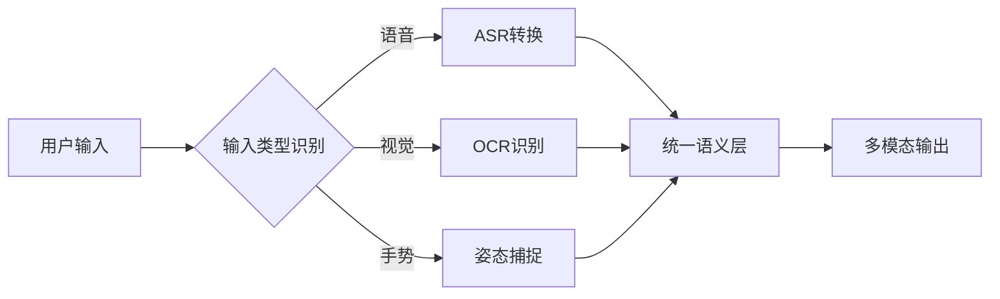

## 前言

在AI Agent技术飞速发展的今天，我们常常沉浸在算法突破和性能提升的喜悦中。然而，一个关键问题却常被忽视：**我们的智能体是否真正服务于所有人？** 🤔 当视障用户无法获得图像描述，听障人士无法通过语音交互，或老年人因界面复杂而望而却步时，我们的技术进步反而可能成为数字鸿沟的推手。今天，让我们深入探讨AI Agent的可访问性与包容性这一不可或缺的维度。

## 什么是AI Agent的可访问性与包容性

::: theorem
可访问性（Accessibility）指AI Agent能够被不同能力用户（如残障人士）有效使用的技术特性；包容性（Inclusivity）则强调智能体设计应考虑文化、语言、年龄、教育背景等多元群体的需求。
:::

### 核心维度

| 维度 | 关键考量 | 实现示例 |
|------|----------|----------|
| **感知可访问性** | 多模态输入输出 | 语音转文字+触觉反馈 |
| **认知包容性** | 简化界面与解释机制 | 分层信息架构+术语解释 |
| **物理适配性** | 跨设备兼容性 | 响应式设计+无障碍控件 |
| **文化敏感性** | 本地化与语境适配 | 跨文化符号库+方言识别 |

## 为什么它至关重要

### 1. 社会责任与伦理考量

> "技术进步应当缩小而非扩大社会差距。" —— 联合国《残疾人权利公约》

当AI Agent仅服务于"标准用户"时，我们实际上在技术层面构建了新的歧视。残障人群（全球约15%人口）被排除在智能服务之外，这违背了技术普惠的基本伦理。

### 2. 法律合规要求

欧盟《无障碍指令》、美国《康复法案》等法规已明确要求公共数字服务必须满足可访问性标准。忽视这些要求可能导致法律风险和声誉损失。

### 3. 商业价值拓展

::: tip
包容性设计能扩大用户基数达30%以上（微软研究数据），同时提升品牌忠诚度。
::`

## 实现路径与技术方案

### 多模态交互架构

### 自适应界面系统

1. **能力感知层**：通过前置问卷或行为分析评估用户能力
2. **动态渲染引擎**：根据用户能力自动调整界面复杂度
3. **辅助工具集成**：内置屏幕阅读器、语音控制等模块

### 文化包容性设计

- **符号本地化**：避免文化敏感符号（如手势在不同文化中的歧义）
- **语境适配**：根据地域文化调整交互风格（如东亚用户偏好间接表达）
- **语言平等**：支持低资源语言和方言识别

## 挑战与突破方向

### 现实困境

1. **成本与复杂度**：可访问性设计增加开发成本15-30%
2. **标准碎片化**：WCAG、EN 301 549等标准存在冲突
3. **用户多样性**：能力组合超过10,000种可能性

### 创新解决方案

::: right
"包容性不是功能叠加，而是设计哲学的重构" —— IBM设计系统负责人
::`

1. **生成式辅助技术**：利用大语言模型自动生成多版本内容（如简化版解释）
2. **众包校准机制**：建立残障用户参与的持续反馈循环
3. **跨平台标准**：推动W3C等机构制定统一可访问性协议

## 成功案例分析

### 1. Google的Lookout应用

- **功能**：为视障用户提供场景描述
- **创新点**：整合了实时图像识别+语义理解+语音反馈
- **效果**：帮助用户独立完成超市购物等日常任务

### 2. 微软 Seeing AI

- **技术突破**：将复杂视觉信息转化为结构化语音描述
- **包容性设计**：支持12种语言，适应不同阅读速度
- **社会影响**：全球超50万视障用户受益

## 未来展望

随着AI Agent深入医疗、教育等关键领域，可访问性将从"加分项"变为"必需项"。未来发展方向包括：

1. **神经可访问性**：通过脑机接口直接服务重度残障用户
2. **情感包容性**：识别用户情绪状态并调整交互方式
3. **伦理审计框架**：建立可访问性影响的量化评估体系

## 结语

构建真正普惠的AI Agent，需要我们跳出"标准用户"的思维定式。当我们为视障用户设计语音交互，为老年人简化操作流程，为不同文化背景者提供本土化体验时，技术才真正成为连接而非隔阂的桥梁。🌉

正如Tim Cook所言："技术最伟大的成就是它如何服务于人类。" 让我们从可访问性与包容性开始，打造真正属于每一个人的智能伙伴。

---

> "真正的创新不是让少数人拥有更多能力，而是让所有人获得平等的机会。"  
> —— Jorgen的AI实践哲学