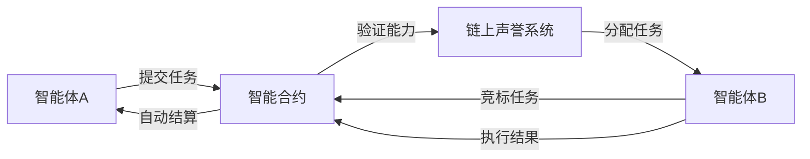

## 前言

随着AI-Agent技术的迅猛发展，我们正步入一个智能体深度融入社会各领域的时代。然而，当这些智能体掌握越来越多决策权时，一个根本性问题浮出水面：**如何确保这些自主系统在分布式环境中保持可信？** 现有文章中已广泛探讨了AI-Agent的安全架构、隐私保护机制和伦理框架，但当我们审视这些方案时，发现它们大多依赖中心化信任模型——这恰恰是区块链技术能够颠覆的领域。今天，我想和大家探讨一个可能被忽视的关键融合点：**AI-Agent与区块链的协同进化**。

::: tip
"当智能体开始自主交易、自主协作时，传统的信任模型将面临根本性挑战。区块链提供的不仅是技术方案，更是构建去中心化智能社会的基础设施。"
:::

## 区块链：AI-Agent的信任基石

### 核心特性互补性

区块链技术为AI-Agent提供了前所未有的信任保障机制：

| 特性 | 对AI-Agent的价值 |
|------|-----------------|
| 不可篡改性 | 确保决策历史永久记录，防止"事后修改" |
| 去中心化架构 | 消除单点故障风险，构建抗审查系统 |
| 智能合约 | 自动化执行预定义规则，减少人为干预 |
| 透明可验证 | 所有操作公开可查，建立行为可追溯性 |

这些特性恰好解决了当前AI-Agent系统的三大痛点：
1. **决策黑箱问题**：区块链使AI决策过程透明化
2. **信任孤岛现象**：跨机构协作时建立统一信任层
3. **中心化依赖风险**：摆脱对单一控制点的依赖

### 技术融合架构

```
┌───────────────────────┐
│   区块链层             │
│  • 共识机制          │
│  • 智能合约          │
│  • 分布式账本        │
└─────────────┬─────────┘
              │
┌─────────────▼─────────┐
│   AI-Agent层          │
│  • 去中心化决策引擎   │
│  • 链上行为验证       │
│  • 激励机制设计       │
└─────────────┬─────────┘
              │
┌─────────────▼─────────┐
│   应用场景层          │
│  • 跨链协作系统       │
│  • DAO治理模型       │
│  • 数据共享市场       │
└───────────────────────┘
```

## 融合应用场景实践

### 1. 去中心化多智能体协作系统

传统多智能体系统面临信任危机时，区块链提供了优雅解决方案：



**优势**：
- 任务分配完全透明
- 执行结果自动验证
- 激励机制链上实现
- 不可篡改的声誉记录

### 2. 跨机构数据共享生态

在医疗、金融等敏感领域，区块链与AI-Agent的结合创造了新型数据共享范式：

- **数据所有权保护**：用户通过私钥控制数据访问权限
- **动态定价机制**：智能合约根据数据价值自动调整交易价格
- **隐私计算融合**：联邦学习+零知识证明实现"可用不可见"
- **审计追踪**：所有数据访问行为永久记录在链

> "当AI-Agent代表患者自动协商医疗数据使用时，区块链确保每个数据交换都获得患者授权且不可抵赖。"

## 实现挑战与突破方向

### 关键技术挑战

1. **性能瓶颈**：区块链TPS限制与AI-Agent高频需求的矛盾
   - 解决方案：Layer2扩容技术 + 分片处理

2. **智能合约安全性**：AI决策逻辑链上部署的漏洞风险
   - 解决方案：形式化验证 + 渐进式部署策略

3. **激励机制设计**：平衡个体利益与系统全局最优
   - 解决方案：博弈论建模 + 动态调整算法

### 未来演进路径

随着技术发展，我们将见证三个关键演进阶段：

1. **基础设施融合期**（当前阶段）
   - 重点：解决基础性能问题
   - 代表：链上AI推理市场

2. **治理机制创新期**（3-5年）
   - 重点：去中心化自治组织(DAO)的AI-Agent治理
   - 代表：链上投票与决策自动化

3. **社会价值重构期**（5-10年）
   - 重点：重塑信任机制与价值分配
   - 代表：AI-Agent参与的社会经济系统

## 结语

当我们站在AI技术革命的临界点，区块链与AI-Agent的融合绝非简单技术叠加，而是**构建可信智能社会的范式革命**。这种融合将重新定义我们与智能体的关系——从"被控制者"到"信任伙伴"，从"中心化依赖"到"分布式自治"。

正如比特币开创了价值互联网的先河，区块链与AI-Agent的协同进化将开启**信任互联网**的新纪元。在这个新范式下，每个智能体都将成为分布式网络中的自主节点，通过不可篡改的规则和透明的交互，共同构建一个更安全、更公平、更高效的智能世界。

::: right
"技术终将服务于人类，而区块链与AI-Agent的融合，正是确保这一方向的锚点。"
:::