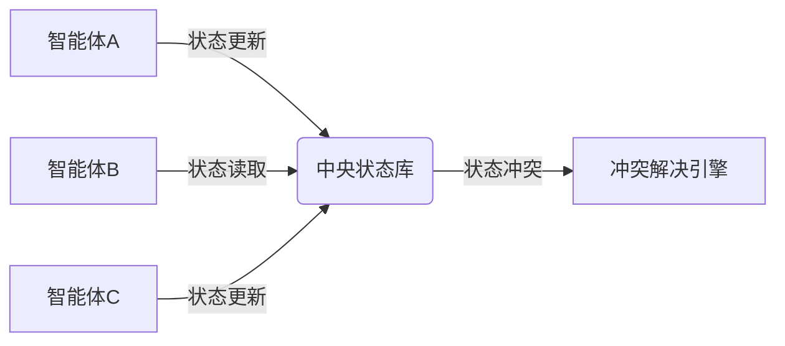
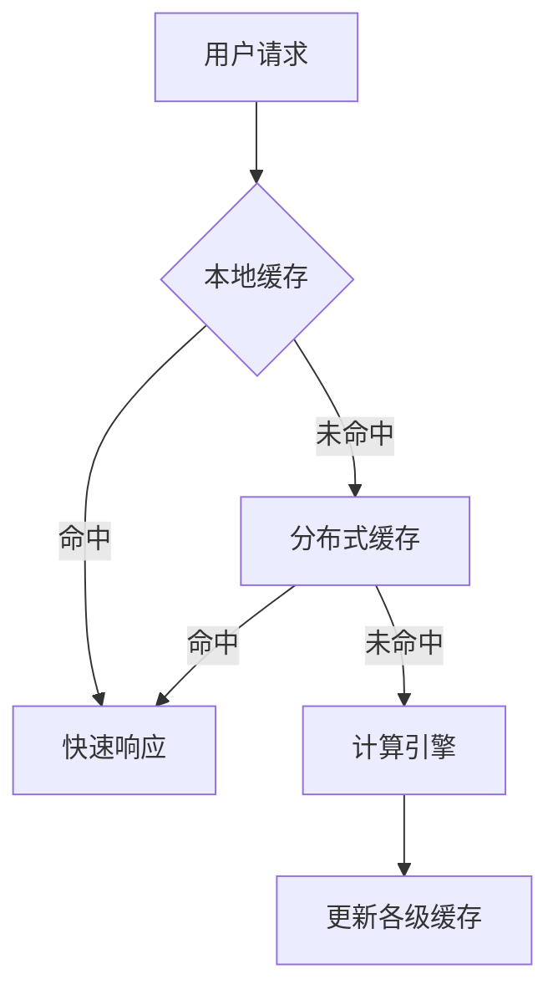
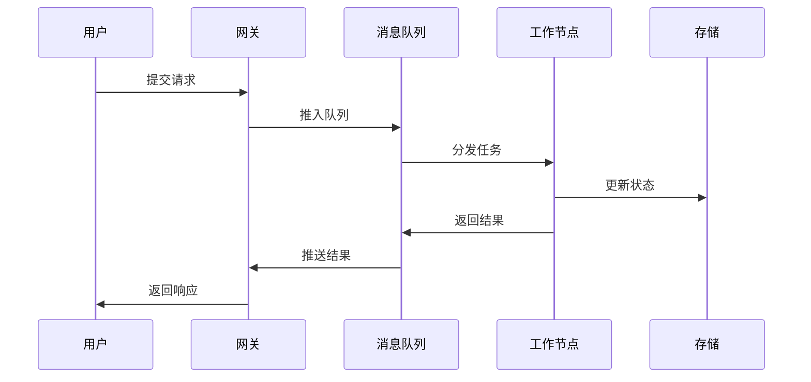

## 前言

在AI Agent的快速发展浪潮中，我们常常关注其智能水平、决策能力和用户体验，却容易忽略一个至关重要的基础问题：**如何让智能体系统像乐高积木一样，既能灵活扩展又能保持稳定运行**？想象一下，当你的智能体用户从1万暴增到100万，系统是像弹簧一样优雅伸缩，还是像橡皮筋一样绷断？今天我们就来聊聊AI Agent可扩展性这个被低估的"隐形支柱"。

::: tip
可扩展性不是锦上添花，而是智能体从实验室走向大规模商业化的必经之路。就像没有高速公路网，再好的汽车也无法发挥真正价值。
:::

## 可扩展性的核心挑战

### 1. 资源需求的非线性增长

AI Agent系统面临的首要挑战是资源需求的指数级增长。随着用户量和复杂度的提升，计算、存储和网络资源的需求往往呈指数级而非线性增长。~~这就像让一个马拉松选手同时参加100场比赛~~。

- **计算资源**：推理任务量随用户量增加而线性增长，但模型参数量可能呈指数级增长
- **内存需求**：上下文缓存、状态管理等需要持续增长的内存空间
- **网络带宽**：分布式系统中节点间通信带宽需求激增

### 2. 状态管理的复杂性

在单智能体系统中，状态管理相对简单。但在多智能体协作系统中，状态同步、一致性保证和冲突解决变得异常复杂：



### 3. 延迟敏感的决策链

AI Agent的决策往往需要在毫秒级完成，而可扩展性架构中的网络延迟可能成为决策链的瓶颈：

**理想状态**：请求 → 本地处理 → 快速响应  
**扩展瓶颈**：请求 → 跨节点通信 → 远程处理 → 多次往返 → 响应延迟

## 可扩展性架构设计模式

### 1. 微服务化智能体架构

将智能体功能拆分为独立的微服务，每个服务负责特定功能模块：

```
┌─────────────────┐    ┌─────────────────┐    ┌─────────────────┐
│   用户管理服务   │    │   认证授权服务   │    │   对话引擎服务   │
└─────────────────┘    └─────────────────┘    └─────────────────┘
         │                       │                       │
         └───────────────────────┼───────────────────────┘
                                 │
                    ┌─────────────────┐
                    │   负载均衡层    │
                    └─────────────────┘
```

**优势**：
- 独立扩展：高负载模块可单独扩容
- 故障隔离：单个服务故障不影响整体
- 技术异构：不同服务可采用最适合的技术栈

**实践要点**：
- 使用API网关统一入口
- 实现服务发现机制
- 建立完善的监控告警系统

### 2. 分层扩展策略

采用"洋葱式"分层架构，不同层级采用不同的扩展策略：

| 层级 | 功能 | 扩展策略 | 典型技术 |
|------|------|----------|----------|
| 接入层 | 请求路由 | 水平扩展 | Nginx, HAProxy |
| 业务层 | 核心逻辑 | 垂直分区 | Kubernetes |
| 数据层 | 状态存储 | 分库分表 | Redis Cluster |
| 计算层 | 模型推理 | 异步队列 | Celery, RabbitMQ |

### 3. 智能缓存策略

AI Agent系统需要多层次缓存来降低计算压力：



**缓存策略**：
- L1缓存：用户会话状态（内存）
- L2缓存：常用响应结果（Redis）
- L3缓存：模型中间结果（磁盘）
- CDN缓存：静态资源（边缘节点）

## 关键技术实现

### 1. 无状态设计

将智能体状态从服务中分离，采用外部存储：

```python
# 错误示范：状态存储在服务内存中
class AgentService:
    def __init__(self):
        self.user_states = {}  # 内存存储状态
    
    def process(self, user_id, input_data):
        state = self.user_states.get(user_id)
        # 处理逻辑...

# 正确示范：状态存储在外部系统
class AgentService:
    def process(self, user_id, input_data):
        state = redis_client.get(f"user:{user_id}:state")
        # 处理逻辑...
        redis_client.set(f"user:{user_id}:state", new_state)
```

### 2. 异步处理模式

对于耗时的AI推理任务，采用异步处理模式：



### 3. 自适应负载均衡

根据不同智能体的负载特征，动态调整分发策略：

```python
class AdaptiveLoadBalancer:
    def __init__(self):
        self.nodes = []
        self.metrics = {}
    
    def select_node(self, request_type):
        # 根据请求类型和节点状态选择
        if request_type == "complex_reasoning":
            return self.select_by_cpu()
        elif request_type == "simple_chat":
            return self.select_by_memory()
        else:
            return self.select_by_network()
```

## 实践案例：智能客服系统扩容

某电商智能客服系统在双十一期间面临10倍流量增长，采用以下扩容策略：

1. **接入层扩展**：从5台负载均衡器扩展到50台，采用IP哈希算法保持会话
2. **服务层分区**：按商品类别将客服智能体分为3个分区，每个分区独立扩展
3. **计算层弹性**：Kubernetes集群从20节点扩展到200节点，GPU利用率从70%提升到95%
4. **数据层分片**：用户对话数据按用户ID分片，热点数据采用多副本

**结果**：
- 响应时间从500ms降至120ms
- 系统稳定性从99.9%提升至99.99%
- 成本效率提升40%（通过智能资源调度）

## 未来展望

随着AI Agent应用的普及，可扩展性架构将呈现以下趋势：

1. **Serverless智能体**：事件驱动的无服务器架构，自动扩缩容
2. **边缘智能体**：将推理下沉到边缘设备，减少中心依赖
3. **联邦式扩展**：跨组织协作的联邦扩展模式，保护数据隐私
4. **量子智能体**：量子计算支持的智能体架构，突破经典计算限制

> "可扩展性不是事后考虑的选项，而是系统设计的DNA。一个无法扩展的智能体系统，就像一辆没有高速公路的车，再先进也跑不远。"

## 结语

在AI Agent的星辰大海中，可扩展性架构设计是承载梦想的方舟。当我们设计智能体时，不仅要考虑它能做什么，更要思考它能做多大规模。记住：**优雅的可扩展性设计，让智能体在成长中保持从容，在扩张中不失优雅**。