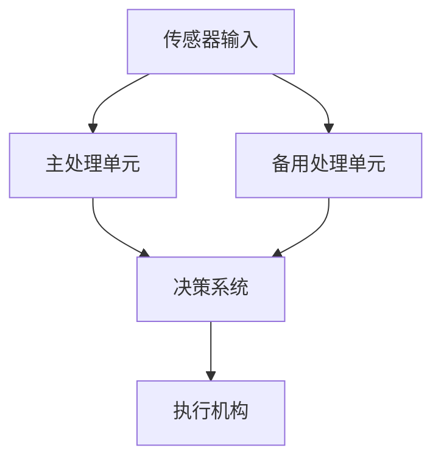

## 前言

随着人工智能技术的快速发展，AI-Agent已经从简单的工具演变为能够自主决策和行动的复杂系统。然而，随着系统复杂性的增加，故障和异常情况也变得更加普遍和难以预测。想象一下，一个自主驾驶AI-Agent在高速公路上突然遇到传感器故障，或者一个医疗AI-Assistant在诊断过程中遇到数据异常，如果没有有效的容错机制和自愈能力，这些情况可能导致灾难性后果。

::: tip
"在复杂的AI系统中，容错不是奢侈品，而是必需品。就像人类会生病但能够自愈一样，高级AI-Agent也需要具备在遇到问题时自我修复的能力。"
:::

## AI-Agent容错机制的重要性

AI-Agent的容错机制是指系统在出现故障或异常时能够继续运行或优雅降级的能力。而自愈能力则更进一步，指系统能够自动检测问题、诊断原因并尝试修复的能力。这两种能力对于构建高可靠性的AI系统至关重要。

### 为什么容错机制如此重要？

1. **提高系统可靠性**：容错机制确保AI-Agent在部分组件失效时仍能继续提供服务，避免完全崩溃。

2. **增强用户体验**：用户希望AI系统能够稳定可靠，即使在遇到问题时也能提供合理的响应。

3. **保障安全性**：特别是在关键应用领域（如医疗、自动驾驶、金融等），容错机制可以防止因系统故障导致的安全事故。

4. **降低运维成本**：具备自愈能力的AI系统可以减少人工干预的需求，降低维护成本。

5. **提升系统寿命**：通过及时发现和修复问题，可以延长AI系统的使用寿命。

## AI-Agent容错机制的主要类型

### 1. 冗余设计

冗余设计是容错机制中最基础也最有效的方法之一，通过在系统中设置冗余组件，当主要组件失效时可以无缝切换到备用组件。



**应用场景**：
- 关键传感器（如自动驾驶中的摄像头、雷达）的多重备份
- 核心算法的多版本实现
- 通信链路的冗余备份

### 2. 异常检测与诊断

异常检测是容错机制的第一步，AI-Agent需要能够识别系统行为与预期之间的偏差。

**常见异常检测方法**：
- 统计异常检测：基于历史数据建立正常行为模型，检测偏离模型的情况
- 基于规则的检测：预设规则判断系统状态是否正常
- 机器学习方法：使用分类器或异常检测算法识别异常

**诊断技术**：
- 因果图分析：建立系统组件间的因果关系，帮助定位故障根源
- 故障树分析：从故障结果逆向推导可能的原因
- 专家系统：基于领域知识库进行故障诊断

### 3. 降级运行模式

当系统检测到严重故障时，可以切换到降级运行模式，在保证核心功能的前提下简化系统复杂度。

**降级策略**：
- 功能降级：保留核心功能，暂时关闭非关键功能
- 性能降级：降低系统响应速度或精度，确保基本功能可用
- 精度降级：在数据不完整的情况下，降低预测或决策的精度

### 4. 自愈机制

自愈是容错机制的高级形式，指系统在检测到问题后能够自动尝试修复。

**自愈策略**：
- 重启机制：自动重启故障组件或服务
- 参数调整：自动调整系统参数以适应新的环境或条件
- 模型更新：自动更新或回滚到稳定的模型版本
- 资源重分配：动态调整系统资源分配，优先保障关键功能

## AI-Agent自愈能力的设计原则

### 1. 分层容错架构

设计分层容错架构，在不同层级实施容错策略：

```
应用层：业务逻辑容错
服务层：服务调用容错
数据层：数据访问容错
基础设施层：硬件容错
```

### 2. 故障隔离

实施故障隔离机制，防止局部故障扩散到整个系统：

- 进程隔离：将不同功能运行在独立进程中
- 资源隔离：限制各组件的资源使用
- 网络隔离：通过防火墙或微服务架构实现服务间隔离

### 3. 自愈决策机制

设计智能的自愈决策机制，权衡不同修复策略的成本和收益：

- 基于规则的决策：预设修复流程和条件
- 基于强化学习的决策：通过训练选择最优修复策略
- 基于多智能体协商的决策：多个自愈代理协作决定最佳行动

### 4. 持续学习与改进

构建持续学习机制，从过去的故障和修复中学习：

- 故障模式库：记录历史故障模式和解决方案
- 修复效果评估：评估不同修复策略的效果
- 自适应调整：根据评估结果调整自愈策略

## 实践案例：自动驾驶AI-Agent的容错与自愈

### 案例背景

自动驾驶AI-Agent需要在复杂的道路环境中安全运行，任何故障都可能导致严重事故。因此，容错机制和自愈能力对于自动驾驶系统至关重要。

### 容错机制设计

1. **传感器冗余**
   - 同时使用摄像头、雷达、激光雷达等多种传感器
   - 当一种传感器失效时，系统自动切换到其他传感器

2. **决策系统降级**
   - 正常情况下使用高级决策算法
   - 当检测到系统异常时，切换到保守的决策模式
   - 在极端情况下，触发安全停车或请求人工接管

3. **通信故障处理**
   - 车内通信系统冗余设计
   - 与云端通信中断时，切换到本地决策模式
   - 定期尝试重新建立连接

### 自愈能力实现

1. **传感器校准自愈**
   - 自动检测传感器数据异常
   - 尝试软件校准或调整参数
   - 如果无法解决，标记传感器为不可用并切换到备用传感器

2. **软件更新自愈**
   - 系统监控软件模块运行状态
   - 检测到异常时自动回滚到稳定版本
   - 在安全条件下尝试自动更新修复补丁

3. **路径规划自愈**
   - 当检测到路径规划异常时，自动重新规划路线
   - 考虑当前交通状况和车辆状态
   - 必要时选择保守的行驶策略

## 技术挑战与解决方案

### 挑战1：故障检测的准确性

**问题**：如何在复杂环境中准确区分正常变化和系统故障？

**解决方案**：
- 结合多种检测方法，提高检测准确性
- 建立多层次检测机制，从简单规则到复杂模型
- 使用无监督学习识别未知类型的故障

### 挑战2：自愈决策的实时性

**问题**：如何在有限时间内做出最优的自愈决策？

**解决方案**：
- 预计算常见故障的应对策略
- 使用轻量级模型进行快速决策
- 采用分层决策机制，先处理紧急情况再深入分析

### 挑战3：自愈过程的可解释性

**问题**：如何让用户理解系统自愈过程和结果？

**解决方案**：
- 提供自愈过程的可视化界面
- 记录自愈决策的依据和结果
- 使用自然语言生成技术解释自愈行为

### 挑战4：自愈能力的评估

**问题**：如何评估自愈能力的有效性？

**解决方案**：
- 构建故障注入测试平台
- 设计量化指标评估自愈效果
- 进行A/B测试比较不同自愈策略

## 未来发展趋势

### 1. 自愈能力的智能化提升

随着AI技术的发展，AI-Agent的自愈能力将更加智能化：

- 基于深度学习的故障预测：提前识别潜在故障
- 强化学习优化的自愈策略：通过训练找到最优修复方法
- 多智能体协同自愈：多个AI-Agent协作完成复杂自愈任务

### 2. 自愈系统的标准化

随着自愈系统应用的普及，标准化将成为趋势：

- 自愈能力评估标准：统一评估AI-Agent自愈能力的方法
- 自愈接口标准：定义AI-Agent自愈功能的接口规范
- 自愈安全标准：确保自愈过程本身的安全性

### 3. 自愈与人类协作的融合

未来的自愈系统将更加注重与人类的协作：

- 人机协同自愈：AI-Agent在自愈过程中寻求人类专家指导
- 自愈决策透明化：向人类解释自愈决策的依据和结果
- 自愈能力培训：帮助人类理解和使用AI-Agent的自愈功能

## 结语

AI-Agent的容错机制与自愈能力是构建高可靠性智能系统的核心保障。随着AI系统在关键领域的广泛应用，容错和自愈能力的重要性将日益凸显。通过合理的架构设计、先进的算法实现和持续的优化改进，我们可以构建更加可靠、安全的AI-Agent，为人类社会创造更大价值。

> "在AI系统设计中，我们不能假设永远不出错，而应该假设一定会出错，并设计系统能够优雅地处理这些错误。容错不是对系统设计的妥协，而是对可靠性的追求。"

随着技术的不断进步，我们有理由相信，未来的AI-Agent将具备更强大的容错能力和更智能的自愈机制，为人类创造更加安全、可靠的智能服务。