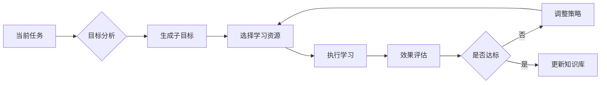

## 前言

在AI-Agent的构建过程中，我们往往关注其如何执行任务、如何与人交互、如何保证安全，但一个常被忽视的关键维度是：**智能体如何在没有人类持续干预的情况下实现自我进化**。现有技术多聚焦于被动学习（如从固定数据集中学习）或受控进化（如人类监督的强化学习），而真正实现自主智能体的核心在于其自主学习与自我提升能力。本文将深入探讨这一缺失的关键领域，揭示构建自主进化智能体的技术路径。

---

## 自主学习：智能体的自我驱动能力

### 1.1 元学习框架

传统学习模式需要人类专家设计学习目标和评估标准，而自主学习要求智能体具备：

- **目标自主生成**：基于当前任务完成度自动调整学习目标
- **资源自主选择**：从海量数据中筛选最相关的学习材料
- **策略自主优化**：动态调整学习算法和超参数



### 1.2 主动学习机制

智能体需要具备"提问能力"：

- **不确定性采样**：主动标记最不确定的样本
- **查询合成**：生成最能暴露模型弱点的测试案例
- **探索-利用平衡**：在已知和未知间智能权衡

> **定理**：主动学习可将标注效率提升3-10倍，但需要设计合理的查询成本函数。

---

## 自我提升：智能体的自我优化能力

### 2.1 架构自适应

智能体需要能够：

- **动态模块加载**：根据任务需求加载/卸载功能模块
- **参数空间优化**：自动调整神经网络架构
- **计算资源分配**：在性能和效率间智能权衡

### 2.2 知识蒸馏与迁移

自主提升的核心是知识管理：

```python
# 伪代码：自主知识蒸馏
def self_distillation():
    while True:
        current_model = load_current_model()
        teacher_model = load_best_model()
        
        # 生成新数据
        synthetic_data = generate_synthetic_data(current_model)
        
        # 自我训练
        new_model = train_with_distillation(
            current_model, 
            teacher_model, 
            synthetic_data
        )
        
        # 评估改进
        if evaluate_improvement(new_model) > threshold:
            save_best_model(new_model)
```

### 2.3 错误自愈机制

智能体需要具备：

- **异常检测**：识别自身行为异常
- **根因分析**：定位失败的根本原因
- **策略修正**：自动调整行为策略

---

## 实现路径与技术挑战

### 3.1 分阶段实现路径

1. **基础阶段**：实现目标自主设定和资源选择
2. **进阶阶段**：构建知识蒸馏和架构优化
3. **成熟阶段**：形成完整的自我进化闭环

### 3.2 核心技术挑战

| 挑战 | 解决方案 |
|------|----------|
| 安全边界控制 | 基于形式化验证的约束系统 |
| 评估标准缺失 | 多目标优化框架 |
| 计算资源限制 | 边缘-云端协同计算 |
| 知识冲突解决 | 置信度加权融合 |

---

## 应用场景与价值

### 4.1 智能运维场景

- **自主故障诊断**：系统自动识别异常并修复
- **性能持续优化**：根据负载自动调整资源分配
- **安全漏洞自愈**：实时检测并修补安全漏洞

### 4.2 个性化教育

- **学习路径自主规划**：根据学生表现动态调整难度
- **知识点关联发现**：自动构建知识网络
- **反馈闭环**：实时评估学习效果并调整策略

---

## 结语

自主学习与自我提升能力是AI-Agent从"工具"向"伙伴"进化的关键。它要求我们重新思考智能体的设计哲学：不是让智能体完美执行预设任务，而是赋予其自主进化的能力。这一领域的研究将推动AI-Agent从被动响应转向主动进化，最终实现真正意义上的自主智能。

> "真正的智能不是知道所有答案，而是知道如何寻找答案。" —— 自主智能体的核心哲学

未来，我们需要在自主性、安全性和可控性间找到平衡点，构建既能自主进化又不会失控的智能系统。这不仅需要技术突破，更需要伦理框架的同步发展，确保自主智能体的进化方向符合人类价值观。

---

## 个人建议

1. **从小闭环开始**：先实现简单的自我评估-调整循环
2. **建立安全边界**：在开放环境前先在沙盒中测试
3. **引入人工监督**：保留关键决策的"人类在环"机制
4. **持续监控进化方向**：定期检查进化是否符合预期目标

这一领域的研究才刚刚起步，但它的潜力不可估量。让我们共同探索AI-Agent自主进化的无限可能！