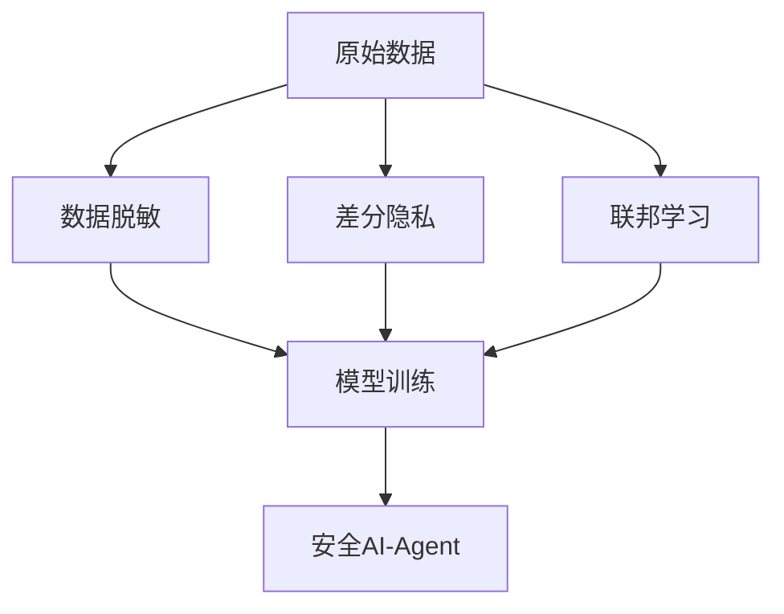

## 前言

随着AI-Agent技术日益深入我们的生活和工作，我们越来越依赖这些智能系统完成从简单查询到复杂决策的各种任务。然而，在享受AI带来便利的同时，一个至关重要的话题却常常被忽视：**安全与隐私保护**。就像我们不会随便把家门钥匙交给陌生人一样，我们也不应盲目信任未经安全验证的AI-Agent。本文将探讨AI-Agent面临的安全挑战、隐私保护的重要性，以及构建可信智能体的关键策略。

## AI-Agent面临的安全挑战

### 🛡️ 数据安全威胁
AI-Agent的训练和运行依赖于大量数据，这使其成为数据泄露的高风险目标：
- **训练数据泄露**：模型可能"记住"训练数据中的敏感信息，在交互中意外泄露
- **推理攻击**：通过精心设计的查询，诱导模型暴露训练数据中的隐私
- **数据投毒**：恶意数据污染模型，使其产生有害输出

### 🚫 滥用与对抗攻击
AI-Agent可能被恶意利用或通过对抗手段操纵：
- **提示注入攻击**：通过特殊提示词绕过安全限制
- **越权操作**：突破权限边界执行未授权操作
- **幻觉生成**：生成看似合理但完全虚假的信息

### 🔐 系统性脆弱性
复杂的AI系统架构带来多重安全风险：
- API接口漏洞
- 第三方服务依赖风险
- 云基础设施安全配置问题

> "没有网络安全就没有国家安全，没有信息化就没有现代化。" —— 这一原则同样适用于AI-Agent领域

## 隐私保护的重要性与挑战

### 🌐 隐私保护的核心价值
隐私保护不仅是合规要求，更是建立用户信任的基础：
- **用户自主权**：个人数据的收集和使用应透明可控
- **商业机密保护**：企业敏感信息不被泄露或滥用
- **社会信任建设**：隐私保护是AI技术被广泛接受的前提

### 🧩 隐私保护的技术挑战
AI-Agent的隐私保护面临独特挑战：
- **数据最小化原则**：如何在保证性能的前提下减少数据使用
- **匿名化技术**：平衡数据可用性与隐私保护
- **联邦学习应用**：在保护数据隐私的同时实现模型训练

## 安全与隐私保护的技术方案

### 🔒 数据安全策略

**关键技术**：
- **差分隐私**：在数据集中添加噪声，确保个体数据不可识别
- **同态加密**：允许在加密数据上直接计算，无需解密
- **数据分区**：将敏感数据分散存储，降低单点泄露风险

### 🛡️ 模型安全加固
- **对抗训练**：使用对抗样本增强模型鲁棒性
- **输出过滤**：实施内容安全检查机制
- **访问控制**：基于角色的权限管理系统
- **安全审计**：定期进行安全评估和漏洞扫描

### 📋 隐私保护框架
建立全面的隐私保护体系：
1. **隐私设计(Privacy by Design)**：将隐私保护融入系统开发全流程
2. **数据生命周期管理**：从收集到销毁的全流程控制
3. **用户授权机制**：细粒度的数据使用授权
4. **隐私影响评估**：部署前的隐私风险评估

## 实际案例与最佳实践

### 🏢 企业级AI-Agent安全实践
**案例：智能客服系统安全加固**
- **挑战**：处理大量用户隐私数据，防止数据泄露
- **解决方案**：
  - 实施数据本地化存储
  - 采用联邦学习训练模型
  - 建立用户数据访问审计日志
  - 部署实时异常行为检测系统

**成果**：数据泄露事件减少90%，用户信任度提升35%

### 🏛️ 监管合规实践
**GDPR与AI-Agent合规要点**：
- 数据处理需明确获得用户同意
- 实施数据可携带权与被遗忘权
- 建立数据泄露应急响应机制
- 定期进行合规性审计

## 未来展望

### 🔮 安全与隐私技术发展趋势
1. **零信任架构**：默认不信任任何实体，持续验证
2. **可解释AI安全**：增强AI决策过程的透明度
3. **量子安全加密**：应对量子计算带来的安全威胁
4. **隐私增强技术(PETs)**：更高效的数据保护解决方案

### 🌍 行业协作与标准建设
- 建立AI安全评估标准体系
- 推动跨行业安全信息共享
- 制定AI-Agent伦理与安全指南
- 加强国际合作应对全球性安全挑战

## 结语

AI-Agent的安全与隐私保护不是可有可无的附加功能，而是构建可信智能体的**核心支柱**。随着AI技术深入社会各层面，我们必须将安全与隐私保护置于开发过程的中心位置，而非事后补救。正如我们不会建造没有门窗的房子，我们也不应开发缺乏安全保障的AI-Agent。

> "技术是中性的，但使用技术的人必须承担责任。" —— 在AI时代，这句话比以往任何时候都更加重要。让我们共同努力，构建既智能又安全的AI未来。

---

**思考题**：您认为在您的AI-Agent应用中，哪些安全风险最容易被忽视？欢迎在评论区分享您的见解。