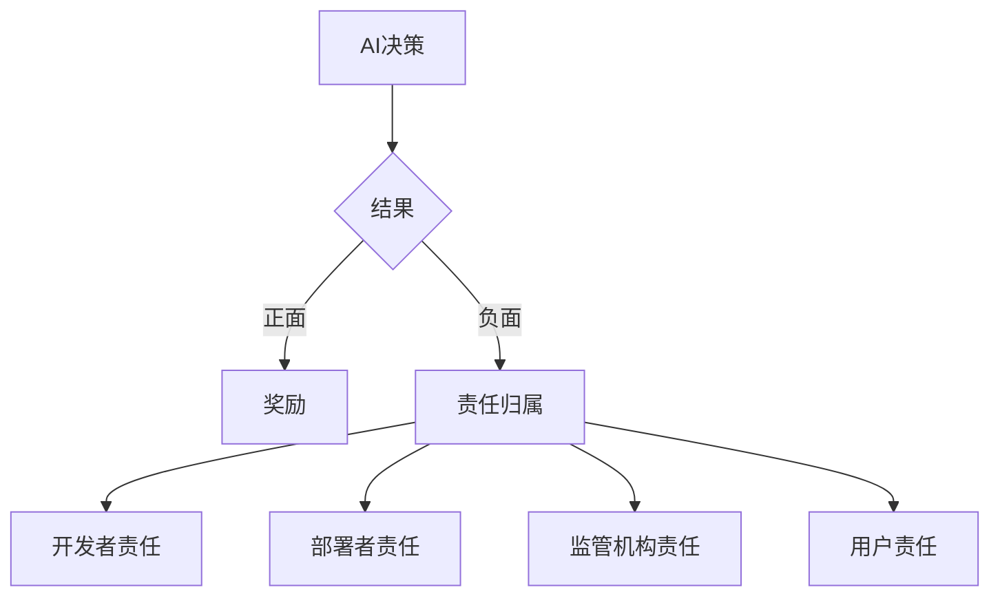

## 前言

随着AI-Agent技术的迅猛发展，我们正步入一个智能体与人类深度协作的新时代。从个人助手到企业决策支持，AI-Agent正在潜移默化地改变我们的工作与生活。然而，在这片技术蓝海中，我们是否忽略了那些看不见的暗礁？当AI开始替我们做决策，当智能体开始影响社会结构，我们是否准备好了面对随之而来的伦理挑战？

::: tip
"技术的价值不在于它能做什么，而在于我们应该用它做什么。" —— AI伦理学家
:::

在这篇文章中，我将探讨AI-Agent背后的伦理与社会影响，思考如何构建真正负责任的智能体。

## AI-Agent的伦理挑战

### 1. 决策透明度与可解释性

当AI-Agent替我们做决定时，我们有权知道"为什么"。然而，当前许多AI系统特别是深度学习模型，往往被视为"黑盒"，其决策过程难以解释。

**问题示例**：
- 医疗AI建议某种治疗方案，但无法解释原因
- 金融AI拒绝贷款申请，但无法说明具体考量因素
- 自动驾驶系统在危急情况下的决策逻辑不透明

**解决方案**：
- 开发可解释AI(XAI)技术，如LIME、SHAP等
- 设计决策日志系统，记录AI-Agent的推理过程
- 在关键应用中采用"人类-in-the-loop"模式

> "不透明的AI决策就像一个没有方向盘的汽车，我们可以乘坐，却不知道它将驶向何方。" —— 技术伦理评论家

### 2. 责任归属问题

当AI-Agent做出错误决策导致损失时，责任应由谁承担？是开发者、部署者，还是AI系统本身？

**典型案例**：
- 自动驾驶事故的责任划分
- AI医疗误诊的法律责任
- AI交易系统导致的金融损失

**思考框架**：

### 3. 公平性与偏见问题

AI-Agent可能无意中放大和传播社会中已有的偏见，导致不公平的结果。

**常见偏见来源**：
- 训练数据中的历史偏见
- 算法设计中的隐含假设
- 评估标准的选择性

**减少偏见的方法**：
- 多样化训练数据
- 定期进行偏见审计
- 建立公平性评估指标
- 引入多元团队参与AI设计

## AI-Agent的社会影响

### 1. 就业市场变革

AI-Agent正在重塑就业市场，一方面创造新机会，另一方面也可能替代某些工作岗位。

**双面影响**：
- **积极面**：创造新岗位，提高生产力，释放人类创造力
- **挑战面**：某些岗位可能被自动化，需要技能转型

**应对策略**：
- 投资终身学习体系
- 设计人机协作的工作模式
- 关注弱势群体的就业保障

### 2. 社会信任与人际关系

随着AI-Agent越来越深入我们的生活，它们可能改变人类之间的互动方式和信任基础。

**值得关注的问题**：
- 过度依赖AI可能导致社交能力下降
- AI个性化推荐可能创造"信息茧房"
- 人机关系可能模糊人际边界

### 3. 数字鸿沟与普惠AI

AI-Agent的普及可能加剧现有的数字鸿沟，如何确保技术红利惠及所有人？

**解决方案方向**：
- 开发低门槛AI工具
- 关注边缘群体的AI可及性
- 设计包容性AI系统

## 构建负责任的AI-Agent

### 1. 伦理设计原则

在AI-Agent设计之初就应考虑伦理因素，而非事后补救。

**核心原则**：
- **以人为本**：AI应增强人类能力而非替代
- **透明可解释**：决策过程应可理解
- **公平公正**：避免偏见和歧视
- **隐私保护**：尊重用户数据权利
- **安全可靠**：确保系统稳定运行

### 2. 伦理审查与监管

建立健全的AI伦理审查机制和监管框架。

**多层次监管体系**：
- **技术层**：开发伦理评估工具
- **组织层**：建立AI伦理委员会
- **行业层**：制定行业标准和最佳实践
- **国家层**：完善法律法规

### 3. 公众参与与教育

提高公众对AI伦理问题的认识，促进多方对话。

**行动建议**：
- 开展AI素养教育
- 组织公众参与AI治理讨论
- 建立AI伦理案例库

## 结语

AI-Agent的伦理与社会影响不是技术发展的副产品，而是我们必须正视的核心议题。构建负责任的AI-Agent需要技术开发者、政策制定者、伦理学家和公众的共同参与。

::: theorem
AI技术的终极目标不是创造更聪明的机器，而是创造更美好的世界。只有将伦理考量融入AI发展的每一个环节，我们才能确保AI-Agent真正服务于人类福祉。
:::

> "在AI的黎明，我们不能只关注它能做什么，更要思考我们应该让它做什么。" —— 未来学家

作为AI技术的探索者和实践者，我们有责任确保AI-Agent的发展方向与人类价值观对齐，让技术真正成为推动社会进步的力量，而非带来新的挑战和问题。

---

*本文为AI-Agent系列文章的一部分，探讨AI技术发展中的伦理与社会影响。欢迎关注后续内容，共同构建负责任的AI未来。*