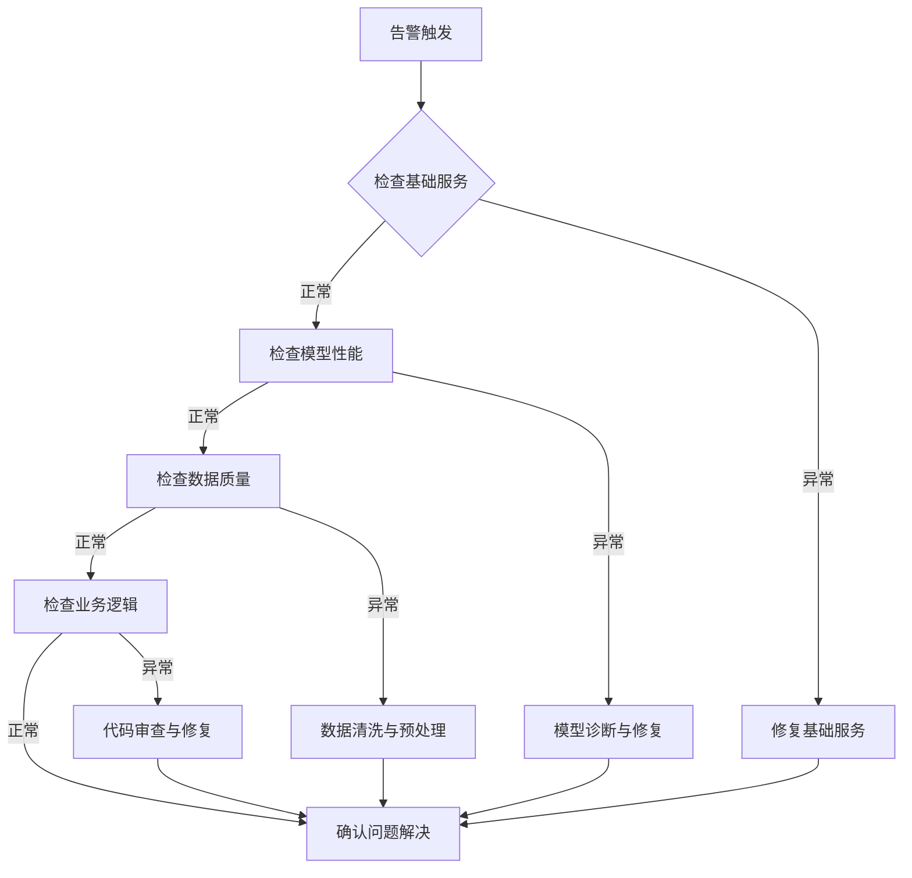

## 前言

在构建AI-Agent的旅程中，我们往往将大量精力投入到架构设计、算法实现和性能优化上。然而，当我们的智能体从开发环境走向生产环境，真正的挑战才刚刚开始。如何确保AI-Agent能够7×24小时稳定运行？如何在海量用户请求下保持响应质量？如何及时发现并解决潜在问题？

::: tip
部署与运维不是AI-Agent开发的终点，而是确保其持续创造价值的起点。一个精心设计的智能体如果缺乏有效的部署策略和运维体系，就如同拥有强大引擎却没有可靠底盘的跑车。
:::

本文将深入探讨AI-Agent部署与运维的关键环节，帮助构建真正可靠、可扩展的智能体系统。

## 部署策略选择

AI-Agent的部署策略直接影响其可用性、扩展性和成本效益。根据业务需求和场景特点，我们可以选择不同的部署方式。

### 云原生部署

云原生部署利用容器化、微服务和编排技术，实现AI-Agent的弹性伸缩和高可用性。

```yaml
# 示例：Kubernetes部署配置
apiVersion: apps/v1
kind: Deployment
metadata:
  name: ai-agent
spec:
  replicas: 3
  selector:
    matchLabels:
      app: ai-agent
  template:
    metadata:
      labels:
        app: ai-agent
    spec:
      containers:
      - name: ai-agent
        image: ai-agent:latest
        resources:
          requests:
            memory: "2Gi"
            cpu: "1000m"
          limits:
            memory: "4Gi"
            cpu: "2000m"
```

**优势**：
- 自动扩展：根据负载自动调整实例数量
- 高可用：多副本部署，故障自动转移
- 快速迭代：支持滚动更新，零停机部署

**适用场景**：
- 用户量波动大的应用
- 需要快速迭代的产品
- 对可用性要求高的关键业务

### 边缘计算部署

对于需要低延迟响应的场景，边缘计算部署将AI-Agent部署在靠近用户的边缘节点。

```python
# 示例：边缘节点部署逻辑
class EdgeDeployment:
    def __init__(self, edge_node_id):
        self.node_id = edge_node_id
        self.model_cache = {}
        
    def deploy_model(self, model_name, model_path):
        """部署模型到边缘节点"""
        try:
            self.model_cache[model_name] = load_model(model_path)
            log(f"成功部署模型 {model_name} 到边缘节点 {self.node_id}")
            return True
        except Exception as e:
            log(f"模型部署失败: {str(e)}")
            return False
    
    def process_request(self, request):
        """处理本地请求"""
        # 根据请求类型选择模型
        model_name = self.select_model(request)
        if model_name in self.model_cache:
            return self.model_cache[model_name].predict(request)
        else:
            # 本地无模型，转发到中心服务器
            return forward_to_central(request)
```

**优势**：
- 低延迟：减少网络传输时间
- 数据隐私：敏感数据可在本地处理
- 离线可用：网络中断时仍可提供服务

**适用场景**：
- 实时性要求高的应用（如自动驾驶、工业控制）
- 数据隐私敏感的场景（如医疗、金融）
- 网络连接不稳定的区域

### 混合部署模式

结合云原生和边缘计算的优势，构建混合部署模式。


::: theorem 混合部署原则
1. **分层处理**：简单请求在边缘处理，复杂请求转发云端
2. **模型分层**：轻量级模型部署边缘，完整模型部署云端
3. **动态路由**：根据网络状况和负载智能分配请求
:::

## 监控系统构建

有效的监控系统是AI-Agent稳定运行的保障。与传统应用不同，AI-Agent的监控需要特别关注模型性能指标。

### 多维度监控指标

| 监控维度 | 关键指标 | 监控工具 |
|---------|---------|---------|
| 系统性能 | CPU/内存使用率、响应时间、吞吐量 | Prometheus, Grafana |
| 业务指标 | 请求量、错误率、用户满意度 | 自定义仪表板 |
| 模型性能 | 准确率、预测时间、特征分布 | MLflow, Weights & Biases |
| 数据质量 | 数据漂移、异常值、缺失值 | Evidently AI, Arize |

### 实时监控实践

```python
# 示例：AI-Agent监控指标收集
class AIMonitor:
    def __init__(self):
        self.metrics = {
            'request_count': 0,
            'error_count': 0,
            'avg_response_time': 0,
            'model_accuracy': 0.0
        }
        self.response_times = []
        
    def record_request(self, response_time, success, prediction, actual):
        """记录请求指标"""
        self.metrics['request_count'] += 1
        self.response_times.append(response_time)
        
        if not success:
            self.metrics['error_count'] += 1
        
        # 计算平均响应时间
        self.metrics['avg_response_time'] = sum(self.response_times) / len(self.response_times)
        
        # 计算模型准确率（简化示例）
        if prediction == actual:
            self.metrics['model_accuracy'] = (self.metrics['model_accuracy'] * (self.metrics['request_count'] - 1) + 1) / self.metrics['request_count']
            
    def alert_on_anomaly(self):
        """异常检测与告警"""
        if self.metrics['error_rate'] > 0.05:  # 错误率超过5%
            send_alert(f"错误率异常: {self.metrics['error_rate']}")
            
        if self.metrics['avg_response_time'] > 1000:  # 平均响应时间超过1秒
            send_alert(f"响应时间异常: {self.metrics['avg_response_time']}ms")
```

### 可视化仪表板

构建直观的监控仪表板，帮助运维人员快速了解系统状态。


关键仪表板要素：
1. **实时状态概览**：系统健康状态、关键指标趋势
2. **性能分析**：响应时间分布、吞吐量变化
3. **模型健康度**：准确率变化、数据分布对比
4. **资源利用率**：CPU/内存使用情况、网络流量

## 故障排查与恢复

即使有完善的监控系统，故障仍然不可避免。建立高效的故障排查和恢复机制至关重要。

### 常见故障类型

1. **性能故障**
   - 症状：响应时间突然增加、吞吐量下降
   - 可能原因：资源不足、模型复杂度增加、网络延迟
   - 解决方案：水平扩展、模型优化、CDN加速

2. **模型故障**
   - 症状：预测准确率下降、输出异常
   - 可能原因：数据漂移、模型退化、特征工程问题
   - 解决方案：数据验证、模型重训练、特征调整

3. **系统故障**
   - 症状：服务不可用、连接超时
   - 可能原因：服务器宕机、网络中断、依赖服务故障
   - 解决方案：自动重启、负载均衡、熔断机制

### 故障排查流程



### 自动化恢复机制

实现故障的自动检测和恢复，减少人工干预。

```python
# 示例：自动化恢复机制
class AutoRecovery:
    def __init__(self):
        self.health_checks = {
            'service_health': self.check_service_health,
            'model_performance': self.check_model_performance,
            'data_quality': self.check_data_quality
        }
        
    def monitor_and_recover(self):
        """监控并自动恢复"""
        for check_name, check_func in self.health_checks.items():
            try:
                status = check_func()
                if not status['healthy']:
                    self.execute_recovery(check_name, status['details'])
            except Exception as e:
                log(f"健康检查失败: {check_name}, 错误: {str(e)}")
                self.execute_recovery(check_name, f"检查执行异常: {str(e)}")
    
    def execute_recovery(self, issue_type, details):
        """执行恢复操作"""
        if issue_type == 'service_health':
            self.restart_service()
        elif issue_type == 'model_performance':
            self.fallback_to_previous_model()
        elif issue_type == 'data_quality':
            self.enable_data_sanitization()
            
        # 记录恢复操作
        log_recovery_action(issue_type, details)
```

## 安全更新策略

AI-Agent系统的安全更新是运维中的重要环节，需要在不影响用户体验的前提下完成。

### 蓝绿部署

蓝绿部署通过维护两个完全相同的生产环境（蓝色和绿色），实现零停机更新。

```
当前流量 -> 蓝色环境
准备更新 -> 绿色环境
测试验证 -> 绿色环境
切换流量 -> 绿色环境(新版本)
回滚准备 -> 蓝色环境(旧版本)
```

**实施步骤**：
1. 部署新版本到绿色环境
2. 运行自动化测试验证
3. 将生产流量从蓝色环境切换到绿色环境
4. 验证新版本运行正常
5. 准备回滚（保持蓝色环境可用）

### 金丝雀发布

逐步将流量切换到新版本，降低风险。

```python
# 示例：金丝雀发布实现
class CanaryRelease:
    def __init__(self, new_version):
        self.new_version = new_version
        self.traffic_ratio = 0.1  # 初始10%流量
        
    def deploy(self):
        """部署金丝雀版本"""
        # 部署新版本到部分服务器
        deploy_to_canary_servers(self.new_version)
        
    def adjust_traffic(self):
        """调整流量分配"""
        # 监控新版本性能
        performance = monitor_canary_performance()
        
        if performance['error_rate'] < 0.01 and performance['avg_latency'] < 100:
            # 性能良好，增加流量
            self.traffic_ratio = min(self.traffic_ratio * 1.5, 1.0)
            update_traffic_distribution(self.traffic_ratio)
            return True
        else:
            # 性能不佳，减少流量或回滚
            if self.traffic_ratio > 0.1:
                self.traffic_ratio *= 0.5
                update_traffic_distribution(self.traffic_ratio)
                return False
            else:
                self.rollback()
                return False
    
    def rollback(self):
        """回滚到稳定版本"""
        log("触发回滚操作")
        deploy_stable_version()
        self.traffic_ratio = 0  # 确保所有流量回到稳定版本
```

### 滚动更新

对于无状态服务，滚动更新是一种高效的更新方式。

**关键原则**：
1. 逐个更新实例，确保系统始终有可用实例
2. 设置合理的健康检查间隔
3. 准备快速回滚机制

## 性能优化实践

基于监控数据，持续优化AI-Agent的性能表现。

### 模型优化

1. **模型压缩**
   - 量化：将浮点模型转换为定点数
   - 剪枝：移除冗余神经元和连接
   - 知识蒸馏：用大模型指导小模型训练

```python
# 示例：模型量化
def quantize_model(model, num_bits=8):
    """模型量化"""
    quantized_model = copy.deepcopy(model)
    
    # 量化权重
    for param in quantized_model.parameters():
        if param.requires_grad:
            # 将浮点数映射到定点数
            min_val = param.min().item()
            max_val = param.max().item()
            
            scale = (max_val - min_val) / (2**num_bits - 1)
            zero_point = -min_val / scale
            
            # 量化
            param.data = torch.clamp((param.data / scale + zero_point).round(), 
                                     0, 2**num_bits - 1) * scale - zero_point
    
    return quantized_model
```

2. **推理优化**
   - 批处理：合并多个请求，减少模型加载开销
   - 缓存：缓存常见查询的结果
   - 异步处理：非阻塞式请求处理

### 架构优化

1. **微服务拆分**
   - 将大模型拆分为多个专业小模型
   - 根据请求类型路由到不同服务

2. **缓存策略**
   - 多级缓存：本地缓存 + 分布式缓存
   - 智能失效：基于数据变化和访问模式的缓存失效

```yaml
# 示例：缓存配置
cache:
  levels:
    - type: local
      max_size: 1000
      ttl: 300  # 5分钟
    - type: redis
      host: redis-cluster
      max_size: 10000
      ttl: 1800  # 30分钟
  invalidation:
    - pattern: "user_*"
      strategy: time_based
    - pattern: "model_*"
      strategy: event_based
```

### 资源优化

1. **弹性伸缩**
   - 基于CPU/内存使用率的自动伸缩
   - 基于预测需求的预伸缩

2. **资源调度**
   - GPU资源池化与共享
   - 任务优先级调度

## 结语

AI-Agent的部署与运维是一个持续演进的过程，需要结合技术发展和业务需求不断优化。随着AI技术的普及，运维智能化将成为趋势，AIOps（AI for IT Operations）将在故障预测、自动修复等方面发挥越来越重要的作用。

> 部署与运维不是AI-Agent开发的终点，而是确保其持续创造价值的起点。一个精心设计的智能体如果缺乏有效的部署策略和运维体系，就如同拥有强大引擎却没有可靠底盘的跑车。

在构建AI-Agent系统的过程中，请记住：**稳定运行是基础，持续优化是常态，用户满意是目标**。只有将部署与运维视为整个生命周期的重要组成部分，我们的AI-Agent才能真正发挥其潜力，为用户带来持久的价值。

---

*本文探讨了AI-Agent部署与运维的关键环节，从部署策略选择到监控系统构建，再到故障排查与恢复、安全更新和性能优化。希望这些实践能帮助您构建更加可靠、高效的AI-Agent系统。*