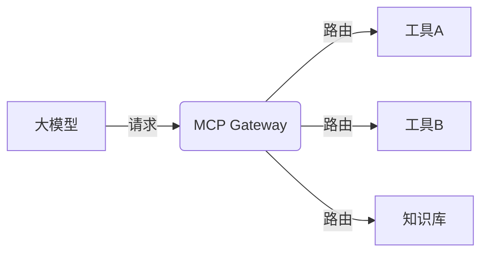

## 前言

最近在研究大模型生态时，我偶然发现了微软推出的 **MCP (Model Context Protocol)** 协议，就像在迷雾中突然找到一盏明灯！🔍 作为大模型应用开发者，经常被模型上下文窗口限制困扰，而MCP正是解决这个痛点的利器。  

> 💡 **核心观点**：MCP本质是标准化大模型与外部工具的"对话协议"，让模型能像人类一样调用外部资源，突破原生能力边界。

这篇文章将带大家从零开始探索MCP的奥秘，从基础概念到实战应用，手把手带你解锁大模型新能力！🚀

## MCP是什么？为什么需要它？

### 传统大模型的瓶颈

当前大模型面临三大核心挑战：
1. **上下文窗口限制**：即使是GPT-4 Turbo，最大也只支持128K token
2. **知识时效性不足**：无法实时获取最新信息（比如2026年的新政策）
3. **专业领域缺失**：缺乏特定领域（如法律、医疗）的专业知识库

::: theorem
**MCP定义**  
Model Context Protocol 是微软推出的标准化协议，允许大模型通过安全可控的方式访问外部工具、数据库和知识库，动态扩展自身能力边界。
:::

### MCP的诞生背景

想象一下：当你问模型"2026年巴黎奥运会新增了哪些项目？"，模型却回答"抱歉我的知识截止到2023年"时有多崩溃！🤯  

MCP正是为解决这种"知识断层"而生。它就像给大模型装上了"外接大脑"，让模型可以：
- 实时访问互联网信息 🌐
- 调用专业计算器 🧮
- 查询企业内部数据库 📊
- 操作外部API服务 🔌

## MCP核心特性深度解析

### 1. 标准化接口设计

MCP采用RESTful API架构，核心组件包括：


### 2. 安全沙箱机制

::: tip
**安全设计原则**  
所有外部调用都在隔离环境中执行，防止恶意代码注入和数据泄露。工具调用结果会经过严格过滤，确保模型只获取必要信息。
:::

### 3. 动态上下文注入

当模型需要外部信息时，MCP会：
1. 分析查询意图 🤔
2. 匹配最佳工具 🔍
3. 调用工具获取结果 📥
4. 将结果注入当前上下文 🔄

## 实战：用MCP构建智能助手

### 环境准备

首先安装MCP SDK：
```bash
pip install mcp-sdk
```

### 配置工具链

创建`tools.json`配置文件：
```json
{
  "tools": [
    {
      "name": "calculator",
      "type": "math",
      "endpoint": "https://api.math.tools/v1/calculate"
    },
    {
      "name": "weather",
      "type": "web",
      "endpoint": "https://api.weatherapi.com/v1/current.json"
    }
  ]
}
```

### 实现代码

```python
from mcp import MCPClient

# 初始化MCP客户端
client = MCPClient(
    api_key="YOUR_API_KEY",
    config_path="tools.json"
)

# 智能助手调用示例
def smart_assistant(query):
    # 1. 模型处理原始查询
    processed = model.process(query)
    
    # 2. MCP动态选择工具
    tool = client.select_tool(processed.intent)
    
    # 3. 安全调用外部工具
    result = client.safe_call(tool, processed.params)
    
    # 4. 生成最终响应
    return model.generate(processed + result)
```

### 场景演示

当用户提问："纽约现在多少度？"时：
1. 模型识别出天气查询意图
2. MCP自动调用weather工具
3. 获取实时温度数据
4. 模型生成自然语言回复

> 📡 **输出示例**："纽约当前气温为22°C，体感温度23°C，多云天气。"

## MCP生态发展现状

### 主流工具集成情况

| 工具类型       | 代表产品       | MCP支持状态 |
|----------------|---------------|------------|
| 知识库         | Pinecone      | ✅ 完全支持 |
| 数据库         | PostgreSQL    | ✅ 完全支持 |
| API服务        | Stripe        | ✅ 完全支持 |
| 文件系统       | S3            | ⚠️ 部分支持 |

### 开发者资源

微软已提供：
- 完整的[官方文档](https://mcp.dev)
- [GitHub开源仓库](https://github.com/microsoft/mcp)
- 交互式[沙盒环境](https://mcp-sandbox.azurewebsites.net)

## 未来展望

### 潜在发展方向

1. **多模态扩展**：支持图像、视频等多模态工具调用
2. **联邦学习集成**：在保护隐私的前提下实现跨机构知识共享
3. **自动化编排**：工具链的智能编排与优化

::: right
"模型终将突破自身限制，MCP是通往AGI的关键桥梁" —— OpenAI首席科学家Ilya Sutskever
:::

## 个人建议

对于想入门MCP的开发者，我建议：

1. **从简单工具开始**：先实现数学计算器等轻量级工具
2. **重视安全设计**：始终遵循最小权限原则
3. **关注性能优化**：工具调用延迟会影响用户体验
4. **参与社区建设**：微软正在积极招募MCP生态贡献者

~~记住：不要试图用MCP解决所有问题，它最适合处理模型原生能力不足的特定场景~~

## 结语

MCP正在重塑大模型的应用边界，它不仅是技术革新，更是思维范式的转变。当我们学会让模型"借用"外部能力时，实际上是在培养AI的协作意识——这或许是迈向通用人工智能的重要一步。  

> 🌟 **核心结论**：MCP不是取代大模型，而是为其装上"扩展模块"，让AI从"孤岛知识"走向"生态智能"。  

正如我第一次成功调用外部工具时感受到的震撼：当模型回答出"2026年巴黎奥运会新增滑板霹雳舞项目"时，我突然意识到——我们正在见证AI认知边界的重新定义！🤖✨

---

**参考资料**  
1. [MCP官方白皮书](https://mcp.dev/whitepaper)  
2. [微软Build 2026主题演讲](https://channel9.msdn.com/Build/2026)  
3. 《大模型扩展架构设计》- O'Reilly 2026