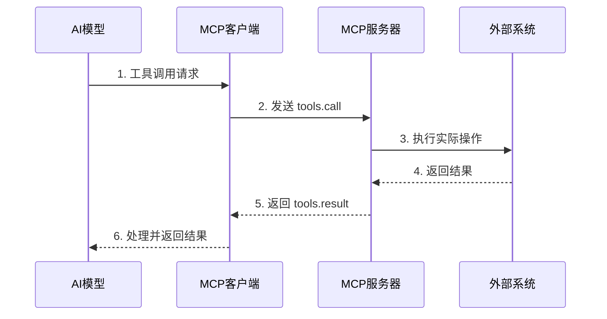

## 前言

在 AI 领域，模型上下文协议（Model Context Protocol, MCP）正在成为连接 AI 模型与外部工具的关键桥梁。作为 `ai_mcp` 博客系列的第二篇，本文将深入探讨 MCP 的核心架构和工作原理，帮助开发者理解如何构建高效的 AI 扩展系统。

> MCP 不仅定义了模型与工具交互的标准，更重新思考了 AI 系统的边界设计。正如 Anthropic 团队所言："MCP 让 AI 模型能够安全、可靠地访问外部世界的能力。"

## MCP 架构概览

MCP 采用分层架构设计，包含四个核心层次：

```
┌───────────────────────────────┐
│      应用层 (Application)      │
├───────────────────────────────┤
│      协议层 (Protocol)        │
├───────────────────────────────┤
│      传输层 (Transport)       │
├───────────────────────────────┤
│      安全层 (Security)        │
└───────────────────────────────┘
```

### 核心组件解析

#### 1. 服务器组件 (Server)
- **职责**：提供工具、资源和数据访问能力
- **实现方式**：通过 `tools` 和 `resources` 两个端点暴露功能
- **示例**：
```python
# 服务器示例：文件访问工具
async def read_file(path: str) -> str:
    with open(path, 'r') as f:
        return f.read()
```

#### 2. 客户端组件 (Client)
- **职责**：代表 AI 模型发起请求并处理响应
- **关键特性**：
  - 请求缓存与去重
  - 错误恢复机制
  - 资源生命周期管理

#### 3. 协议层 (Protocol)
定义标准化的消息格式，包含三种核心消息类型：
- `tools.call`: 调用工具请求
- `tools.result`: 工具执行结果
- `resources.list`: 资源列表查询

## 工作流程详解

### 典型交互流程



### 关键设计原则

1. **无状态通信**：每次请求独立处理，避免服务器端状态维护
2. **异步处理**：支持长时间运行的操作
3. **类型安全**：使用 JSON Schema 定义接口规范

## 实战：构建 MCP 服务器

让我们实现一个简单的天气查询服务器：

```typescript
// weather-server.ts
import { Server } from "@modelcontextprotocol/sdk/server/index.js";
import { StdioServerTransport } from "@modelcontextprotocol/sdk/server/stdio.js";
import {
  CallToolRequestSchema,
  ListToolsRequestSchema,
} from "@modelcontextprotocol/sdk/types.js";

const server = new Server(
  {
    name: "weather-server",
    version: "1.0.0",
  },
  {
    capabilities: {
      tools: {},
    },
  }
);

// 注册工具
server.setRequestHandler(ListToolsRequestSchema, async () => {
  return {
    tools: [
      {
        name: "get_weather",
        description: "获取指定城市的天气信息",
        inputSchema: {
          type: "object",
          properties: {
            city: {
              type: "string",
              description: "城市名称",
            },
          },
          required: ["city"],
        },
      },
    ],
  };
});

// 实现工具逻辑
server.setRequestHandler(CallToolRequestSchema, async (request) => {
  const { name, arguments: args } = request.params;
  
  if (name === "get_weather") {
    const weatherData = await fetchWeather(args.city);
    return {
      content: [
        {
          type: "text",
          text: `当前${args.city}的天气：${weatherData.description}，温度${weatherData.temp}°C`,
        },
      ],
    };
  }
  
  throw new Error(`未知工具: ${name}`);
});

// 启动服务器
const transport = new StdioServerTransport();
server.connect(transport);
await server.run();
```

## 安全考量

MCP 架构通过多层安全机制保障系统安全：

1. **输入验证**：所有输入参数通过 JSON Schema 验证
2. **权限控制**：基于角色的访问控制（RBAC）
3. **沙箱执行**：工具在隔离环境中运行
4. **速率限制**：防止滥用和 DoS 攻击

## 未来展望

随着 MCP 生态的成熟，我们预计将看到：

- **标准化工具库**：社区驱动的工具生态
- **性能优化**：流式处理和增量更新
- **多模态支持**：扩展到图像、音频等非结构化数据
- **跨平台兼容**：统一不同 AI 模型的接口标准

## 结语

MCP 架构代表了 AI 系统设计的新范式，它通过清晰的分层结构和标准化的协议，为 AI 模型提供了安全、可扩展的外部访问能力。理解 MCP 的工作原理，不仅有助于开发者构建更好的 AI 应用，更能把握下一代 AI 系统的发展方向。

> 正如计算机科学先驱 Alan Kay 所说："预测未来的最好方式就是创造它。" MCP 正在为我们创造一个更开放、更强大的 AI 未来。