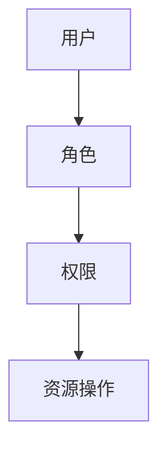

## 前言

嗨，大家好！我是Jorgen，今天想和大家聊聊一个在MCP开发中经常被忽视但又极其重要的主题——多租户与权限管理。🤔

在构建企业级应用时，我们常常需要在一个平台上为多个客户提供服务，这就涉及到多租户架构。而如何确保每个客户的数据安全、操作权限分明，则是权限管理的核心。~~说实话，我曾经因为忽略了这一点，差点把A公司的数据展示给了B公司的客户，幸好及时发现，否则后果不堪设想！~~

::: tip
多租户架构是一种软件架构模式，其中单个软件实例服务于多个客户（租户），但每个客户的数据和配置是相互隔离的。
:::

今天，我将带大家深入了解如何在MCP平台中实现高效的多租户架构与精细化的权限管理，让你的应用既安全又灵活！

## MCP多租户架构基础

### 什么是多租户架构？

多租户架构是指单个软件实例为多个客户（租户）提供服务的一种架构模式。在这种架构中，不同租户的数据和配置是相互隔离的，但共享相同的代码库和基础设施。

::: theorem
多租户架构的核心优势：
1. **成本效益**：多个租户共享资源，降低总体拥有成本
2. **集中维护**：只需维护一个代码库，简化升级和维护
3. **一致性体验**：所有租户使用相同版本的功能
:::

### MCP中的多租户实现模式

在MCP平台中，主要有以下几种多租户实现模式：

#### 1. 共享数据库，共享架构模式

所有租户使用相同的数据库架构，通过租户ID进行数据隔离。

```sql
-- 示例：通过租户ID隔离数据
SELECT * FROM orders WHERE tenant_id = 'tenant123';
```

**优点**：
- 实现简单，资源利用率高
- 查询性能较好

**缺点**：
- 存在数据泄露风险（如果租户ID处理不当）
- 难以实现定制化的架构需求

#### 2. 独立数据库模式

每个租户拥有独立的数据库。

**优点**：
- 数据隔离性最强
- 可以为每个租户定制数据库架构
- 易于迁移和备份

**缺点**：
- 资源消耗大
- 管理复杂度高

#### 3. 共享数据库，独立架构模式

共享数据库，但每个租户拥有独立的数据库架构（通过不同的表前缀或schema实现）。

**优点**：
- 平衡了隔离性和资源利用率
- 可以实现一定程度的定制化

**缺点**：
- 管理复杂度较高
- 某些数据库操作可能受限

在MCP平台中，我推荐使用**共享数据库，独立架构模式**作为默认选择，因为它在大多数场景下提供了最佳的性能与隔离性平衡。

## MCP权限管理系统设计

### 权限模型概述

一个完善的权限管理系统应该包含以下几个核心概念：

1. **用户（User）**：系统的实际使用者
2. **角色（Role）**：权限的集合，如管理员、普通用户等
3. **权限（Permission）**：具体的操作权限，如"创建订单"、"查看报表"等
4. **资源（Resource）**：系统中的可操作对象，如订单、客户、产品等

::: right
"权限管理不是限制用户，而是保护数据和功能的安全边界"
:::

### 基于RBAC的权限模型

在MCP中，我推荐使用基于角色的访问控制（RBAC）模型，因为它既灵活又易于理解和实现。



#### 实现示例

以下是一个基于RBAC的权限管理实现示例：

```python
# 用户模型
class User:
    def __init__(self, user_id, username):
        self.user_id = user_id
        self.username = username
        self.roles = []

# 角色模型
class Role:
    def __init__(self, role_id, role_name):
        self.role_id = role_id
        self.role_name = role_name
        self.permissions = []

# 权限模型
class Permission:
    def __init__(self, permission_id, resource, action):
        self.permission_id = permission_id
        self.resource = resource  # 如 'order', 'product'
        self.action = action      # 如 'create', 'read', 'update', 'delete'

# 检查用户是否有特定权限
def has_permission(user, resource, action):
    for role in user.roles:
        for permission in role.permissions:
            if permission.resource == resource and permission.action == action:
                return True
    return False
```

### MCP中的权限实现策略

#### 1. 声明式权限控制

在MCP中，我们可以使用注解或装饰器来实现声明式权限控制：

```java
// Java示例
@PreAuthorize("hasPermission('order', 'create')")
public Order createOrder(OrderRequest request) {
    // 创建订单逻辑
    return orderService.createOrder(request);
}
```

#### 2. 数据过滤权限

在数据查询时，自动应用权限过滤：

```sql
-- 自动添加租户ID和权限过滤条件
SELECT * FROM orders 
WHERE tenant_id = :tenantId 
AND (created_by = :userId OR has_permission(:userId, 'order', 'read'));
```

#### 3. UI级权限控制

在前端实现基于权限的UI控制：

```javascript
// Vue.js示例
<template>
  <div v-if="hasPermission('order', 'create')">
    <button @click="showCreateOrderDialog">创建订单</button>
  </div>
</template>

<script>
export default {
  methods: {
    hasPermission(resource, action) {
      return this.$store.getters.hasPermission(resource, action);
    }
  }
}
</script>
```

## MCP多租户最佳实践

### 1. 数据隔离策略

确保数据隔离是多租户架构的核心。以下是几种有效的数据隔离策略：

#### 租户上下文传递

在每个请求中传递租户上下文：

```java
// 使用线程局部变量存储当前租户ID
private static final ThreadLocal<String> CURRENT_TENANT = new ThreadLocal<>();

public void setCurrentTenant(String tenantId) {
    CURRENT_TENANT.set(tenantId);
}

public String getCurrentTenant() {
    return CURRENT_TENANT.get();
}
```

#### 自动租户过滤

实现自动租户过滤的拦截器：

```java
public class TenantFilter implements Filter {
    @Override
    public void doFilter(ServletRequest request, ServletResponse response, FilterChain chain) 
            throws IOException, ServletException {
        HttpServletRequest httpRequest = (HttpServletRequest) request;
        String tenantId = httpRequest.getHeader("X-Tenant-ID");
        
        // 设置当前租户上下文
        setCurrentTenant(tenantId);
        
        try {
            chain.doFilter(request, response);
        } finally {
            // 清理租户上下文
            clearCurrentTenant();
        }
    }
}
```

### 2. 缓存策略优化

多租户环境下的缓存需要特别注意隔离性：

```java
// 使用租户ID作为缓存键前缀
public String getCacheKey(String key, String tenantId) {
    return tenantId + ":" + key;
}

// 示例使用
String productKey = getCacheKey("product:123", getCurrentTenant());
Product product = cache.get(productKey);
```

### 3. 监控与日志

实现租户级别的监控和日志：

```java
// 使用MDC（Mapped Diagnostic Context）记录租户信息
MDC.put("tenantId", getCurrentTenant());

// 日志输出示例
// 2026-01-30 10:15:30 [main] INFO com.example.service.OrderService - Created order for tenant: tenant123
```

## MCP权限管理进阶

### 动态权限控制

在某些场景下，我们需要实现动态权限控制，例如基于数据所有权的权限：

```java
@PreAuthorize("hasPermission(#orderId, 'order', 'read') or hasRole('ADMIN')")
public Order getOrder(String orderId) {
    // 获取订单逻辑
    return orderService.getOrder(orderId);
}
```

### 权限继承与组合

实现角色继承和权限组合：

```java
// 角色继承
class Role {
    private List<Role> inheritsFrom = new ArrayList<>();
    
    public boolean hasPermission(String resource, String action) {
        // 检查当前角色的权限
        for (Permission permission : permissions) {
            if (permission.matches(resource, action)) {
                return true;
            }
        }
        
        // 检查继承角色的权限
        for (Role role : inheritsFrom) {
            if (role.hasPermission(resource, action)) {
                return true;
            }
        }
        
        return false;
    }
}
```

### 审计日志

实现全面的权限审计日志：

```java
@Aspect
@Component
public class PermissionAuditAspect {
    
    @AfterReturning("execution(* com.example..*(..)) && @annotation(preAuthorize)")
    public void auditPermission(JoinPoint joinPoint, PreAuthorize preAuthorize) {
        String tenantId = getCurrentTenant();
        String username = getCurrentUser();
        String method = joinPoint.getSignature().getName();
        
        // 记录权限审计日志
        auditService.logPermissionUsage(tenantId, username, method);
    }
}
```

## 结语

多租户与权限管理是构建企业级MCP应用不可或缺的部分。通过合理的设计和实现，我们可以在保证数据安全的同时，提供灵活的权限控制机制。

🏗 构建一个完善的多租户权限系统需要考虑多个方面，从数据隔离到权限控制，从缓存策略到审计日志。但正是这些细节，决定了你的应用是否能够真正满足企业级需求。

💡 记住，权限管理不是一次性工作，而是一个持续演进的过程。随着业务的发展和需求的变化，你需要不断优化和完善你的权限系统。

希望今天的分享能够帮助大家在MCP开发中更好地实现多租户与权限管理。如果有任何问题或建议，欢迎在评论区交流讨论！

> "安全不是终点，而是一段旅程。在多租户架构中，权限管理就是我们在这段旅程中的指南针。"