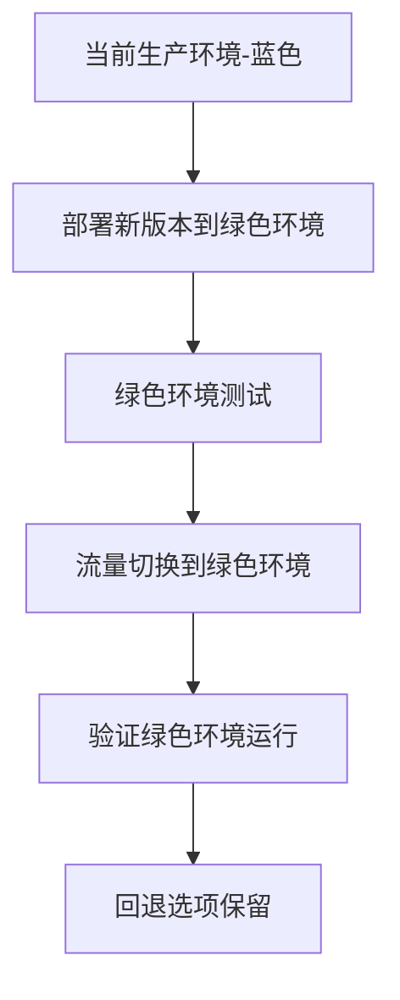

## 前言

在企业级应用开发中，MCP（Microservice Control Platform）平台已经成为构建分布式系统的首选技术栈。然而，随着业务的快速发展和技术迭代，我们不可避免地需要面对MCP平台的迁移与升级问题。如何在不影响业务连续性的前提下，完成MCP平台的平滑迁移和升级，是每个技术团队必须面对的挑战。

> "在技术演进的道路上，迁移不是终点，而是新起点。每一次成功的迁移，都是对系统架构的一次优化和提升。"

本文将深入探讨MCP迁移与升级的最佳实践，帮助您的团队构建健壮的迁移策略，确保业务连续性。

## 为什么需要MCP迁移与升级

在开始讨论具体策略之前，让我们先了解一下为什么MCP迁移与升级如此重要：

### 技术演进需求

随着MCP平台的持续发展，新版本通常会带来性能提升、安全增强和功能扩展。~~然而，许多团队因为害怕迁移过程中的风险而选择长期停留在旧版本，最终导致技术债务累积~~。

### 业务扩展需求

当业务规模扩大时，可能需要：
- 从单机部署扩展到集群部署
- 从开发环境迁移到生产环境
- 从本地部署迁移到云原生架构

### 合规与安全要求

新的安全漏洞和合规要求可能促使我们升级MCP平台，以应对不断变化的安全威胁和法规环境。

## MCP迁移前的准备工作

成功的迁移始于充分的准备阶段。以下是迁移前必须完成的准备工作：

### 1. 评估当前系统状态

::: tip
系统评估是迁移成功的基础，建议使用自动化工具进行全面的系统健康检查。
:::

```bash
# 示例：使用MCP健康检查工具
mcp-health-check --config system-health.yaml --output report.html
```

评估应包括：
- 当前MCP版本及依赖组件版本
- 系统性能指标（响应时间、吞吐量、资源利用率）
- 数据存储结构和大小
- 现有API和服务的依赖关系

### 2. 制定详细的迁移计划

迁移计划应包含以下要素：
- **时间表**：确定迁移窗口，避开业务高峰期
- **回滚策略**：制定详细的回滚计划，包括触发条件和执行步骤
- **团队分工**：明确各成员职责，包括技术负责人、测试人员、业务协调人员等
- **沟通计划**：确保所有利益相关方了解迁移计划和时间表

### 3. 环境准备

创建与生产环境相似的测试环境，用于验证迁移过程：

```yaml
# 示例：测试环境配置
test_environment:
  infrastructure: "AWS EC2"
  mcp_version: "2.5.0"
  database: "PostgreSQL 13"
  load_balancer: "Nginx"
```

## MCP迁移策略

根据不同的迁移场景，我们可以采用不同的迁移策略：

### 1. 蓝绿部署策略

蓝绿部署是一种零停机时间的部署策略，通过维护两个相同的生产环境来实现平滑切换。

**实施步骤**：
1. 在"绿色"环境中部署新版本的MCP
2. 在绿色环境中进行全面测试
3. 将流量从"蓝色"环境切换到"绿色"环境
4. 保留蓝色环境作为回退选项



### 2. 金丝雀发布策略

金丝雀发布逐步将流量引导到新版本，降低风险：

1. 将一小部分流量（如1%）导向新版本
2. 监控新版本的性能和稳定性
3. 逐步增加流量比例（10%、50%、100%）
4. 如发现问题，立即回退

### 3. 滚动更新策略

对于无状态服务，滚动更新是一种高效的迁移方式：

```bash
# 示例：使用MCP CLI进行滚动更新
mcp update-service --service-name user-service \
  --image registry.example.com/user-service:v2.0.0 \
  --batch-size 3 \
  --batch-interval 30s
```

## 数据迁移策略

数据迁移是MCP迁移中最复杂且风险最高的环节：

### 1. 数据备份与验证

在数据迁移前，必须确保有完整的备份：

```bash
# 示例：MCP数据备份命令
mcp backup --database all --location /backups/$(date +%Y%m%d)
```

### 2. 数据同步策略

对于需要零停机时间迁移的系统，可以采用双写+同步策略：

1. 新旧系统同时写入数据
2. 使用数据同步工具将旧系统数据同步到新系统
3. 验证数据一致性
4. 切读流量到新系统
5. 停止旧系统写入

### 3. 数据验证

数据迁移完成后，必须进行严格的数据验证：

```bash
# 示例：数据一致性检查脚本
python data_consistency_check.py \
  --old-db jdbc:postgresql://old-db:5432/app \
  --new-db jdbc:postgresql://new-db:5432/app \
  --sample-size 10000
```

## MCP升级最佳实践

### 1. 版本兼容性检查

在升级前，务必检查版本间的兼容性：

```bash
# 示例：使用MCP兼容性检查工具
mcp compatibility-check --from-version 2.3.0 --to-version 2.5.0
```

### 2. 分阶段升级

对于大型MCP集群，建议采用分阶段升级策略：

1. 先升级边缘节点
2. 升级管理节点
3. 最后升级核心服务节点

### 3. 配置迁移

MCP升级通常涉及配置文件的变更：

```yaml
# 示例：配置迁移示例
old_config:
  logging:
    level: INFO
    format: text

new_config:
  logging:
    level: INFO
    format: json
    outputs:
      - type: file
        path: /var/log/mcp/app.log
```

## 迁移后的验证与优化

### 1. 性能基准测试

迁移完成后，应进行全面的性能测试：

```bash
# 示例：使用JMeter进行性能测试
jmeter -n -t performance_test.jmx -l results.jtl
```

### 2. 监控与告警配置

确保监控系统已更新，能够监控新版本MCP的性能指标：

```yaml
# 示例：Prometheus监控配置
mcp_metrics:
  - name: request_duration_seconds
    type: histogram
    description: "请求处理时间"
    labels:
      - service_name
      - status_code
```

### 3. 文档更新

及时更新技术文档，包括：
- 架构图更新
- API变更说明
- 运维手册更新
- 故障排查指南

## 常见挑战与解决方案

### 挑战1：数据一致性保证

**解决方案**：
- 实施事务性数据迁移
- 使用数据校验工具定期检查一致性
- 建立数据不一致的告警机制

### 挑战2：服务依赖管理

**解决方案**：
- 建立服务依赖图谱
- 实施依赖版本锁定策略
- 使用服务网格管理服务间通信

### 挑战3：回滚复杂度高

**解决方案**：
- 自动化回滚流程
- 实施状态快照机制
- 建立详细的回滚检查清单

## 结语

MCP迁移与升级是技术演进过程中的必经之路。通过充分的准备、合理的策略选择和严格的执行，我们可以确保迁移过程的平稳进行，同时为业务带来新的技术红利。

> "成功的迁移不仅仅是技术的升级，更是架构的优化和团队的成长。每一次迁移，都是对系统韧性和团队协作能力的一次考验。"

希望本文分享的策略和实践能够帮助您的团队顺利完成MCP平台的迁移与升级，构建更加稳定、高效的系统架构。

在未来的技术道路上，让我们持续学习，不断进步，共同迎接挑战，创造价值！