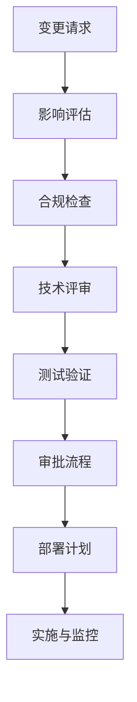

## 前言

嗨，我是Jorgen！在之前的一系列MCP博客中，我们已经探讨了从架构设计、开发实践到部署运维的方方面面。但是，有一个对企业级应用至关重要的主题我们尚未深入探讨——那就是**合规性与治理**。🤔

在当今数据驱动的商业环境中，确保您的MCP应用符合各种行业标准和法规要求，不仅仅是法律要求，更是建立客户信任的关键。今天，我想和大家分享MCP平台上的合规性与治理最佳实践，帮助您构建既强大又合规的企业级应用。

::: tip
合规不是阻碍创新的枷锁，而是保障业务可持续发展的安全网。良好的治理架构能让您的MCP应用在合规的同时，依然保持灵活和高效。
:::

## 什么是MCP合规性与治理？

在深入探讨之前，让我们先明确几个关键概念：

- **合规性**：确保您的MCP应用遵循相关的法律法规、行业标准和企业内部政策。
- **治理**：建立一套框架和流程，用于管理MCP应用的生命周期，确保其安全、可靠且符合业务目标。

::: theorem
MCP合规性与治理框架应包含以下核心要素：
1. 数据隐私保护
2. 访问控制与身份管理
3. 审计日志与监控
4. 变更管理流程
5. 风险评估与管理
6. 政策执行与自动化
:::

## MCP合规性关键领域

### 1. 数据隐私保护

在MCP平台上处理个人数据时，必须确保符合GDPR、CCPA等数据保护法规。

```yaml
# 示例：MCP数据分类策略
data_classification:
  personal: "加密存储，访问需审批"
  confidential: "最高权限控制，全链路加密"
  internal: "标准访问控制"
  public: "无需特殊保护"
```

**最佳实践**：
- 实施数据分类和标记策略
- 使用MCP的内置数据加密功能
- 配置数据保留和删除策略
- 定期进行数据隐私影响评估

### 2. 访问控制与身份管理

确保只有授权人员才能访问敏感数据和系统资源。

```powershell
# 示例：MCP基于角色的访问控制(RBAC)配置
New-MCPRole -Name "ComplianceAuditor" -Permissions @(
    "Read-Logs",
    "View-Reports",
    "Monitor-Resources"
)
```

**关键控制措施**：
- 实施最小权限原则
- 建立强身份验证机制（如多因素认证）
- 定期审查访问权限
- 实施特权访问管理(PAM)

### 3. 审计日志与监控

全面的审计日志是合规性的基础，也是安全事件调查的关键。

```json
// 示例：MCP审计日志配置
{
  "log_retention": 365,
  "log_level": "verbose",
  "log_categories": [
    "authentication",
    "authorization",
    "data_access",
    "configuration_changes"
  ],
  "real_time_monitoring": true
}
```

**实施建议**：
- 启用所有相关服务的审计日志
- 集中日志管理，便于分析
- 设置异常行为警报
- 定期审查审计日志

## MCP治理框架

### 1. 变更管理流程

在MCP环境中，未经充分测试和审批的变更可能导致安全漏洞或合规问题。



### 2. 风险评估与管理

定期识别和评估MCP环境中的风险，并制定缓解措施。

::: right
*注：风险评估应至少每季度进行一次，或在重大变更后进行。*
:::

**风险评估步骤**：
1. 识别资产和威胁
2. 评估可能性和影响
3. 确定风险级别
4. 制定缓解策略
5. 实施控制措施
6. 监控和审查

### 3. 政策执行与自动化

将合规要求转化为自动化检查和控制，确保持续合规。

```yaml
# 示例：MCP合规策略即代码
compliance_policies:
  - name: "encryption_required"
    resource: "storage_account"
    rule: "properties.encryption.services.blob.enabled == true"
    severity: "high"
    
  - name: "audit_logs_enabled"
    resource: "log_analytics_workspace"
    rule: "properties.retentionInDays >= 365"
    severity: "critical"
```

## 实施MCP合规性治理的实用步骤

### 第一步：建立合规性基线

1. 识别适用的法律法规和行业标准
2. 进行差距分析，确定当前状态与要求之间的差距
3. 制定合规性路线图

### 第二步：实施技术控制

1. 配置MCP的安全设置
2. 实施网络隔离和分段
3. 启用加密和密钥管理
4. 配置身份和访问管理

### 第三步：建立流程和控制

1. 制定数据分类和处理政策
2. 建立变更管理流程
3. 实施事件响应计划
4. 建立定期审查机制

### 第四步：自动化和监控

1. 实施配置管理工具
2. 部署持续合规监控
3. 建立自动化警报
4. 实施合规报告生成

## 常见挑战与解决方案

### 挑战1：合规要求复杂多变

**解决方案**：
- 采用模块化的合规框架
- 建立合规性注册表，跟踪所有要求
- 定期更新合规策略

### 挑战2：跨环境一致性

**解决方案**：
- 实施基础设施即代码(IaC)
- 使用MCP Policy as Code功能
- 建立环境模板和标准

### 挑战3：合规与业务敏捷性的平衡

**解决方案**：
- 采用"安全左移"策略，在开发早期考虑合规性
- 实施自动化合规检查，减少手动工作
- 建立合规性例外流程，允许在受控环境中灵活处理

## 结语

构建符合行业标准的企业级MCP应用，不仅仅是技术挑战，更是管理挑战。通过建立全面的合规性与治理框架，您可以在确保合规的同时，保持业务的敏捷性和创新力。

记住，合规不是一次性项目，而是一个持续的过程。随着法规的变化和业务的发展，您的MCP合规性策略也需要不断演进。

希望这篇指南能帮助您在MCP平台上构建既强大又合规的应用。如果您有任何问题或经验分享，欢迎在评论区留言讨论！👋

> "合规不是创新的障碍，而是高质量创新的保障。在MCP平台上，良好的治理架构能让您的业务在安全的轨道上高速前进。"