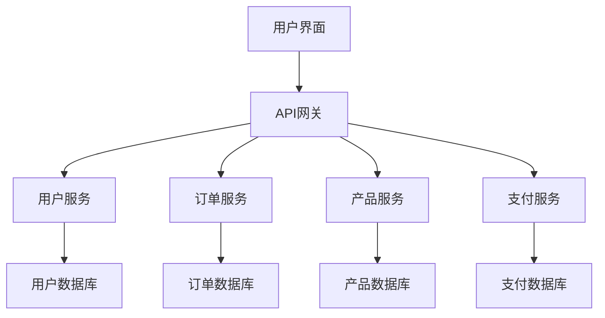

## 前言

在我深入探索MCP平台的旅程中，一个明显的话题一直萦绕在我心头：如何在这个强大的平台上构建真正的微服务架构？🤔 当我浏览已有的MCP文章时，发现虽然我们有关于多租户、部署、安全等各个方面的指南，但缺少一个专门讨论如何在MCP上实现微服务架构的核心主题。

微服务架构已经成为现代应用开发的黄金标准，它允许我们将复杂的应用拆分为小型、独立的服务，每个服务都可以独立开发、部署和扩展。对于MCP平台来说，提供清晰的微服务架构指南至关重要，因为这将帮助开发者充分利用MCP的分布式特性，构建真正可扩展的企业级应用。

::: tip
微服务架构不仅仅是技术选择，更是一种组织文化。它要求我们重新思考应用的设计、开发和运维方式。
:::

在本文中，我将分享在MCP平台上构建微服务架构的最佳实践、设计模式和注意事项，帮助你释放MCP平台的全部潜力。🚀

## MCP微服务架构基础

### 什么是微服务架构？

微服务架构是一种将应用程序构建为小型、自治服务的集合的方法，每个服务都围绕特定的业务功能构建，并通过轻量级机制（通常是HTTP/REST API）进行通信。

在MCP平台上，微服务架构意味着将你的应用拆分为多个独立部署的服务，每个服务都可以单独扩展、更新和故障恢复，同时共享MCP平台提供的核心基础设施。

### MCP平台与微服务的天然契合

MCP平台的设计初衷就与微服务架构高度契合：

- **分布式特性**：MCP从设计上就是分布式的，天然适合微服务架构
- **服务发现机制**：内置的服务注册与发现功能
- **API网关**：提供统一的入口和路由功能
- **配置中心**：集中管理不同服务的配置
- **消息队列**：支持服务间异步通信

::: theorem
微服务架构不是银弹，它带来了开发复杂性的增加。在MCP平台上实施微服务架构前，请确保你的业务场景确实需要这种架构。
:::

## MCP微服务设计模式

### 服务拆分策略

在MCP平台上拆分微服务时，应遵循以下原则：

- **业务边界驱动**：按照业务领域拆分，而不是技术层面
- **单一职责原则**：每个服务只做一件事，并把它做好
- **高内聚低耦合**：服务内部紧密相关，服务间松散耦合
- **数据自治**：每个服务拥有自己的数据存储



### 服务通信模式

在MCP微服务架构中，主要有两种服务通信模式：

#### 1. 同步通信

使用HTTP/REST或gRPC进行服务间直接调用：

```javascript
// MCP服务间同步通信示例
const orderService = mcp.getService('order-service');
const order = await orderService.createOrder({
  userId: '123',
  productId: '456',
  quantity: 2
});
```

**优点**：
- 实现简单直观
- 调试方便
- 适合实时性要求高的场景

**缺点**：
- 容易产生级联故障
- 性能瓶颈
- 增加系统复杂性

#### 2. 异步通信

使用MCP内置的消息队列进行服务间解耦：

```javascript
// MCP服务间异步通信示例
// 订单服务发布事件
await mcp.publish('order.created', {
  orderId: '789',
  userId: '123',
  amount: 99.99
});

// 通知服务订阅事件
mcp.subscribe('order.created', async (event) => {
  await sendNotification(event.userId, '您的订单已创建');
});
```

**优点**：
- 服务解耦
- 提高系统弹性和可扩展性
- 支持最终一致性

**缺点**：
- 实现复杂度较高
- 调试困难
- 可能导致数据一致性问题

### 数据管理策略

在MCP微服务架构中，数据管理是一个关键挑战。推荐采用以下策略：

#### 1. 数据库 per 服务

每个微服务拥有自己的数据库，实现数据隔离：

```yaml
# MCP服务配置示例 - 每个服务有独立数据库
services:
  - name: user-service
    database: user-db
  - name: order-service
    database: order-db
  - name: product-service
    database: product-db
```

#### 2. CQRS模式

使用命令查询责任分离(CQRS)模式优化读写性能：

```javascript
// MCP中的CQRS实现示例
// 命令端 - 写操作
class OrderCommandService {
  async createOrder(orderData) {
    const order = new Order(orderData);
    await order.save();
    await mcp.publish('order.created', order);
    return order;
  }
}

// 查询端 - 读操作
class OrderQueryService {
  async getOrderById(id) {
    return OrderModel.findById(id).lean();
  }
  
  async getUserOrders(userId) {
    return OrderModel.find({ userId }).lean();
  }
}
```

## MCP微服务实现指南

### 服务注册与发现

MCP平台内置了服务注册与发现机制，让你的微服务能够轻松找到彼此：

```javascript
// 服务提供方注册
const userService = new MCPService({
  name: 'user-service',
  version: '1.0.0',
  port: 3000,
  healthCheck: '/health'
});

await userService.register();

// 服务消费方发现
const userService = await mcp.getService('user-service');
const user = await userService.getUser('123');
```

### API网关配置

使用MCP的API网关统一管理所有微服务的入口点：

```yaml
# MCP API网关配置
gateway:
  routes:
    - path: /api/users
      service: user-service
      stripPrefix: true
    - path: /api/orders
      service: order-service
      stripPrefix: true
    - path: /api/products
      service: product-service
      stripPrefix: true
  middlewares:
    - authentication
    - rateLimiting
    - logging
```

### 配置管理

利用MCP的配置中心管理不同环境的微服务配置：

```yaml
# MCP配置中心示例 - 开发环境
environments:
  development:
    user-service:
      database:
        host: localhost
        port: 5432
    order-service:
      paymentGateway:
        apiKey: dev-key-123
```

### 容器化与编排

将MCP微服务容器化，使用Kubernetes进行编排：

```dockerfile
# MCP微服务Dockerfile示例
FROM mcp/base:latest

WORKDIR /app
COPY package*.json ./
RUN npm install

COPY . .
EXPOSE 3000

CMD ["mcp", "start", "--service", "user-service"]
```

```yaml
# Kubernetes部署配置示例
apiVersion: apps/v1
kind: Deployment
metadata:
  name: user-service
spec:
  replicas: 3
  selector:
    matchLabels:
      app: user-service
  template:
    metadata:
      labels:
        app: user-service
    spec:
      containers:
      - name: user-service
        image: mcp/user-service:latest
        ports:
        - containerPort: 3000
```

## MCP微服务监控与可观测性

### 分布式追踪

利用MCP的分布式追踪功能监控微服务间的调用链：

```javascript
// MCP分布式追踪示例
const tracer = mcp.getTracer('user-service');

async function getUserWithTrace(userId) {
  return tracer.startActiveSpan('getUser', async (span) => {
    try {
      const user = await userService.getUser(userId);
      span.setAttribute('user.id', user.id);
      span.setAttribute('user.name', user.name);
      return user;
    } catch (error) {
      span.recordException(error);
      throw error;
    } finally {
      span.end();
    }
  });
}
```

### 日志聚合

配置MCP的日志聚合系统，集中收集所有微服务的日志：

```javascript
// MCP日志配置示例
const logger = mcp.getLogger('user-service');

logger.info('User service started', {
  version: '1.0.0',
  port: process.env.PORT
});

logger.warn('Slow database query detected', {
  query: 'SELECT * FROM users',
  duration: 1200
});
```

### 指标收集

使用MCP的指标收集功能监控微服务性能：

```javascript
// MCP指标收集示例
const metrics = mcp.getMetrics();

// 记录HTTP请求指标
metrics.counter('http_requests_total', {
  method: 'GET',
  path: '/users',
  status: 200
});

// 记录数据库查询耗时
metrics.histogram('db_query_duration_seconds', 0.45, {
  service: 'user-service',
  operation: 'find'
});
```

## MCP微服务部署策略

### 蓝绿部署

使用MCP的蓝绿部署策略实现零停机更新：

```yaml
# MCP蓝绿部署配置
deployments:
  - name: user-service
    strategy: blueGreen
    blue:
      version: 1.0.0
    green:
      version: 1.1.0
    trafficRouting:
      blue: 50%
      green: 50%
```

### 金丝雀发布

使用MCP的金丝雀发布策略逐步推出新版本：

```yaml
# MCP金丝雀发布配置
deployments:
  - name: user-service
    strategy: canary
    baseline:
      version: 1.0.0
      traffic: 90%
    canary:
      version: 1.1.0
      traffic: 10%
```

### 自动扩展

配置MCP的自动扩展策略，根据负载自动调整微服务实例数量：

```yaml
# MCP自动扩展配置
autoscaling:
  user-service:
    minReplicas: 2
    maxReplicas: 10
    targetCPUUtilizationPercentage: 70
    targetMemoryUtilizationPercentage: 80
```

## MCP微服务安全实践

### 服务间认证

使用MCP的服务间认证机制确保只有授权服务可以相互通信：

```javascript
// MCP服务间认证示例
const secureUserService = new MCPService({
  name: 'user-service',
  version: '1.0.0',
  port: 3000,
  authentication: {
    type: 'service-to-service',
    credentials: mcp.getServiceCredentials('user-service')
  }
});
```

### API安全

使用MCP的API安全中间件保护微服务端点：

```javascript
// MCP API安全配置
const securityMiddleware = mcp.getMiddleware('security');

app.use(securityMiddleware.rateLimit({
  windowMs: 15 * 60 * 1000, // 15分钟
  max: 100 // 限制每个IP在15分钟内最多100个请求
}));

app.use(securityMiddleware.authenticate({
  type: 'jwt',
  secret: mcp.getSecret('jwt-secret')
}));
```

### 数据加密

使用MCP的数据加密功能保护敏感数据：

```javascript
// MCP数据加密示例
const encryption = mcp.getEncryption();

async function saveUserWithEncryption(userData) {
  const encryptedData = encryption.encrypt(userData, {
    algorithm: 'aes-256-gcm',
    key: mcp.getSecret('encryption-key')
  });
  
  return await userService.save(encryptedData);
}
```

## MCP微服务常见陷阱与解决方案

### 1. 服务间过度耦合

**问题**：微服务间直接调用过多，导致紧耦合。

**解决方案**：
- 使用事件驱动架构减少直接依赖
- 实施反腐败层(anti-corruption layer)集成外部服务
- 定义明确的API契约和版本控制

```javascript
// MCP反腐败层示例
class ExternalOrderAdapter {
  constructor() {
    this.externalOrderService = mcp.getService('external-order-service');
  }
  
  async adaptToInternalFormat(externalOrder) {
    return {
      id: externalOrder.orderId,
      userId: externalOrder.customerId,
      items: externalOrder.products.map(p => ({
        productId: p.id,
        quantity: p.quantity,
        price: p.price
      })),
      totalAmount: externalOrder.total
    };
  }
}
```

### 2. 分布式事务管理

**问题**：跨多个微服务的事务一致性难以保证。

**解决方案**：
- 采用Saga模式管理分布式事务
- 使用最终一致性而非强一致性
- 实施补偿事务处理失败情况

```javascript
// MCP Saga模式实现示例
class OrderSaga {
  async createOrder(orderData) {
    try {
      // 步骤1: 创建订单
      const order = await this.createOrderStep(orderData);
      
      // 步骤2: 预扣库存
      await this.reserveInventoryStep(order);
      
      // 步骤3: 处理支付
      await this.processPaymentStep(order);
      
      return order;
    } catch (error) {
      // 补偿事务
      await this.compensate(error);
      throw error;
    }
  }
  
  async compensate(error) {
    // 根据错误类型执行相应的补偿操作
    if (error.step === 'processPayment') {
      await this.releaseInventory(error.orderId);
    }
    if (error.step === 'reserveInventory') {
      await this.cancelOrder(error.orderId);
    }
  }
}
```

### 3. 配置管理复杂性

**问题**：随着微服务数量增加，配置管理变得复杂。

**解决方案**：
- 使用MCP的配置中心集中管理配置
- 实施配置版本控制和回滚机制
- 使用环境变量和配置文件分层管理不同环境配置

```javascript
// MCP分层配置示例
const config = mcp.getConfig();

// 基础配置
const baseConfig = {
  service: {
    name: 'user-service',
    version: '1.0.0'
  },
  database: {
    host: config.get('database.host', 'localhost'),
    port: config.get('database.port', 5432)
  }
};

// 环境特定配置
const envConfig = {
  development: {
    database: {
      host: 'dev-db.example.com'
    }
  },
  production: {
    database: {
      host: 'prod-db.example.com',
      ssl: true
    }
  }
};

// 合并配置
const finalConfig = {
  ...baseConfig,
  ...envConfig[process.env.NODE_ENV || 'development']
};
```

## 结语

在MCP平台上构建微服务架构是一项复杂但极具价值的任务。通过本文的指南，我希望你已经了解了如何在MCP平台上设计和实现微服务架构，从服务拆分、通信模式到部署策略和最佳实践。

微服务架构不是银弹，它带来了开发复杂性的增加，但也提供了无与伦比的可扩展性和灵活性。在MCP平台上，我们拥有强大的工具和功能来简化微服务开发的复杂性，让我们能够专注于业务逻辑而非基础设施。

随着MCP平台的不断发展，我们可以期待更多专门针对微服务架构的功能和工具。如果你已经在MCP平台上实施了微服务架构，或者有任何问题、建议或经验分享，欢迎在评论区留言讨论！

> "微服务架构的真正价值不在于技术本身，而在于它如何帮助我们构建更灵活、更 resilient 的系统，更好地适应不断变化的业务需求。"

在下一篇文章中，我们将探讨MCP与Serverless架构的集成，看看如何将微服务与无服务器计算结合，进一步优化应用架构和成本。敬请期待！🚀