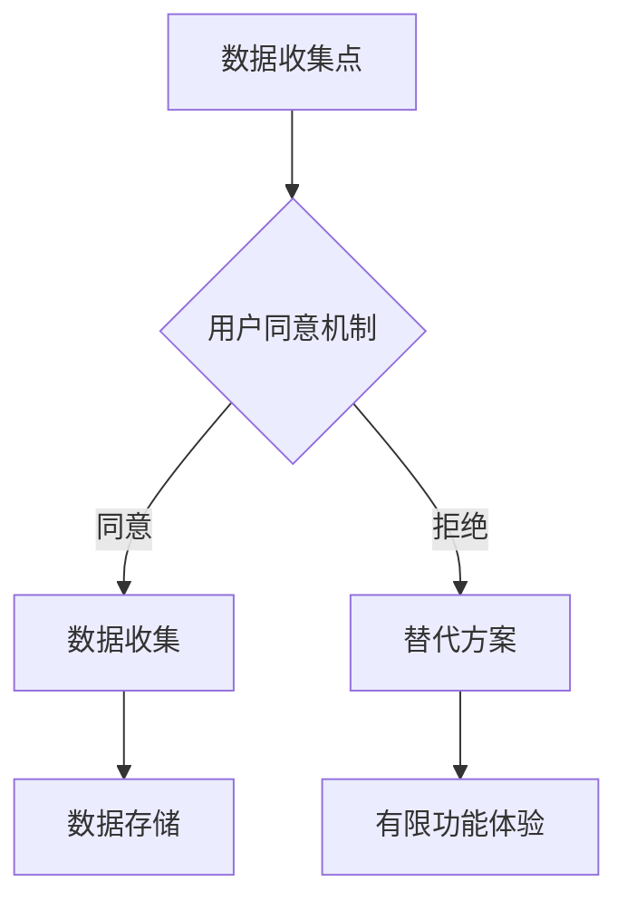

## 前言

在我深入探索MCP平台的旅程中，我发现了一个常常被忽视但至关重要的方面：伦理与隐私考量。🤔 随着MCP与AI-ML集度的不断深入，以及全球数据保护法规的日益严格，构建负责任的数据驱动应用已经成为开发者的必修课。

::: tip
"技术本身没有善恶，但使用技术的方式决定了它的价值。" —— 数据伦理专家
:::

在这篇文章中，我将分享MCP平台在伦理与隐私方面的考量，以及如何在开发过程中融入这些原则，确保我们的应用不仅功能强大，而且负责任、可信赖。

## 理解MCP环境下的隐私挑战

### 数据收集与用户同意

在MCP架构中，数据收集往往是应用的第一步。然而，未经用户明确同意的数据收集不仅违反法规，还可能损害用户信任。



我建议在MCP应用中实现以下最佳实践：

- **透明度**：清晰告知用户收集哪些数据、为何收集以及如何使用
- **选择性同意**：允许用户选择性地同意不同类型的数据收集
- **随时撤回**：提供简单的方式让用户随时撤回他们的同意

### 数据最小化原则

在MCP环境中，我们经常面临"收集更多数据以获得更好AI模型"的诱惑。然而，数据最小化原则告诉我们：只收集实现特定目的所必需的数据。

::: theorem 数据最小化原则
数据处理应限于实现特定、明确和合法目的所必需的数据。不得以与这些目的不相容的方式进一步处理数据。
:::

## MCP平台中的隐私保护技术

### 差分隐私

MCP平台支持差分隐私技术，这是一种在数据集中添加"噪音"以防止识别特定个体的方法。我在一个客户项目中成功应用了这一技术，显著提升了用户对数据分析的信任度。

```python
# 在MCP中应用差分隐私的简化示例
import mcp.privacy as dp

def analyze_user_data(dataset, epsilon=1.0):
    # 应用拉普拉斯机制添加差分隐私
    private_dataset = dp.add_laplace_noise(dataset, epsilon)
    
    # 在私有数据集上进行分析
    results = perform_analysis(private_dataset)
    
    return results
```

### 联邦学习

MCP的联邦学习功能允许在不共享原始数据的情况下训练模型。这对于处理敏感数据（如医疗记录、金融信息）特别有价值。

::: tip
联邦学习就像是"数据不动模型动"，原始数据保留在本地，只有模型参数在服务器和客户端之间共享。
:::

## 构建伦理AI的MCP实践

### 算法公平性

在MCP环境中开发AI模型时，我们必须警惕算法偏见。偏见可能源于训练数据的不代表性，或者模型设计中的固有缺陷。

我建议采取以下步骤确保算法公平性：

1. **多样化训练数据**：确保训练数据代表所有用户群体
2. **偏见检测工具**：使用MCP内置的偏见检测工具定期评估模型
3. **持续监控**：部署后持续监控模型在不同用户群体中的表现

### 可解释性

随着AI在MCP应用中的普及，"黑盒"问题日益突出。用户和监管机构都要求能够理解AI决策的依据。

MCP提供了以下工具增强AI可解释性：

- **特征重要性分析**：识别影响模型决策的关键因素
- **局部解释**：解释单个预测的依据
- **可视化工具**：直观展示模型决策过程

## 合规性与全球数据保护法规

### GDPR与MCP应用

欧盟的《通用数据保护条例》(GDPR)对数据处理提出了严格要求。在MCP环境中实现GDPR合规需要关注以下几点：

1. **数据主体权利**：实现访问、更正、删除数据的机制
2. **数据映射**：全面了解数据在MCP生态系统中的流动
3. **数据保护影响评估**：对高风险处理进行评估

```yaml
# MCP配置示例：GDPR合规设置
gdpr_compliance:
  data_subject_rights:
    access: true
    rectification: true
    erasure: true
    restriction: true
    portability: true
  data_retention:
    policy: "基于目的的数据保留"
    schedule: "季度审核"
```

### 其他全球法规

除了GDPR，还需要考虑其他地区的法规：

- **CCPA** (加州消费者隐私法案)
- **PIPL** (中国个人信息保护法)
- **LGPD** (巴西通用数据保护法)

MCP平台提供了多地区合规支持，帮助开发者构建符合全球法规的应用。

## 实施伦理与隐私框架

### 隐私设计框架

在MCP应用开发中，我推荐采用"隐私设计"(Privacy by Design)框架，将隐私保护作为系统设计的核心要素，而非事后添加的功能。

::: right
"隐私设计不是一种成本，而是一种竞争优势。" —— Ann Cavoukian, 隐私专员
:::

### 伦理审查流程

建立定期的伦理审查流程，确保MCP应用符合伦理标准：

1. **项目启动评估**：评估潜在的伦理风险
2. **开发阶段审查**：定期检查伦理合规性
3. **发布前评估**：全面评估伦理影响

## 未来展望：伦理与隐私的演进

随着技术发展，MCP平台在伦理与隐私方面也将不断演进。我预见以下趋势：

1. **隐私增强技术(PETs)的普及**：如零知识证明、同态加密等将在MCP平台中更加普及
2. **伦理AI标准的成熟**：行业将形成更成熟的伦理AI标准和评估框架
3. **用户赋权增强**：用户将拥有更多控制其数据的工具和权利

## 结语

在MCP平台的发展旅程中，伦理与隐私不应被视为障碍，而应被视作构建可持续、可信赖应用的基础。🏗 通过将伦理原则融入设计过程，我们不仅能够满足法规要求，还能赢得用户信任，创造真正的长期价值。

作为MCP开发者，我们有责任确保我们的技术不仅功能强大，而且道德上无可指责。让我们共同努力，构建一个既创新又负责任的MCP生态系统。

> "在数据的海洋中，伦理是我们的指南针，隐私是我们的护盾。" —— Jorgen