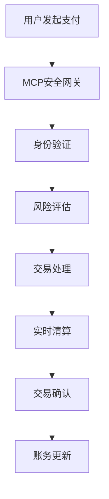

## 前言

金融科技（FinTech）正在以前所未有的速度重塑全球金融行业。从移动支付到区块链，从智能投顾到开放银行，技术创新正在改变我们与金融系统互动的方式。在这一变革浪潮中，MCP（Management and Control Platform）凭借其强大的管理能力和灵活的控制机制，为金融科技应用提供了理想的支撑平台。

本文将深入探讨MCP在金融科技领域的应用，展示如何利用MCP构建安全、合规、高效的数字化金融服务。

## 金融科技的挑战与机遇

金融科技行业面临着独特的挑战和机遇：

### 挑战

1. **严格的安全要求**：金融数据高度敏感，需要最高级别的安全保护
2. **复杂的合规环境**：各地区金融法规差异大，合规要求严格
3. **高并发交易处理**：需要处理大量实时交易，系统稳定性要求极高
4. **快速迭代与创新**：市场竞争激烈，需要快速推出新功能和服务
5. **数据隐私保护**：客户隐私数据保护是重中之重

### 机遇

1. **金融包容性**：通过技术扩大金融服务覆盖范围
2. **运营效率提升**：自动化流程降低成本，提高效率
3. **客户体验优化**：提供个性化、便捷的金融服务
4. **风险管理改进**：利用大数据和AI进行更精准的风险评估
5. **新型商业模式**：创造基于技术的全新金融产品和服务

## MCP在金融科技中的核心价值

MCP平台为金融科技应用提供了多方面的价值：

### 🔒 安全保障

MCP提供多层次的安全机制，确保金融交易和数据的安全：

```yaml
安全架构:
  身份认证: 多因素认证、生物识别
  访问控制: 基于角色的权限管理、最小权限原则
  数据加密: 传输加密、存储加密
  审计追踪: 完整的操作日志、实时监控
  威胁检测: 异常行为分析、实时警报
```

### 📋 合规管理

金融行业受到严格监管，MCP帮助实现合规自动化：

- **监管报告自动化**：自动生成符合监管要求的报告
- **合规规则引擎**：内置金融合规规则，实时检查交易合规性
- **数据保留策略**：自动执行数据保留和归档策略
- **合规审计**：提供完整的合规审计跟踪

### ⚡ 高性能处理

金融交易系统需要处理高并发请求，MCP提供：

- **弹性扩展**：根据负载自动扩展资源
- **低延迟架构**：优化处理流程，减少交易延迟
- **容错机制**：确保系统高可用性
- **负载均衡**：智能分配请求，优化资源利用

### 🔄 快速创新

MCP加速金融科技产品开发：

- **微服务架构**：支持快速开发和部署独立服务
- **API管理**：简化API开发和管理，促进开放银行
- **DevOps集成**：自动化CI/CD流程，加速迭代
- **沙箱环境**：提供安全的测试环境，降低创新风险

## MCP金融科技应用场景

### 💳 数字支付与结算

MCP为数字支付系统提供强大支持：



**关键特性**：
- 实时交易处理
- 多渠道支付整合
- 欺诈检测与预防
- 跨境支付支持

### 🏦 智能投顾与财富管理

MCP赋能个性化财富管理服务：

- **客户画像分析**：整合多源数据，构建全面客户画像
- **投资组合优化**：基于AI的投资建议和组合调整
- **风险评估**：实时市场风险分析
- **合规检查**：确保投资建议符合监管要求

**架构示例**：
```yaml
智能投顾系统:
  数据层:
    - 市场数据API
    - 客户数据仓库
    - 历史交易数据库
  分析层:
    - 风险评估引擎
    - 投资组合优化算法
    - 市场趋势预测模型
  服务层:
    - 客户门户
    - 投资建议API
    - 报告生成系统
  管理层:
    - MCP平台
    - 合规检查模块
    - 审计跟踪系统
```

### 🛡️ 风险管理与欺诈检测

MCP增强金融风险管控能力：

- **实时交易监控**：识别异常交易模式
- **信用评分模型**：动态评估客户信用风险
- **反洗钱(AML)检查**：自动检测可疑交易
- **压力测试**：模拟市场极端情况下的系统表现

### 📊 开放银行与API经济

MCP支持开放银行战略：

- **API管理**：安全发布和管理银行API
- **开发者门户**：为第三方开发者提供开发工具
- **使用分析**：监控API使用情况和性能
- **计费与结算**：管理API使用计费和收入分成

## MCP金融科技实施策略

### 阶段一：基础设施准备

1. **安全评估**：全面评估现有安全架构，确定MCP安全配置
2. **合规映射**：将金融合规要求映射到MCP控制机制
3. **性能基准测试**：建立系统性能基准，为优化提供参考

### 阶段二：核心功能迁移

1. **优先级排序**：确定迁移功能的优先级
2. **增量迁移**：采用增量方法迁移核心功能
3. **并行运行**：新旧系统并行运行，确保业务连续性

### 阶段三：创新功能开发

1. **敏捷开发**：采用敏捷方法开发创新功能
2. **快速迭代**：基于用户反馈快速迭代产品
3. **A/B测试**：使用A/B测试优化用户体验

### 阶段四：生态系统扩展

1. **API开放**：逐步开放API，构建开发者生态
2. **合作伙伴集成**：与金融科技公司建立合作关系
3. **创新实验室**：设立创新实验室，探索新技术应用

## 金融科技MCP应用最佳实践

### 安全最佳实践

1. **零信任架构**：实施零安全信任模型，持续验证所有访问
2. **数据分类**：对金融数据实施分类管理，差异化保护
3. **加密策略**：端到端加密，保护数据传输和存储安全
4. **安全测试**：定期进行渗透测试和安全评估

### 合规最佳实践

1. **合规即代码**：将合规要求编码为自动化检查
2. **监管更新响应**：建立快速响应监管变化的机制
3. **合规报告自动化**：自动生成监管报告，减少人工错误
4. **合规培训**：定期对团队进行合规培训

### 性能优化最佳实践

1. **资源弹性**：根据负载自动调整资源分配
2. **缓存策略**：实施多级缓存，提高响应速度
3. **数据库优化**：优化数据库查询和索引设计
4. **网络优化**：优化网络架构，减少延迟

## 案例研究：MCP驱动的数字银行转型

### 背景

某传统银行面临数字化转型的挑战，需要构建现代化的数字银行平台，同时保持系统安全性和合规性。

### 解决方案

采用MCP平台构建新一代数字银行系统：

1. **微服务架构**：将银行服务拆分为独立微服务
2. **API优先设计**：构建API优先的数字银行平台
3. **安全网关**：实施统一的安全网关，保护所有服务
4. **合规引擎**：内置合规检查引擎，确保交易合规
5. **实时分析**：集成实时分析能力，支持智能决策

### 成果

- **客户体验提升**：移动应用用户满意度提升40%
- **运营效率提高**：后台处理时间减少60%
- **风险控制增强**：欺诈检测准确率提高35%
- **创新加速**：新功能上线时间缩短70%

## 未来展望

随着金融科技的不断发展，MCP在金融领域的应用将呈现以下趋势：

### 🌐 跨境金融整合

MCP将支持更无缝的跨境金融服务：

- **统一合规框架**：整合不同地区的合规要求
- **多币种支持**：简化多币种交易处理
- **实时汇率集成**：提供实时汇率和转换服务

### 🤖 AI驱动的金融服务

AI与MCP结合将创造更智能的金融服务：

- **个性化金融服务**：基于用户行为的个性化推荐
- **自动化风险管理**：AI驱动的实时风险评估
- **智能客服**：AI辅助的客户服务系统

### 📈 实时金融分析

MCP将支持更复杂的实时金融分析：

- **市场情绪分析**：分析市场情绪和趋势
- **交易模式识别**：识别复杂交易模式
- **预测分析**：预测市场变化和客户行为

## 结语

金融科技正处于前所未有的变革时期，MCP平台为这一变革提供了强大的技术支撑。通过MCP，金融机构可以构建安全、合规、高效的数字化金融服务，满足日益增长的客户需求，同时应对复杂的监管环境。

未来，随着技术的不断发展，MCP在金融科技领域的应用将更加广泛和深入，推动金融行业向更加开放、智能、普惠的方向发展。对于金融科技从业者而言，掌握MCP技术将成为提升竞争力的关键。

> "金融科技不是技术的终点，而是金融服务的新起点。MCP作为这一变革的核心技术，正在重新定义我们与金融系统的互动方式。"

---

*本文基于MCP在金融科技领域的应用实践，旨在为金融科技从业者提供有价值的参考和指导。随着技术的不断发展，MCP在金融科技领域的应用将不断创新和演进。*