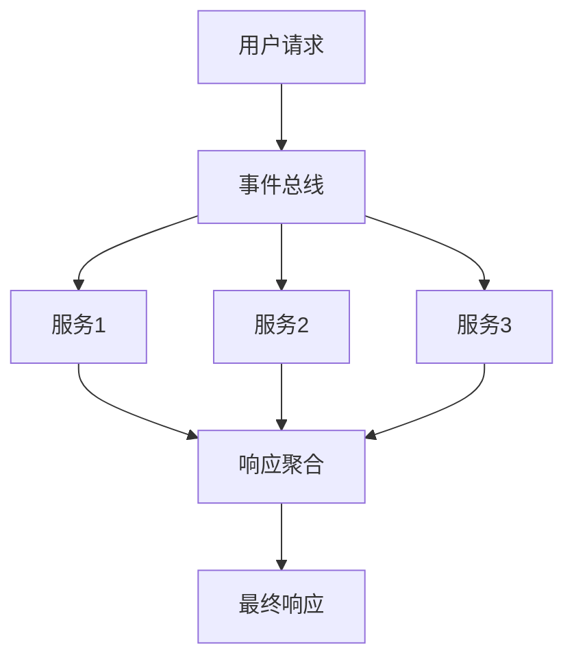

## 前言

在之前的三篇文章中，我们了解了MCP的基本概念、架构原理以及从零开始的开发实践。但当我们真正将MCP应用到生产环境时，往往会遇到各种性能瓶颈和意想不到的问题。🏗 本篇将深入探讨MCP的性能优化策略和行业最佳实践，帮助大家构建高效、稳定的MCP应用。

::: tip
"过早的优化是万恶之源，但完全忽视优化则是职业自杀。"
- Donald Knuth
:::

## 性能瓶颈分析

在开始优化之前，我们需要先识别常见的性能瓶颈：

### 1. 网络延迟问题
MCP应用通常涉及分布式组件间的通信，网络延迟往往成为主要瓶颈。

### 2. 资源竞争
多个请求同时访问共享资源（如数据库连接、缓存）时可能导致性能下降。

### 3. 内存泄漏
长时间运行的MCP服务容易因不当的资源管理导致内存泄漏。

### 4. 同步阻塞
过度使用同步操作会阻塞事件循环，降低整体吞吐量。

## 优化策略

### 🚀 网络优化

**连接池管理**
```javascript
// 使用连接池减少连接建立开销
const pool = new MCP.ConnectionPool({
  min: 5,
  max: 20,
  acquireTimeout: 30000
});
```

**批量请求处理**
- 合并多个小请求为单个批量请求
- 实现请求队列和批处理机制

**数据压缩**
```javascript
// 启用Gzip压缩
const server = new MCP.Server({
  compression: true,
  threshold: 1024 // 仅对大于1KB的响应压缩
});
```

### 💾 资源优化

**缓存策略**
```javascript
// 实现多级缓存
const cache = new MCP.MultiLevelCache([
  new MCP.MemoryCache({ maxSize: 1000, ttl: 5000 }),
  new MCP.RedisCache({ host: 'redis.example.com' })
]);
```

**异步资源释放**
```javascript
// 使用RAII模式管理资源
class ResourceGuard {
  constructor(resource) {
    this.resource = resource;
  }
  
  [Symbol.dispose]() {
    this.resource.release();
  }
}

// 使用方式
using guard = new ResourceGuard(acquireResource());
```

### 🧠 架构优化

**微服务拆分**
- 按业务领域拆分服务
- 实现服务间轻量级通信

**事件驱动架构**


## 最佳实践

### 1. 监控与度量
- 实现实时性能监控
- 设置关键指标告警阈值
- 使用APM工具（如New Relic、Datadog）

### 2. 压力测试
```bash
# 使用k6进行压力测试
k6 run --vus 100 --duration 30s mcp-stress-test.js
```

### 3. 配置管理
- 分离环境配置（开发/测试/生产）
- 实现配置热更新
- 敏感信息加密存储

### 4. 错误处理
```javascript
// 全局错误处理
process.on('uncaughtException', (err) => {
  logger.error('Uncaught Exception:', err);
  gracefulShutdown();
});

process.on('unhandledRejection', (reason, promise) => {
  logger.error('Unhandled Rejection at:', promise, 'reason:', reason);
});
```

## 实战案例

### 电商系统优化

**问题背景**：某电商平台在使用MCP处理订单高峰时，响应时间从200ms飙升至2秒。

**优化方案**：
1. 实现订单分片处理
2. 引入Redis缓存热点数据
3. 优化数据库查询索引

**优化效果**：
```markdown
| 指标       | 优化前 | 优化后 | 提升   |
|------------|--------|--------|--------|
| 响应时间   | 2000ms | 150ms  | 93%    |
| 吞吐量     | 500/s  | 5000/s | 900%   |
| 错误率     | 15%    | 0.1%   | 99%    |
```

## 结语

MCP性能优化是一个持续的过程，需要结合具体场景不断调整和改进。记住这些关键点：

> "优秀的性能不是偶然的，而是精心设计和持续优化的结果。"

希望本文提供的策略和实践能帮助大家在MCP开发中构建高性能应用。下一篇文章我们将探讨MCP的安全防护实践，敬请期待！

---

*作者：Jorgen | 本文基于实际项目经验总结，欢迎在评论区分享您的优化技巧*