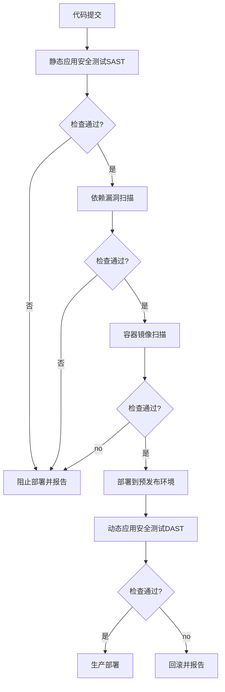

## 前言

在当今快速发展的软件开发环境中，安全不再是开发周期的最后阶段，而是需要贯穿始终的核心要素。DevSecOps理念应运而生，它强调将安全实践无缝集成到DevOps流程中，实现安全与效率的平衡。🔒

作为MCP平台用户，我们常常面临如何在保证安全的同时不牺牲开发速度的挑战。本文将深入探讨如何在MCP环境中实现DevSecOps，构建安全优先的自动化开发流程。

::: tip
"安全不是障碍，而是加速器。当安全成为自动化流程的一部分时，它不再是拖慢速度的环节，而是确保质量和信任的基础。"
:::

## MCP中的DevSecOps基础

### 什么是DevSecOps？

DevSecOps是将安全实践集成到DevOps流程中的方法论，它强调：

- **左移安全**：将安全测试和评估提前到开发阶段
- **自动化安全**：通过自动化工具持续执行安全检查
- **全员安全**：开发、运维、安全团队共同负责安全
- **持续监控**：在部署后持续监控安全态势

### MCP平台的安全能力

MCP平台提供了丰富的安全功能，为DevSecOps实践奠定了基础：

- **身份与访问管理**：精细化的权限控制和身份验证
- **加密服务**：数据传输和存储的加密保护
- **安全监控**：实时安全事件检测和响应
- **合规管理**：内置合规性检查和报告功能

## 在MCP中实现DevSecOps的关键实践

### 1. 安全即代码(Securing as Code)

将安全策略和检查作为代码存储在版本控制系统中，实现安全配置的版本化和可追溯性。

```yaml
# 示例：MCP安全策略配置
security_policies:
  - name: "容器安全扫描"
    type: "container"
    schedule: "每次构建"
    tools: ["Trivy", "Clair"]
    criticality: "high"
  
  - name: "依赖漏洞检查"
    type: "dependencies"
    schedule: "每日"
    tools: ["OWASP Dependency-Check"]
    criticality: "medium"
```

### 2. 自动化安全测试流水线

在MCP CI/CD流水线中集成自动化安全测试工具：



### 3. 基于MCP策略即代码的治理

利用MCP的策略即代码功能，实现安全策略的自动化执行：

```yaml
# MCP策略示例
apiVersion: security.mcp.io/v1
kind: SecurityPolicy
metadata:
  name: "network-isolation"
spec:
  rules:
    - name: "deny-all-traffic"
      action: "Deny"
      sources: ["*"]
      destinations: ["*"]
      except:
        - protocol: "TCP"
          ports: [80, 443]
        - protocol: "UDP"
          ports: [53]
```

## MCP DevSecOps工具链集成

### 1. 集成安全扫描工具

MCP平台支持与多种安全扫描工具集成：

- **SAST工具**：SonarQube, Checkmarx, Veracode
- **DAST工具**: OWASP ZAP, Burp Suite
- **容器安全**: Clair, Trivy, Anchore
- **依赖扫描**: OWASP Dependency-Check, Snyk

### 2. 实现安全合规自动化

利用MCP的合规管理功能，自动化安全合规检查：

```python
# MCP合规检查脚本示例
def run_compliance_scan():
    # 获取MCP资源清单
    resources = mcp_client.get_resources()
    
    # 执行合规检查
    compliance_results = []
    for resource in resources:
        result = mcp_client.check_compliance(
            resource_id=resource.id,
            standard="CIS",
            controls=["1.1", "1.2", "1.3"]
        )
        compliance_results.append(result)
    
    # 生成报告
    report = generate_compliance_report(compliance_results)
    return report
```

### 3. 安全事件响应自动化

构建安全事件自动响应机制：

```yaml
# MCP安全事件响应配置
event_responses:
  - trigger:
      event_type: "unauthorized_access"
      severity: "high"
    actions:
      - type: "isolate"
        target: "affected_resource"
      - type: "notify"
        channels: ["security_team", "devops_team"]
      - type: "create_incident"
        priority: "P1"
```

## 案例研究：金融科技公司的MCP DevSecOps实践

### 背景

某金融科技公司采用MCP平台构建核心交易系统，面临严格的安全合规要求和快速迭代需求之间的矛盾。

### 实施方案

1. **构建DevSecOps流水线**
   - 在CI/CD中集成7个安全检查点
   - 实现自动化安全测试覆盖率90%以上
   - 安全检查平均耗时从30分钟减少到5分钟

2. **实施策略即代码**
   - 将安全策略代码化并版本控制
   - 实现策略自动验证和部署
   - 减少配置错误导致的安全事件60%

3. **建立安全度量体系**
   - 定义10个关键安全指标
   - 实现安全指标可视化监控
   - 建立安全评分卡机制

### 成果

- 安全漏洞修复时间从平均7天缩短到2天
- 安全合规检查通过率从85%提升至98%
- 安全事件响应时间减少70%
- 开发团队安全意识显著提升

## MCP DevSecOps最佳实践

### 1. 安全左移，从源头预防

- 在需求阶段就考虑安全因素
- 在设计阶段进行威胁建模
- 在编码阶段遵循安全编码规范
- 在测试阶段执行全面安全测试

### 2. 持续学习与改进

- 建立安全知识库和案例库
- 定期进行安全培训和演练
- 收集安全度量数据并分析改进
- 关注行业安全动态和最佳实践

### 3. 文化建设

- 培养全员安全意识
- 建立安全激励机制
- 鼓励安全创新和实验
- 创建开放的安全沟通渠道

## 结语

DevSecOps不是一蹴而就的过程，而是需要持续优化的旅程。在MCP平台上实现DevSecOps，可以让我们在保证安全的同时，不牺牲开发速度和敏捷性。🚀

通过将安全实践自动化、标准化和左移，我们能够构建更加安全、可靠和高效的软件系统。记住，安全不是开发流程的障碍，而是质量和信任的保障。

> "安全不是某个团队的责任，而是每个人的责任。当每个人都将安全视为己任时，我们才能真正构建安全优先的数字化未来。"

---

希望这篇指南能帮助您在MCP平台上成功实施DevSecOps实践！如果您有任何问题或想分享您的经验，欢迎在评论区留言交流。👇