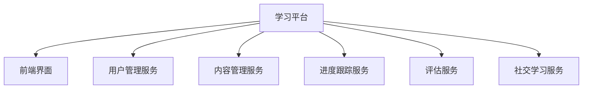

## 前言

在当今快速发展的技术世界中，持续学习已成为开发者的必备技能。然而，传统教育模式往往难以跟上技术发展的步伐，导致学习内容与实践需求脱节。MCP（Microservices Control Platform）作为一种现代化的技术平台，不仅应用于企业级系统构建，还有潜力彻底改变教育领域，为学习者提供更加个性化、互动和高效的学习体验。

> "教育的目的不是填满一桶水，而是点燃一把火。" — 叶芝

本文将探讨MCP如何应用于教育领域，构建下一代学习平台，以及教育工作者和开发者如何利用MCP的优势创建创新的教育解决方案。

## MCP教育应用的优势

### 1. 模块化学习体验

MCP的微服务架构天然适合构建模块化的学习内容。每个知识点或技能可以作为独立的服务进行开发和维护，使学习者能够根据自己的需求和进度选择学习模块。



### 2. 个性化学习路径

通过MCP的数据处理和分析能力，平台可以根据学习者的行为、偏好和表现，动态调整学习内容和难度，实现真正的个性化教育。

### 3. 实时互动与反馈

MCP的实时数据处理能力使教育平台能够提供即时反馈，加速学习过程。无论是代码练习、项目评估还是问题解答，都能得到及时响应。

### 4. 可扩展的教育生态系统

MCP的开放性和可扩展性允许教育机构轻松集成新的学习工具、资源和第三方服务，构建丰富的教育生态系统。

## MCP教育平台架构设计

### 核心服务组件

1. **学习内容服务**
   - 管理课程、教程和练习
   - 支持多媒体内容（视频、交互式演示）
   - 版本控制和内容更新

2. **学习者分析服务**
   - 跟踪学习进度和表现
   - 识别学习模式和难点
   - 提供学习建议和优化路径

3. **互动与协作服务**
   - 实时讨论和问答
   - 项目协作工具
   - 社区建设功能

4. **评估与认证服务**
   - 自动化测试和评估
   - 技能认证和徽章系统
   - 学习成果可视化

5. **个性化推荐服务**
   - 基于学习历史的课程推荐
   - 适应学习者节奏的内容调整
   - 相关资源和工具推荐

### 技术实现要点

```yaml
# MCP教育平台服务配置示例
services:
  learning-content:
    image: mcp-education/content:latest
    ports:
      - "8081:8080"
    environment:
      - DB_HOST=postgres
      - CACHE_TYPE=redis
    depends_on:
      - postgres
      - redis
  
  learner-analytics:
    image: mcp-education/analytics:latest
    ports:
      - "8082:8080"
    environment:
      - KAFKA_BROKERS=kafka:9092
    depends_on:
      - kafka
  
  interactive-tools:
    image: mcp-education/interactive:latest
    ports:
      - "8083:8080"
    environment:
      - WEBSOCKET_PORT=8084
```

## 实际应用场景

### 1. 编程教育平台

MCP可以构建支持多种编程语言的学习平台，提供实时代码评估、项目指导和协作功能。

```javascript
// 代码评估服务示例
const codeEvaluationService = {
  evaluate: async (code, language, testCases) => {
    // 使用容器安全执行代码
    const result = await executeInContainer(code, language);
    
    // 迧行测试用例
    const testResults = testCases.map(test => {
      return runTest(test.input, test.expected, result.output);
    });
    
    return {
      passed: testResults.every(r => r.passed),
      details: testResults,
      suggestions: generateSuggestions(result, testResults)
    };
  }
};
```

### 2. 技能认证与微证书

利用MCP的模块化特性，可以创建灵活的技能认证体系，学习者可以根据自己的需求获得特定技能的微证书，而非传统的学位证书。

### 3. 企业培训系统

企业可以利用MCP构建定制化的培训平台，根据员工角色和需求提供个性化的学习内容，并与企业系统集成，跟踪培训效果。

### 4. 开源学习社区

MCP可以支持构建开源学习社区，允许教育工作者贡献学习内容，学习者共享学习经验，形成自我维持的教育生态系统。

## 实施挑战与解决方案

### 1. 数据隐私与安全

**挑战**：教育平台涉及大量个人学习数据，需要确保数据安全和隐私保护。

**解决方案**：
- 实施严格的数据访问控制
- 使用加密技术保护敏感数据
- 遵循教育数据保护法规（如FERPA、GDPR）

### 2. 内容质量保证

**挑战**：大量模块化内容需要确保质量和一致性。

**解决方案**：
- 建立内容审核流程
- 实施内容评级系统
- 鼓励社区参与内容改进

### 3. 技术复杂性

**挑战**：MCP架构对教育工作者可能过于复杂。

**解决方案**：
- 提供简化的内容创建工具
- 开发可视化界面管理服务
- 提供详细的文档和培训

## 未来展望

随着MCP技术的不断发展，其在教育领域的应用将更加广泛：

1. **AI增强的学习体验**：结合人工智能技术，提供更智能的学习辅导和个性化建议。

2. **沉浸式学习环境**：结合AR/VR技术，创建沉浸式的学习体验。

3. **全球教育资源共享**：通过MCP平台实现全球教育资源的无缝共享和协作。

4. **终身学习生态系统**：构建支持个人终身学习的综合平台，适应不同人生阶段的学习需求。

## 结语

MCP在教育领域的应用不仅是一种技术趋势，更是教育创新的重要驱动力。通过模块化、个性化和互动性的学习体验，MCP有潜力改变我们获取知识和技能的方式，使教育更加高效、包容和有趣。

对于教育工作者和技术开发者而言，现在是探索MCP教育应用的绝佳时机。通过构建创新的教育平台，我们可以共同塑造一个更加智能、互联和个性化的学习未来。

> "教育的艺术不在于传授知识，而在于唤醒、激发和鼓舞。" — 第斯多惠

---

*本文由Jorgen原创，如需转载请注明出处。*