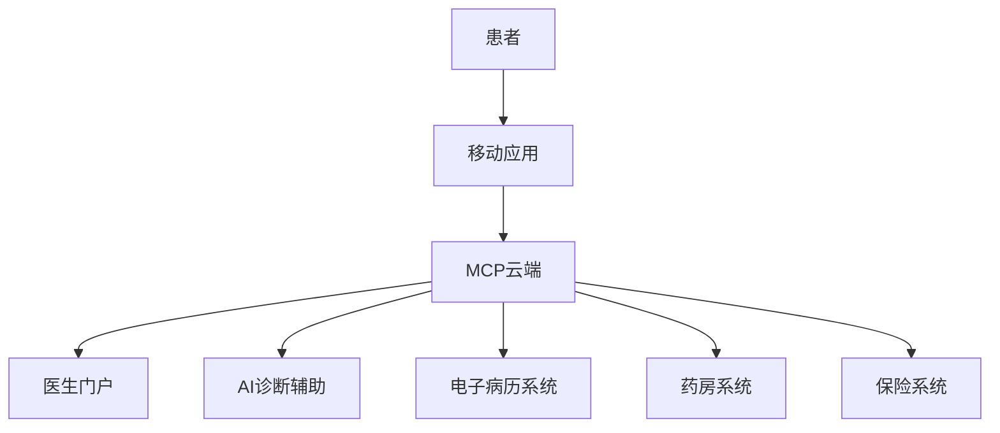

## 前言

随着全球医疗健康行业的数字化转型加速，医疗机构面临着前所未有的机遇与挑战。从电子病历系统到远程医疗平台，从AI辅助诊断到个性化治疗方案，数字化技术正在重塑医疗服务的每一个环节。Microsoft Cloud Platform (MCP) 作为企业级云计算平台，凭借其强大的安全性、可扩展性和丰富的服务生态，为医疗健康领域的数字化转型提供了坚实的技术基础。

> "医疗数据是患者最敏感的个人信息，医疗系统的可靠性直接关系到生命安全。在数字化医疗时代，我们需要平台不仅功能强大，更要安全可靠。" —— 世界卫生组织数字化医疗报告

本文将深入探讨MCP在医疗健康领域的应用场景、技术架构和最佳实践，帮助医疗机构构建安全、高效、合规的数字化医疗生态系统。

## MCP医疗应用的核心价值

### 🏥 数据安全与隐私保护

医疗数据因其高度敏感性，对安全性和隐私保护提出了极高要求。MCP通过多层次的安全机制，为医疗数据提供全方位保护：

- **端到端加密**：采用AES-256加密算法确保数据在传输和存储过程中的安全性
- **细粒度访问控制**：基于角色的访问控制(RBAC)确保只有授权人员才能访问敏感数据
- **合规性认证**：符合HIPAA、GDPR等医疗行业法规要求
- **数据脱敏技术**：在数据分析过程中自动识别和脱敏敏感信息

### 📊 高性能数据处理能力

医疗系统每天产生海量数据，包括患者记录、医学影像、监测数据等。MCP提供强大的数据处理能力：

- **分布式存储**：Azure Blob Storage和Cosmos DB支持PB级医疗数据存储
- **实时分析**：Azure Stream Analytics实现医疗监测数据的实时分析
- **AI集成**：Azure Cognitive Services提供医疗影像分析、自然语言处理等AI能力
- **大数据处理**：Azure Databricks支持医疗大数据的批处理和流处理

### 🏗 可扩展的系统架构

医疗需求具有明显的波动性，如疫情期间的远程医疗需求激增。MCP的弹性架构能够应对这些变化：

- **自动扩展**：根据负载自动调整计算资源
- **多区域部署**：支持全球多区域部署，确保服务可用性
- **混合云支持**：允许医疗机构在本地和云端之间灵活部署工作负载
- **微服务架构**：支持医疗系统模块化开发和部署

## MCP医疗应用场景

### 远程医疗平台

远程医疗在新冠疫情期间得到了广泛应用，成为医疗体系的重要组成部分。基于MCP构建的远程医疗平台具有以下特点：



**技术实现**：
- 使用Azure App Service构建患者和医生门户
- 通过Azure Communication Services实现视频问诊功能
- 利用Azure AI服务提供AI辅助诊断
- 采用Azure Cosmos DB存储患者健康数据

### 医学影像分析

医学影像分析是AI在医疗领域的重要应用。基于MCP的医学影像分析系统可以：

- 自动识别CT、MRI等影像中的异常
- 提供影像三维重建和可视化
- 辅助医生进行精准诊断
- 追踪疾病发展过程

**架构设计**：
```
[影像采集设备] -> [Azure IoT Edge] -> [Azure Storage] 
-> [Azure Machine Learning] -> [AI分析模型] 
-> [Azure API Management] -> [医生工作站]
```

### 智能医院管理系统

智能医院管理系统整合了预约、挂号、收费、药房、住院等多个子系统，实现医院运营的全面数字化：

- **智能排班**：基于历史数据和AI预测优化医护人员排班
- **资源调度**：实时监控和调度医疗设备、床位等资源
- **患者流量管理**：预测患者流量，优化就诊流程
- **供应链管理**：智能管理药品和耗材库存

## MCP医疗应用的技术架构

### 整体架构设计

基于MCP的医疗应用通常采用分层架构设计：

```
[表现层]
├── 患者门户 (Web/移动应用)
├── 医生工作站 (Web/桌面应用)
└── 管理仪表板 (Web应用)

[业务逻辑层]
├── 医疗服务API
├── 数据处理服务
├── AI分析服务
└── 通知服务

[数据层]
├── 关系型数据库 (患者记录、预约等)
├── 文档数据库 (医疗记录、文档)
├── 时序数据库 (监测数据)
└── AI模型存储

[基础设施层]
├── 计算服务 (Azure VM/容器)
├── 存储服务 (Azure Storage)
├── 网络服务 (虚拟网络/VPN)
└── 安全服务 (身份认证/加密)
```

### 关键技术组件

1. **身份认证与授权**：
   - Azure Active Directory实现统一身份管理
   - 多因素认证确保安全访问
   - 基于JWT的API访问控制

2. **数据存储**：
   - Azure SQL Server存储结构化医疗数据
   - Azure Cosmos DB存储非结构化医疗记录
   - Azure Data Lake存储大规模医疗数据集

3. **AI服务**：
   - Azure Cognitive Services提供医疗影像分析
   - Azure Machine Learning构建定制医疗AI模型
   - Azure Bot Service实现智能医疗助手

4. **通信服务**：
   - Azure Event Grid实现系统间事件驱动通信
   - Azure Service Bus处理医疗消息队列
   - Azure Communication Services提供实时通信

## MCP医疗应用的安全与合规

### 医疗数据安全策略

医疗数据安全是医疗应用的核心考量。基于MCP的医疗系统应实施以下安全策略：

1. **数据分类与标记**：
   - 根据敏感度对医疗数据进行分类
   - 实施数据标签和元数据管理
   - 基于分类实施差异化保护措施

2. **访问控制**：
   - 实施最小权限原则
   - 基于角色的访问控制(RBAC)
   - 属性基访问控制(ABAC)增强灵活性

3. **审计与监控**：
   - 全面的数据访问日志
   - 异常行为检测
   - 实时安全事件响应

### 合规性管理

医疗行业面临严格的法规要求，包括：

- **HIPAA**：美国健康保险流通与责任法案
- **GDPR**：欧盟通用数据保护条例
- **HITRUST**：医疗信息信任与安全框架

**MCP合规性支持**：
- 提供合规性文档和模板
- 自动化合规性检查工具
- 合规性报告生成功能
- 第三方合规性认证

## MCP医疗应用的最佳实践

### 开发最佳实践

1. **敏捷开发方法**：
   - 采用Scrum或Kanban方法
   - 持续集成/持续部署(CI/CD)
   - 自动化测试确保质量

2. **微服务架构**：
   - 按业务领域划分服务
   - 服务间API标准化
   - 实施服务发现和负载均衡

3. **DevOps实践**：
   - 基于Azure DevOps实现开发流程自动化
   - 使用Azure Monitor实现应用监控
   - 实施基础设施即代码(IaC)

### 部署与运维最佳实践

1. **混合云策略**：
   - 敏感数据保留在本地数据中心
   - 计算密集型任务部署在云端
   - 实现本地与云端的统一管理

2. **灾难恢复**：
   - 实施数据备份和恢复策略
   - 多区域部署确保高可用性
   - 定期进行灾难恢复演练

3. **性能优化**：
   - 实施缓存策略减少数据库负载
   - 使用CDN加速静态资源分发
   - 数据库查询优化和索引设计

## MCP医疗应用案例分析

### 案例一：区域医疗云平台

某区域医疗云平台整合了区域内多家医疗机构的数据和资源，实现了医疗资源的共享和优化配置。

**架构特点**：
- 采用多租户架构支持多家医疗机构
- 实现医疗数据的安全共享和互操作性
- 提供统一的医疗API和开发平台

**技术实现**：
- Azure Active Directory实现跨机构身份管理
- Azure API Management提供统一API网关
- Azure Kubernetes Service实现微服务容器化部署
- Azure Synapse Analytics实现医疗大数据分析

**成果**：
- 医疗资源利用率提升40%
- 患者就医等待时间减少60%
- 医疗决策效率提升35%

### 案例二：AI辅助诊断系统

某三甲医院部署了基于MCP的AI辅助诊断系统，主要针对肺部CT影像的自动分析和诊断。

**系统特点**：
- 集成深度学习模型进行肺部结节检测
- 提供诊断建议和置信度评分
- 支持医生交互式诊断流程

**技术实现**：
- Azure Machine Learning构建和训练AI模型
- Azure Cognitive Services实现影像分析
- Azure Databricks进行大规模数据处理
- Azure AI Model部署和管理AI模型

**成果**：
- 诊断准确率达到95%以上
- 医生诊断时间减少50%
- 早期肺癌检出率提升30%

## MCP医疗应用的挑战与应对

### 数据隐私与共享的平衡

医疗数据需要在保护隐私和促进共享之间找到平衡点：

**挑战**：
- 患者隐私保护要求严格
- 医疗研究需要大量数据
- 数据共享与隐私保护存在冲突

**应对策略**：
- 实施差分隐私技术
- 使用联邦学习实现数据不出域的分析
- 建立数据使用授权和审计机制

### 系统集成与互操作性

医疗机构通常使用多种遗留系统，系统集成面临挑战：

**挑战**：
- 系统间数据格式不一致
- 接口标准不统一
- 遗留系统难以现代化

**应对策略**：
- 采用HL7 FHIR标准实现医疗数据交换
- 实施API中间件进行协议转换
- 使用Azure Logic Apps实现系统集成

### AI模型的可靠性与可解释性

医疗AI模型需要高可靠性和可解释性：

**挑战**：
- AI决策难以解释
- 模型可能存在偏见
- 医疗决策需要可追溯性

**应对策略**：
- 采用可解释AI技术
- 实施模型监控和再训练机制
- 建立AI决策审核流程

## 结语

医疗健康行业的数字化转型正在加速推进，MCP作为企业级云计算平台，为医疗机构的数字化转型提供了强大的技术支持。从远程医疗平台到AI辅助诊断，从智能医院管理到医疗大数据分析，MCP正在帮助构建更加安全、高效、人性化的医疗生态系统。

未来，随着5G、AI、区块链等技术与医疗健康领域的深度融合，基于MCP的医疗应用将迎来更广阔的发展空间。医疗机构应积极拥抱数字化转型，充分利用MCP的平台能力，提升医疗服务质量，改善患者体验，推动医疗健康行业的创新发展。

> "数字化不是目的，而是手段。真正的目标是让医疗服务更普惠、更精准、更人性化，让每个人都能获得优质的医疗资源。" —— 医疗数字化转型愿景

通过合理规划和实施基于MCP的医疗应用，医疗机构可以实现数字化转型目标，为患者提供更好的医疗服务，同时为医护人员创造更高效的工作环境，共同推动医疗健康行业的进步。

---

*本文基于Microsoft Cloud Platform最新版本编写，技术细节可能随平台更新而变化。建议在实际应用前参考官方文档和最新最佳实践。*