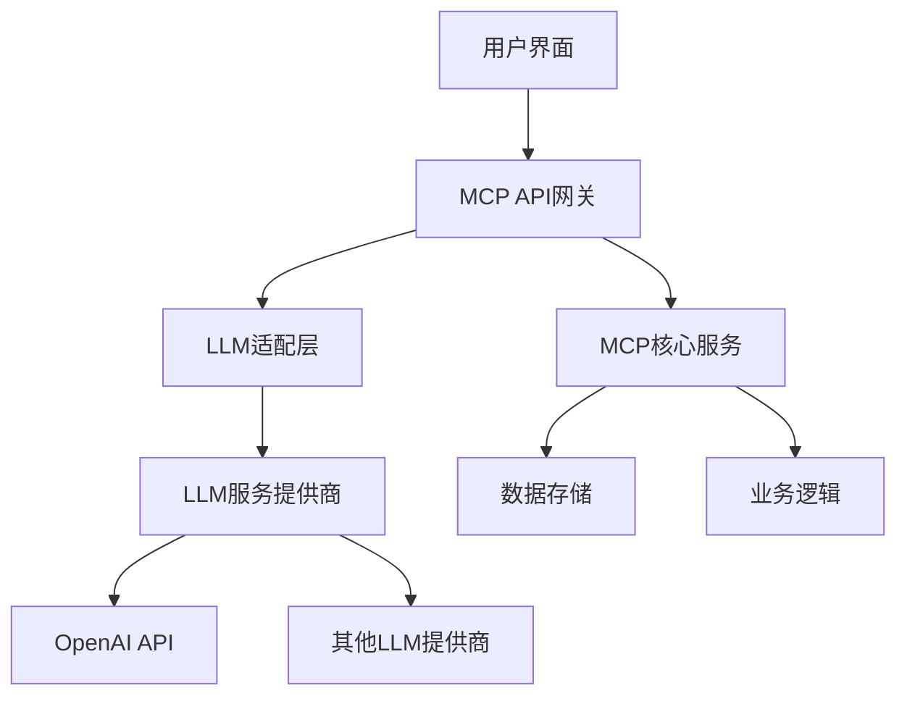

## 前言

随着生成式AI和大语言模型(LLM)技术的迅猛发展，越来越多的企业开始探索将这些先进AI能力集成到现有系统中。MCP作为一个强大的技术平台，为构建智能化应用提供了坚实基础。然而，如何将MCP与生成式AI和大语言模型进行深度集成，充分发挥两者协同效应，仍然是许多开发者面临的挑战。

::: tip
"生成式AI不仅是工具，更是重新定义人机交互方式的范式转变。当MCP遇上生成式AI，我们将看到前所未有的应用可能性。"
:::

## MCP与生成式AI的协同价值

MCP平台提供了强大的数据处理、应用构建和部署能力，而生成式AI则擅长内容创作、自然语言理解和复杂推理。两者的结合能够创造出更加智能、人性化的应用体验。

### 核心优势

- **智能内容生成**：利用LLM的能力自动生成报告、邮件、代码等结构化内容
- **自然交互界面**：通过大语言模型构建更自然的人机对话界面
- **智能决策支持**：结合MCP的数据处理能力和AI的推理能力提供决策建议
- **自动化流程增强**：在现有MCP工作流中嵌入AI能力，提升自动化水平

## MCP与LLM集成的技术架构

### 基础架构设计

构建MCP与LLM集成的系统时，我们需要考虑以下几个关键组件：



### LLM适配层设计

LLM适配层是连接MCP平台与各种大语言模型的关键组件，主要负责：

1. **统一接口**：为不同LLM提供商提供统一调用接口
2. **请求路由**：根据业务需求将请求路由到最适合的LLM
3. **结果处理**：对LLM返回结果进行标准化处理
4. **缓存管理**：对常见查询结果进行缓存，提高响应速度

## 实践指南：构建MCP+LLM应用

### 1. 智能客服系统

构建一个基于MCP和LLM的智能客服系统，可以大幅提升客户服务体验。

#### 系统架构

- **前端交互**：基于MCP构建的Web界面或移动应用
- **意图识别**：使用LLM理解用户问题
- **知识检索**：结合MCP的数据库能力检索相关知识
- **回答生成**：基于检索结果和用户问题生成回答
- **工单系统**：MCP的工单管理功能处理复杂问题

#### 实现代码示例

```python
class MCP_LLM_Integration:
    def __init__(self, mcp_client, llm_client):
        self.mcp = mcp_client
        self.llm = llm_client
    
    def process_customer_query(self, query):
        # 步骤1: 使用LLM理解用户意图
        intent = self.llm.analyze_intent(query)
        
        # 步骤2: 根据意图从MCP数据库检索相关信息
        knowledge = self.mcp.retrieve_knowledge(intent)
        
        # 步骤3: 结合检索结果和原始问题生成回答
        response = self.llm.generate_response(query, knowledge)
        
        # 步骤4: 如果问题复杂，创建工单
        if self.llm.is_complex_query(query):
            ticket_id = self.mcp.create_ticket(query, intent)
            response += f" 您的问题已记录，工单号: {ticket_id}"
        
        return response
```

### 2. 智能文档处理系统

利用MCP的文档处理能力和LLM的理解能力，构建智能文档处理系统。

#### 核心功能

- **文档分类**：自动识别文档类型并分类存储
- **内容提取**：从文档中提取关键信息
- **摘要生成**：自动生成文档摘要
- **问答系统**：基于文档内容提供问答服务

#### 实现步骤

1. **文档上传**：用户通过MCP界面上传文档
2. **预处理**：MCP对文档进行格式转换和基础处理
3. **内容分析**：LLM分析文档内容和结构
4. **信息提取**：提取关键实体、关系和事件
5. **存储与索引**：将处理结果存储到MCP数据库并建立索引
6. **查询服务**：提供基于内容的查询和问答服务

### 3. 代码生成与辅助编程

结合MCP的开发环境和LLM的代码生成能力，构建智能编程助手。

#### 功能特性

- **代码自动补全**：基于上下文提供代码建议
- **代码解释**：解释复杂代码的功能和逻辑
- **错误修复**：自动识别和修复常见编程错误
- **文档生成**：自动生成代码文档和注释

## MCP与LLM集成的最佳实践

### 性能优化

1. **请求批处理**：将多个小请求合并为批量请求，减少API调用次数
2. **结果缓存**：对常见问题和查询结果进行缓存
3. **模型选择**：根据任务复杂度选择合适的模型大小
4. **异步处理**：对耗时操作采用异步处理方式

### 成本控制

1. **智能路由**：根据任务复杂度将简单任务路由到较小模型
2. **本地缓存**：对频繁查询的结果进行本地缓存
3. **请求限流**：实施合理的请求限流策略
4. **监控与分析**：监控API使用情况，优化成本结构

### 安全与合规

1. **数据隐私**：确保敏感数据不被发送到外部LLM服务
2. **内容过滤**：对LLM生成内容进行适当过滤
3. **访问控制**：实施严格的访问控制策略
4. **审计日志**：记录所有LLM调用和相关操作

## MCP与特定LLM提供商的集成

### OpenAI集成

```python
import openai

class OpenAI_Integration:
    def __init__(self, api_key):
        self.client = openai.OpenAI(api_key=api_key)
    
    def generate_content(self, prompt, model="gpt-4"):
        response = self.client.chat.completions.create(
            model=model,
            messages=[
                {"role": "system", "content": "You are a helpful assistant."},
                {"role": "user", "content": prompt}
            ]
        )
        return response.choices[0].message.content
```

### Anthropic Claude集成

```python
import anthropic

class Claude_Integration:
    def __init__(self, api_key):
        self.client = anthropic.Anthropic(api_key=api_key)
    
    def generate_content(self, prompt, model="claude-3-opus"):
        response = self.client.messages.create(
            model=model,
            max_tokens=1000,
            messages=[
                {"role": "user", "content": prompt}
            ]
        )
        return response.content[0].text
```

### 本地LLM集成

```python
from transformers import AutoTokenizer, AutoModelForCausalLM

class LocalLLM_Integration:
    def __init__(self, model_name):
        self.tokenizer = AutoTokenizer.from_pretrained(model_name)
        self.model = AutoModelForCausalLM.from_pretrained(model_name)
    
    def generate_content(self, prompt, max_length=200):
        inputs = self.tokenizer(prompt, return_tensors="pt")
        outputs = self.model.generate(
            inputs.input_ids,
            max_length=max_length,
            num_return_sequences=1,
            no_repeat_ngram_size=2
        )
        return self.tokenizer.decode(outputs[0], skip_special_tokens=True)
```

## 实际应用案例

### 案例一：智能金融分析平台

某金融机构利用MCP与LLM构建智能分析平台，实现了：

- **市场报告自动生成**：结合实时市场数据和LLM生成每日市场分析报告
- **投资建议生成**：基于客户风险偏好和市场数据，生成个性化投资建议
- **风险预警**：结合MCP的风险监控模型和LLM的自然语言理解，提前识别潜在风险

### 案例二：医疗健康助手

医疗机构使用MCP与LLM构建的医疗健康助手提供：

- **病历智能分析**：自动提取病历关键信息，生成健康摘要
- **用药建议**：基于患者病史和药物数据库，提供用药建议
- **健康咨询**：通过自然语言对话提供健康咨询服务

## 未来展望

随着MCP平台和生成式AI技术的不断发展，我们将看到更多创新应用场景：

1. **多模态AI集成**：结合文本、图像、音频等多种模态的AI能力
2. **个性化AI助手**：基于用户行为和偏好定制的智能助手
3. **自主决策系统**：结合MCP的业务逻辑和AI的推理能力，实现更高级的自主决策
4. **边缘AI计算**：在边缘设备上运行轻量级AI模型，减少延迟和带宽需求

> "MCP与生成式AI的结合不仅是技术上的融合，更是思维方式的革新。它将帮助我们构建更加智能、人性化的数字体验，开启人机协作的新篇章。"

## 结语

MCP与生成式AI和大语言模型的深度集成，为我们打开了构建智能化应用的新大门。通过本文介绍的架构设计、实践案例和最佳实践，开发者可以更好地理解如何将这两者有机结合，创造出具有真正价值的智能应用。

随着技术的不断进步，MCP与AI的融合将产生更多可能性。作为开发者，我们需要持续学习，不断探索，才能在这个快速发展的领域中保持竞争力。

---

::: right
"技术改变世界，创新驱动未来"
:::