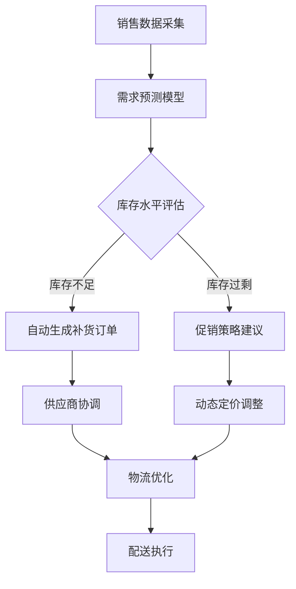

## 前言

在我深入探索MCP平台的旅程中，我发现了一个有趣的现象：虽然MCP在各种领域都有应用，但关于如何构建自动化与智能决策系统的内容却相对较少。🤔 作为一名热衷于将技术与实际业务结合的开发者，我决定填补这一空白，分享如何利用MCP构建自适应的业务流程自动化平台。

在当今数字化转型的浪潮中，企业面临着日益复杂的业务流程和决策挑战。传统的自动化工具往往局限于预定义的规则，难以应对动态变化的环境。而MCP平台凭借其灵活性和扩展性，为构建真正的智能自动化系统提供了可能。

::: tip
"自动化不是简单地替代人力，而是让系统具备自主决策和适应变化的能力，这才是智能自动化的核心。"
:::

## MCP与自动化系统的融合

### 传统自动化的局限性

在我多年的开发经验中，我见过太多所谓的"自动化系统"实际上只是简单的脚本串联。这些系统往往存在以下问题：

- **刚性流程**：一旦业务规则发生变化，整个自动化流程就需要重新设计
- **缺乏上下文感知**：系统无法根据当前环境动态调整行为
- **决策逻辑固化**：难以处理复杂或模糊的业务场景

### MCP带来的变革

MCP平台通过其模块化架构和事件驱动机制，为解决上述问题提供了全新思路：

1. **动态工作流引擎**：MCP允许构建能够根据实时数据自动调整流程的工作流
2. **智能决策节点**：通过集成机器学习模型，使系统能够做出更智能的决策
3. **自适应规则引擎**：业务规则可以动态更新而无需重启整个系统

## 构建基于MCP的智能决策系统

### 系统架构设计

一个完整的MCP智能决策系统通常包含以下核心组件：

```
┌─────────────────┐    ┌─────────────────┐    ┌─────────────────┐
│   数据采集层    │    │   决策引擎层    │    │   执行控制层    │
├─────────────────┤    ├─────────────────┤    ├─────────────────┤
│ - 事件监听器    │───▶│ - 规则处理器    │───▶│ - 动作执行器    │
│ - 数据连接器    │    │ - ML模型集成    │    │ - 状态管理器    │
│ - API网关       │    │ - 决策树引擎    │    │ - 通知系统      │
└─────────────────┘    └─────────────────┘    └─────────────────┘
```

### 关键技术实现

#### 1. 动态规则引擎的实现

```javascript
// 示例：基于MCP的动态规则引擎
class DynamicRuleEngine {
  constructor(mcpClient) {
    this.mcpClient = mcpClient;
    this.rules = new Map();
  }

  // 动态加载规则
  async loadRule(ruleId, ruleDefinition) {
    const rule = await this.mcpClient.createRule(ruleId, ruleDefinition);
    this.rules.set(ruleId, rule);
    return rule;
  }

  // 执行规则评估
  async evaluateRule(ruleId, context) {
    const rule = this.rules.get(ruleId);
    if (!rule) throw new Error(`Rule ${ruleId} not found`);
    
    // 使用MCP的决策API执行规则
    const result = await this.mcpClient.executeDecision(rule.id, context);
    return result;
  }
}
```

#### 2. 机器学习模型的集成

MCP平台提供了与机器学习模型集成的能力，使系统能够基于历史数据做出预测和决策：

```python
# 示例：使用MCP集成ML模型进行预测
class MLPredictionService:
    def __init__(self, mcp_endpoint):
        self.mcp_endpoint = mcp_endpoint
        self.model_cache = {}
    
    async def load_model(self, model_id, model_path):
        # 通过MCP加载模型
        response = await self.mcp_endpoint.upload_model(model_id, model_path)
        self.model_cache[model_id] = response.model_id
        return response
    
    async def predict(self, model_id, input_data):
        model_id = self.model_cache.get(model_id)
        if not model_id:
            raise ValueError(f"Model {model_id} not loaded")
        
        # 使用MCP进行预测
        response = await self.mcp_endpoint.predict(model_id, input_data)
        return response.prediction
```

### 实际应用场景

#### 1. 智能供应链管理

在供应链管理中，需求预测、库存优化和物流调度都是复杂且动态的过程。基于MCP的智能决策系统可以：

- 实时分析销售数据、季节性因素和市场趋势
- 动态调整库存水平和补货策略
- 优化物流路径和配送计划



#### 2. 金融服务自动化决策

在金融服务领域，基于MCP的智能决策系统可以用于：

- 信贷风险评估与审批
- 欺诈检测与预防
- 投资组合优化
- 客户服务自动化

## MCP智能决策系统的优势

### 1. 自适应能力

传统自动化系统通常需要人工干预来适应变化，而基于MCP的系统可以：

- 自动检测环境变化
- 动态调整决策参数
- 持续学习和优化

### 2. 实时响应

MCP的事件驱动架构使系统能够：

- 实时处理业务事件
- 快速做出决策
- 立即执行相应动作

### 3. 可扩展性

MCP的模块化设计确保系统可以：

- 轻松添加新的决策规则
- 集成新的数据源
- 扩展到新的业务场景

## 实施挑战与解决方案

### 挑战1：规则复杂度管理

随着业务规则数量的增加，系统维护变得越来越复杂。

**解决方案**：
- 建立规则分类和版本控制机制
- 实现规则可视化编辑工具
- 开发规则测试和模拟环境

### 挑战2：数据质量与一致性

智能决策高度依赖数据质量，而现实世界的数据往往存在质量问题。

**解决方案**：
- 实施数据清洗和验证流程
- 建立数据质量监控机制
- 开发异常检测和恢复策略

### 挑战3：模型可解释性

机器学习模型的"黑盒"特性使得决策过程难以理解和信任。

**解决方案**：
- 采用可解释的AI技术
- 实现决策路径可视化
- 建立人工审核机制

## 结语

在我深入探索MCP平台的过程中，我逐渐认识到自动化与智能决策系统是MCP最具潜力的应用方向之一。通过将MCP的灵活性与AI技术相结合，我们可以构建真正自适应的业务流程自动化平台。

::: right
"未来的自动化不是简单地执行命令，而是理解意图、预测需求并主动行动。"
:::

对于想要构建智能自动化系统的团队，我建议从以下步骤开始：

1. 识别业务流程中重复性高、规则明确的环节
2. 设计基于事件的流程架构
3. 逐步引入机器学习模型增强决策能力
4. 建立持续学习和优化机制

MCP平台为我们提供了构建智能自动化系统的强大工具，但真正的成功来自于技术与业务的深度融合。希望这篇文章能为你的MCP智能决策之旅提供一些启发和指导！

> 记住，最好的自动化是那种让用户几乎感觉不到存在的自动化。当系统足够智能时，人们会专注于创造价值，而不是被流程所束缚。