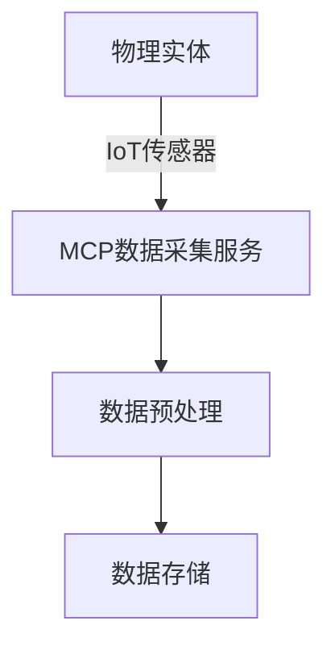

## 前言

在当今工业4.0和智慧城市建设的大背景下，数字孪生(Digital Twin)技术已经成为连接物理世界与数字世界的关键桥梁。通过创建物理实体的高保真虚拟副本，数字孪生技术实现了实时监控、预测性维护和智能决策。然而，构建高效、可靠的数字孪生系统面临着数据处理、模型精度、实时响应等多重挑战。

> "数字孪生不仅是物理实体的复制，更是物理世界与数字世界的对话桥梁。" — NASA工程师

作为先进的技术框架，MCP(Microservices Computing Platform)平台以其分布式架构、弹性扩展和高性能处理能力，为数字孪生技术的发展提供了强有力的支撑。本文将深入探讨MCP与数字孪生技术的融合应用，帮助读者构建虚实结合的智能系统。

## 数字孪生技术概述

数字孪生技术通过将物理实体映射到数字空间，实现物理世界与数字世界的实时交互。一个完整的数字孪生系统通常包含以下几个核心组件：

- **物理实体**：被监测和控制的实际对象或系统
- **虚拟模型**：物理实体的数字表示，包括几何、行为和规则
- **数据连接**：物理实体与虚拟模型之间的数据传输通道
- **分析服务**：处理和分析收集到的数据，提供洞察和决策支持
- **交互接口**：用户与数字孪生系统交互的界面

数字孪生技术已在制造业、城市规划、医疗健康、航空航天等多个领域展现出巨大潜力，但其广泛应用仍面临诸多技术挑战。

## MCP平台的优势

MCP(Microservices Computing Platform)作为一种现代化的分布式计算框架，具有以下显著优势：

### 1. 微服务架构

MCP采用微服务架构，将复杂系统拆分为一系列小型、独立的服务单元。这种架构模式特别适合数字孪生系统的构建，因为：

- **模块化设计**：数字孪生的不同功能（如数据采集、模型更新、分析预测）可以作为独立服务开发
- **独立部署**：各服务可以独立更新和扩展，不影响其他组件
- **技术灵活性**：不同服务可以使用最适合的技术栈实现

### 2. 高性能数据处理

数字孪生系统需要处理大量实时数据，MCP平台提供了强大的数据处理能力：

- **流式处理**：支持实时数据流处理，确保数字孪生模型的及时更新
- **分布式计算**：利用集群资源处理大规模数据集
- **内存计算**：通过内存数据库加速数据处理，减少延迟

### 3. 弹性扩展能力

数字孪生系统的负载可能随时间波动，MCP平台的弹性扩展能力可以应对这种变化：

- **自动扩缩容**：根据负载自动调整服务实例数量
- **负载均衡**：智能分配请求，避免单点过载
- **故障隔离**：单个服务故障不会影响整个系统

## MCP与数字孪生的融合架构

将MCP平台与数字孪生技术融合，可以构建一个高效、可靠的数字孪生系统。以下是典型的融合架构：

### 1. 数据采集层

数据采集层负责从物理实体收集实时数据，并将其传输到数字孪生系统：

MCP平台提供的数据采集服务可以支持多种数据源和协议，包括：

- **IoT设备**：通过MQTT、CoAP等协议连接传感器
- **工业控制系统**：通过OPC UA、Modbus等工业协议
- **API接口**：集成现有系统的数据接口

### 2. 模型管理服务

模型管理服务负责数字孪生模型的创建、更新和维护：

- **模型版本控制**：使用Git等工具管理模型版本
- **模型训练**：集成机器学习框架，支持模型训练和优化
- **模型部署**：将训练好的模型部署为MCP微服务

### 3. 实时分析服务

实时分析服务处理采集到的数据，提供洞察和预测：

- **时序数据分析**：处理传感器数据的时间序列
- **异常检测**：识别系统异常和潜在故障
- **预测性维护**：预测设备故障和维护需求

### 4. 可视化与交互层

可视化与交互层提供用户界面，实现人与数字孪生系统的交互：

- **3D可视化**：使用WebGL等技术在浏览器中渲染3D模型
- **AR/VR集成**：支持增强现实和虚拟现实交互
- **实时仪表盘**：提供关键指标和状态的实时监控

## 实施步骤

### 1. 需求分析与规划

在构建MCP支持的数字孪生系统前，需要进行全面的需求分析：

- **确定物理实体的关键指标**：识别需要监测和优化的参数
- **定义数据采集策略**：确定数据采集频率、精度和可靠性要求
- **规划模型精度与复杂度**：平衡模型精度与计算资源需求

### 2. 系统设计与架构

基于需求分析结果，设计系统架构：

- **服务拆分**：将系统功能拆分为微服务
- **数据流设计**：定义数据在各服务间的流动路径
- **接口定义**：定义服务间的API接口和数据格式

### 3. 开发与集成

按照设计进行开发工作：

- **微服务开发**：使用适合的技术栈开发各个微服务
- **数据管道构建**：建立数据采集、处理和存储的管道
- **模型训练与部署**：训练数字孪生模型并部署为服务

### 4. 测试与优化

在开发过程中进行持续测试和优化：

- **性能测试**：评估系统在高负载下的表现
- **准确性验证**：验证数字孪生模型的准确性
- **用户体验测试**：评估用户界面的易用性

### 5. 部署与运维

将系统部署到生产环境并进行持续运维：

- **容器化部署**：使用Docker和Kubernetes部署微服务
- **监控与告警**：建立系统监控和告警机制
- **持续集成/持续部署**：实现自动化部署流程

## 应用案例

### 智能工厂数字孪生

某大型制造企业利用MCP平台构建了智能工厂的数字孪生系统，实现了以下功能：

- **设备状态实时监控**：通过MCP微服务采集设备数据，实时显示设备运行状态
- **生产流程优化**：基于历史数据优化生产流程，提高生产效率15%
- **预测性维护**：提前48小时预测设备故障，减少停机时间30%
- **能源管理**：实时监控能源消耗，优化能源使用，降低能源成本20%

### 城市数字孪生

某智慧城市项目使用MCP平台构建城市数字孪生系统，实现了：

- **交通流量优化**：实时监测交通状况，优化信号灯配时，减少拥堵25%
- **应急响应**：模拟灾害场景，优化应急响应路线，缩短响应时间40%
- **资源分配**：基于人口密度和需求优化公共资源分配
- **环境监测**：实时监测空气质量、噪声等环境指标

## 技术挑战与解决方案

### 1. 数据质量与一致性

**挑战**：物理世界的数据可能存在噪声、缺失或不一致问题。

**解决方案**：
- 实施数据清洗和验证流程
- 使用异常检测算法识别异常数据
- 建立数据质量监控机制

### 2. 模型精度与计算效率

**挑战**：高精度模型通常需要大量计算资源，影响实时性。

**解决方案**：
- 采用模型压缩和优化技术
- 使用边缘计算处理部分计算任务
- 实现模型动态选择机制，根据需求选择不同精度的模型

### 3. 系统集成与互操作性

**挑战**：数字孪生系统需要与多种现有系统集成。

**解决方案**：
- 使用API网关统一管理外部接口
- 实现适配器模式，统一不同系统的数据格式
- 建立数据转换和映射机制

### 4. 安全与隐私

**挑战**：数字孪生系统涉及大量敏感数据，面临安全威胁。

**解决方案**：
- 实施端到端加密保护数据传输
- 建立细粒度的访问控制机制
- 定期进行安全审计和漏洞扫描

## 未来展望

随着技术的不断发展，MCP与数字孪生技术的融合将迎来更多可能性：

### 1. 人工智能增强

将人工智能技术深度集成到数字孪生系统中，实现：

- **自适应模型**：模型能够根据环境变化自动调整
- **智能决策**：基于数字孪生模拟结果自动做出决策
- **自主学习**：系统从历史数据中持续学习和改进

### 2. 边缘计算与5G集成

结合边缘计算和5G技术，实现：

- **低延迟响应**：减少数据传输延迟，实现实时交互
- **分布式处理**：将计算任务分散到边缘节点
- **大规模连接**：支持大量设备同时接入

### 3. 跨领域协同

构建跨领域的数字孪生系统，实现：

- **产业链协同**：连接不同企业的数字孪生系统
- **城市-工业融合**：整合城市和工业的数字孪生系统
- **全球协作**：支持全球范围内的数字孪生系统协作

### 4. 元宇宙集成

将数字孪生系统与元宇宙技术结合，创造：

- **沉浸式体验**：通过VR/AR技术提供沉浸式交互
- **虚拟协作**：支持多人虚拟协作和决策
- **数字孪生经济**：基于数字孪生的创新商业模式

## 结语

MCP平台与数字孪生技术的融合为构建虚实结合的智能系统提供了强大支撑。通过微服务架构、高性能数据处理和弹性扩展能力，MCP平台可以有效解决数字孪生系统面临的技术挑战，推动数字孪生技术在各行业的广泛应用。

随着人工智能、边缘计算、5G等技术的发展，MCP与数字孪生技术的融合将迎来更广阔的应用前景。未来，我们将看到更多创新的应用场景，从智能制造到智慧城市，从医疗健康到环境保护，数字孪生技术将在构建智能社会中发挥越来越重要的作用。

对于技术团队而言，掌握MCP与数字孪生技术的融合应用，不仅能够提升技术能力，还能为所在行业带来创新和变革。希望本文能够为读者提供有价值的参考，启发更多关于MCP与数字孪生技术融合的思考和实践。

> "数字孪生不是未来的技术，而是现在正在改变我们世界的技术。" — 数字孪生专家