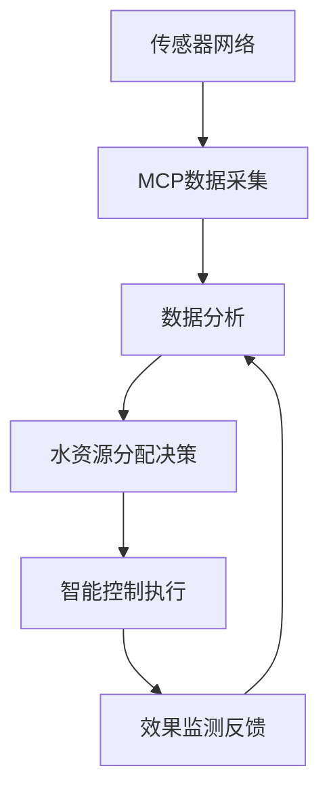
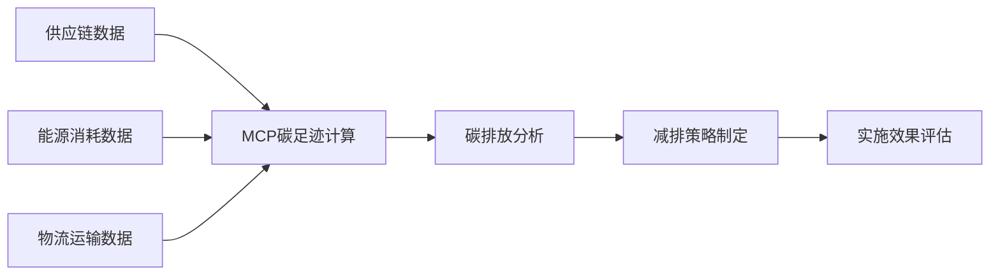

## 前言

随着全球气候变化问题日益严峻，各行各业都在寻求创新解决方案来减少环境影响、提高资源利用效率。作为一项强大的技术平台，MCP（可能是一个技术框架或平台）在环境保护领域展现出巨大潜力。本文将深入探讨MCP如何助力气候变化监测、资源优化管理和生态系统保护，为构建可持续的数字未来提供技术支持。

## 气候变化监测与数据分析

### 实时环境数据收集

MCP平台能够整合来自卫星、地面传感器、气象站等多源环境数据，构建全面的监测网络。通过边缘计算能力，MCP可以在数据源头进行初步处理，减少传输延迟和能耗。

```python
# 示例：MCP环境数据采集模块
class ClimateDataCollector:
    def __init__(self, sensor_network):
        self.network = sensor_network
        self.data_buffer = []
        
    def collect_data(self):
        # 从多个传感器收集环境数据
        for sensor in self.network:
            data = sensor.read()
            self.data_buffer.append(data)
            
    def process_locally(self):
        # 在边缘设备上进行初步数据处理
        processed = []
        for data in self.data_buffer:
            # 应用本地算法减少数据量
            reduced = self.reduce_data(data)
            processed.append(reduced)
        return processed
```

### 气候变化预测模型

MCP平台支持构建复杂的气候变化预测模型，通过机器学习算法分析历史气候数据，预测未来气候变化趋势，为政策制定提供科学依据。

::: tip
MCP的分布式计算能力使其能够处理海量气候数据，同时通过模型并行训练加速预测模型的开发与优化。
:::

## 资源管理与优化

### 能源系统优化

MCP在可再生能源管理方面具有独特优势，可以优化太阳能、风能等可再生能源的采集、存储和分配，提高能源利用效率。

- 智能电网管理
- 能源需求预测
- 微电网协调控制
- 能源存储优化

### 水资源管理

水资源是应对气候变化的关键要素，MCP平台可以构建智能水资源管理系统：



## 生态系统保护与生物多样性监测

### 森林监测与保护

MCP平台可以通过卫星图像分析、地面传感器网络和无人机监测，构建森林健康监测系统，实现森林火灾预警、非法砍伐检测和森林恢复评估。

### 海洋生态系统保护

利用MCP的物联网和AI能力，可以构建海洋生态系统监测网络：

- 海洋污染监测
- 珊瑚礁健康评估
- 海洋生物多样性追踪
- 海洋酸化监测

## 可持续城市规划与建设

### 智能交通系统

MCP可以优化城市交通系统，减少碳排放：

- 实时交通流量分析
- 智能信号灯控制
- 电动汽车充电网络优化
- 共享出行系统整合

### 绿色建筑管理

MCP平台支持构建绿色建筑管理系统：

- 能源消耗监测与优化
- 室内环境质量控制
- 智能灌溉系统
- 废物管理与回收

## 碳足迹追踪与减排策略

### 企业碳足迹管理

MCP平台可以帮助企业全面追踪和管理碳足迹：



### 个人碳足迹应用

MCP还可以支持开发个人碳足迹应用，帮助用户了解自己的环境影响并采取行动：

- 日常活动碳排放计算
- 碳减排建议
- 碳抵消方案
- 环保行为激励

## 气候变化教育与公众参与

### 环境教育平台

利用MCP的交互能力，可以构建沉浸式环境教育平台：

- 气候变化可视化
- 环保知识游戏化学习
- 虚拟环境体验

### 公众参与机制

MCP平台可以支持构建公众参与环境保护的机制：

- 环境问题众包解决
- 社区环保项目协作
- 环保行动追踪与分享

## 结语

MCP技术在气候变化与环境保护领域的应用前景广阔，从数据收集、分析到决策支持，再到公众参与，MCP平台能够为构建可持续的数字未来提供全方位的技术支持。随着技术的不断发展和应用场景的拓展，MCP有望成为应对全球气候变化的重要技术力量。

> 正如联合国环境规划署所强调的："数字化转型不是气候变化的替代方案，而是加速解决方案的关键工具。" MCP平台正是这一理念的最佳实践。

通过本文的探讨，我们可以看到MCP技术在环境保护领域的巨大潜力，期待更多开发者、企业和组织能够利用MCP平台，共同应对气候变化挑战，创造更可持续的未来。

---

*本文基于MCP技术在环境保护领域的应用实践，旨在为相关研究和开发提供参考。随着技术的不断发展，MCP在环境保护领域的应用将持续扩展和深化。*