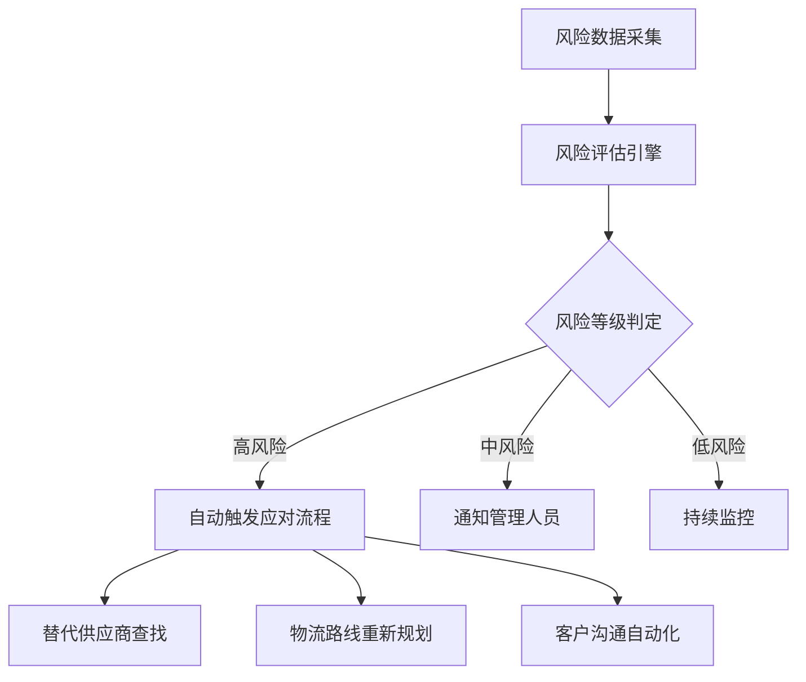
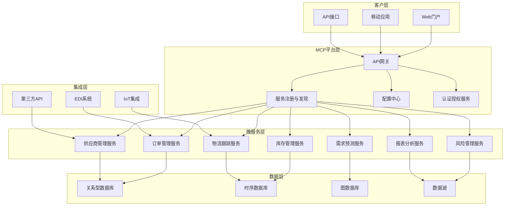

## 前言

在全球化和电子商务快速发展的今天，供应链管理已成为企业核心竞争力的重要组成部分。传统的供应链管理面临着信息孤岛、响应迟缓、缺乏透明度等诸多挑战。🤔 那么，如何利用MCP（Microservice Computing Platform）技术构建一个智能高效的数字化供应链呢？

今天，我将与大家分享MCP技术在供应链管理中的应用，以及如何通过MCP构建一个实时、透明、智能的供应链生态系统。

## 供应链管理的挑战

在深入探讨MCP应用之前，让我们先了解一下现代供应链管理面临的主要挑战：

1. **信息孤岛**：供应链各环节（供应商、制造商、物流、分销商、零售商）使用不同的系统，数据难以共享和整合。
2. **缺乏实时可见性**：难以实时追踪货物位置、库存状态和订单进度。
3. **预测不准确**：基于历史数据的预测模型难以应对市场波动和突发事件。
4. **响应迟缓**：当供应链出现问题时，难以快速定位并采取应对措施。
5. **协作困难**：供应链各方协作效率低下，信息传递不及时。

::: tip
供应链管理的本质是"在正确的时间，将正确的产品，以正确的状态，送到正确的地点，同时实现成本最低"。而MCP技术为实现这一目标提供了强大的技术支撑。
:::

## MCP如何赋能供应链管理

MCP的分布式架构、微服务特性和实时数据处理能力，使其成为构建现代化供应链管理系统的理想选择。以下是MCP在供应链管理中的关键应用：

### 1. 实时供应链可视化

通过MCP的实时数据处理能力，可以构建端到端的供应链可视化系统：

```yaml
架构组件:
  - 数据采集层: IoT设备、RFID、GPS追踪器
  - 数据处理层: MCP实时数据流处理
  - 数据存储层: 分布式数据库时序数据存储
  - 可视化层: 实时仪表板和地图展示
```

### 2. 智能需求预测

利用MCP与AI/ML的集成能力，构建智能需求预测系统：

```python
# 示例：基于MCP的需求预测服务
class DemandPredictionService:
    def __init__(self):
        self.ml_model = load_model("demand_forecasting.h5")
        self.data_collector = DataCollector()
        
    def predict_demand(self, product_id, region, time_horizon):
        # 收集多源数据
        historical_data = self.data_collector.get_historical_data(product_id, region)
        market_trends = self.data_collector.get_market_trends(region)
        seasonal_factors = self.data_collector.get_seasonal_factors(time_horizon)
        
        # 使用MCP分布式计算进行预测
        features = combine_features(historical_data, market_trends, seasonal_factors)
        prediction = self.ml_model.predict(features)
        
        return prediction
```

### 3. 动态库存优化

MCP的智能决策能力可以实现库存的动态优化：

- **实时库存监控**：跟踪各地库存水平
- **智能补货算法**：基于需求预测和供应链时间动态计算补货点
- **库存分配优化**：根据需求和优先级自动分配库存资源

### 4. 供应链风险管理

利用MCP的事件驱动架构，构建供应链风险预警和应对系统：



### 5. 供应商协作平台

通过MCP的多租户架构，构建安全的供应商协作平台：

- **供应商门户**：实时订单、交付和库存信息共享
- **协同规划**：销售与运营计划(S&OP)协同
- **绩效评估**：供应商KPI实时监控和评估

## MCP供应链架构设计

下面是一个基于MCP的供应链管理系统架构设计：

### 整体架构



### 关键微服务设计

#### 1. 订单管理服务

```python
class OrderManagementService:
    def __init__(self):
        self.order_repository = OrderRepository()
        self.inventory_service = InventoryService()
        self.supplier_service = SupplierService()
        self.notification_service = NotificationService()
    
    def create_order(self, order_data):
        # 验证订单
        self._validate_order(order_data)
        
        # 检查库存
        inventory_status = self.inventory_service.check_inventory(order_data.items)
        
        if inventory_status.sufficient:
            # 创建订单
            order = self.order_repository.create(order_data)
            
            # 更新库存
            self.inventory_service.update_inventory(order_data.items, 'reserve')
            
            # 通知相关方
            self.notification_service.send_order_confirmation(order)
            
            return order
        else:
            # 处理缺货情况
            return self._handle_insufficient_inventory(order_data, inventory_status)
```

#### 2. 物流跟踪服务

```python
class LogisticsTrackingService:
    def __init__(self):
        self.tracking_repository = TrackingRepository()
        self.map_service = MapService()
        self.notification_service = NotificationService()
    
    def track_shipment(self, shipment_id):
        # 获取最新位置信息
        location = self.tracking_repository.get_latest_location(shipment_id)
        
        # 更新地图位置
        self.map_service.update_location(shipment_id, location)
        
        # 检查异常情况
        if self._detect_anomalies(location):
            self.notification_service.send_alert(f"Shipment {shipment_id} has unusual movement")
        
        return location
    
    def predict_delivery_time(self, shipment_id):
        # 获取历史数据
        history = self.tracking_repository.get_history(shipment_id)
        
        # 获取实时路况
        traffic_data = self.map_service.get_traffic_data(history[-1].route)
        
        # 预测到达时间
        eta = self._calculate_eta(history, traffic_data)
        
        return eta
```

## 实施案例分析

### 案例一：全球电子产品制造商的智能供应链

某全球电子产品制造商面临供应链可视性差、库存成本高、交付延迟等问题。通过实施基于MCP的供应链管理系统，实现了以下成果：

- **库存周转率提升35%**：通过智能库存优化算法
- **交付准时率提升至98%**：通过实时物流跟踪和动态路线规划
- **供应链响应时间缩短60%**：通过事件驱动架构和自动化决策

### 案例二：零售连锁企业的需求预测与补货系统

某零售连锁企业通过MCP构建了需求预测与自动补货系统：

- **预测准确率提升25%**：结合多源数据和机器学习模型
- **缺货率降低40%**：智能补货算法和供应商协同
- **人力成本减少30%**：自动化订单生成和供应商管理

## 技术实施建议

### 1. 分阶段实施

建议采用分阶段实施策略：

1. **第一阶段**：构建核心订单管理和库存管理服务
2. **第二阶段**：添加物流跟踪和供应商管理服务
3. **第三阶段**：集成AI/ML能力，实现智能预测和决策
4. **第四阶段**：扩展高级功能，如供应链风险管理和优化

### 2. 数据治理

确保数据质量和一致性：

- 建立统一的数据模型和标准
- 实施数据验证和清洗流程
- 设计数据安全和隐私保护机制

### 3. 性能优化

针对供应链系统的性能优化建议：

- 使用缓存策略提高响应速度
- 实施数据分片和分区处理高并发
- 采用异步处理机制优化资源使用

### 4. 安全与合规

确保系统符合行业标准和法规：

- 实施细粒度的访问控制
- 建立审计日志和监控机制
- 确保数据跨境传输合规性

## 未来展望

随着技术的发展，MCP在供应链管理中的应用将更加广泛和深入：

### 1. 数字孪生供应链

构建供应链的数字孪生模型，实现物理世界和数字世界的实时映射和交互：


### 2. 区块链集成

利用区块链技术增强供应链的透明度和可信度：

- 产品溯源：从原材料到终端消费者的全链路追踪
- 智能合约：自动执行供应链协议和付款
- 供应链金融：基于可信数据的融资和保险服务

### 3. 边缘计算与物联网

结合边缘计算和IoT技术，实现供应链的实时感知和响应：

- 智能包装：内置传感器监测产品状态
- 自动化仓库：机器人与MCP系统协同工作
- 智能运输：车辆和货物的实时监控和优化

## 结语

MCP技术为构建智能高效的数字化供应链提供了强大的技术支撑。通过微服务架构、实时数据处理、智能决策和跨平台协作能力，企业可以实现供应链的可视化、自动化和智能化，从而提高效率、降低成本、增强竞争力。

随着技术的不断发展，MCP在供应链管理中的应用将更加广泛和深入，为企业创造更大的价值。未来，我们将看到更多创新的供应链解决方案，推动整个行业的数字化转型。

> 正如供应链管理大师马丁·克里斯托弗所言："供应链之间的竞争不再是企业之间的竞争，而是供应链与供应链之间的竞争。"借助MCP技术，构建强大的数字化供应链，将帮助企业在未来的竞争中立于不败之地。

---

希望这篇文章能为您提供关于MCP在供应链管理中应用的全面见解。如果您有任何问题或建议，欢迎在评论区留言讨论！