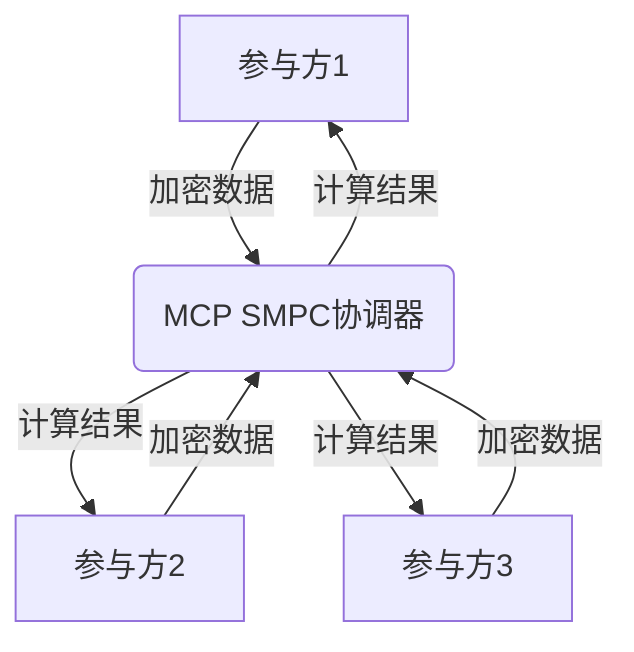
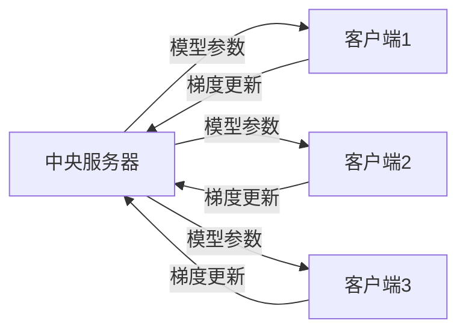
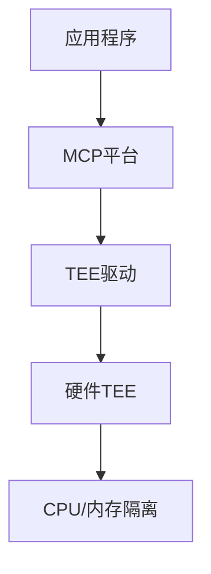
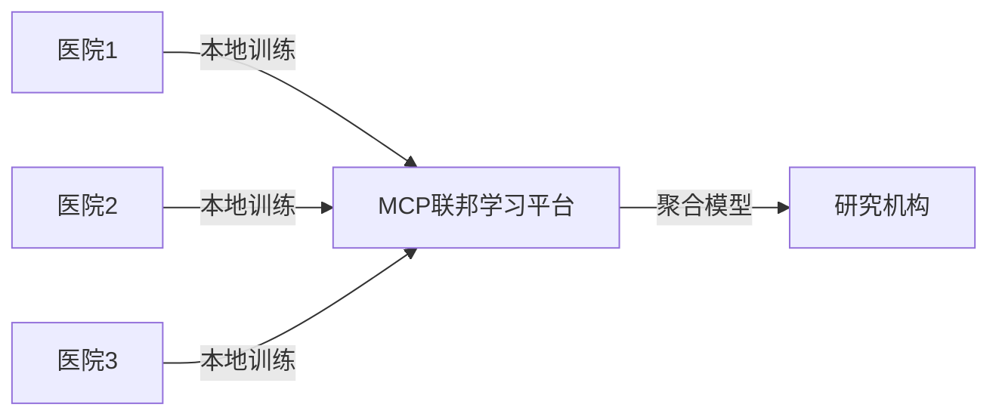
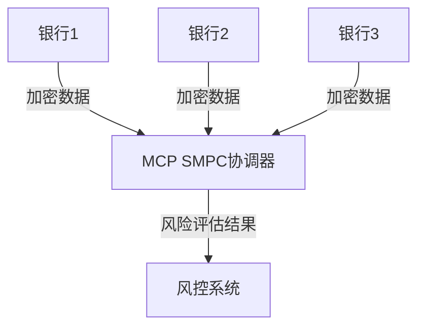
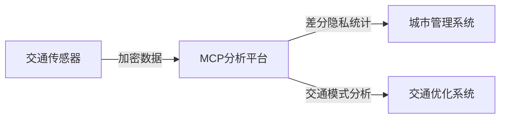

## 前言

在数字化时代，数据已成为企业最宝贵的资产之一。然而，随着数据隐私法规的日益严格（如GDPR、CCPA等）以及数据安全事件的频发，如何在利用数据价值的同时保护用户隐私，已成为技术架构设计中的核心挑战。

🤔 隐私增强计算(Privacy-Enhancing Technologies, PETs)是一类旨在保护数据隐私的技术集合，它允许在不暴露原始数据的情况下进行数据分析。MCP平台作为企业级应用架构的核心，提供了强大的隐私增强计算能力，使开发者能够在保护数据隐私的同时，充分发挥数据的价值。

本文将深入探讨MCP平台中的隐私增强计算技术，帮助您构建隐私优先的下一代应用。

## 隐私增强计算概述

隐私增强计算是一类技术的总称，主要包括：

- **同态加密(Homomorphic Encryption)**：允许在加密数据上直接进行计算，而无需先解密
- **安全多方计算(Secure Multi-Party Computation, SMPC)**：允许多个参与方在不泄露各自私有输入的情况下，共同计算一个函数
- **差分隐私(Differential Privacy)**：通过添加精确计算的噪声，确保查询结果不会泄露任何个体信息
- **联邦学习(Federated Learning)**：在不共享原始数据的情况下，通过模型参数的交换来共同训练模型
- **可信执行环境(Trusted Execution Environments, TEEs)**：在硬件隔离的环境中执行敏感计算

::: theorem
隐私增强计算的核心目标是：**在保护数据隐私的前提下，实现数据的可用性和价值挖掘**。
:::

## MCP平台中的隐私增强计算技术

### 1. 同态加密集成

MCP平台内置了对同态加密的支持，使开发者能够轻松实现隐私保护的计算。

#### 实现原理

MCP使用部分同态加密方案（如Paillier或BFV），支持在加密数据上进行加法和乘法运算：

```java
// MCP中的同态加密示例
MCPHomomorphicEncryption mcpHE = new MCPHomomorphicEncryption();
BigInteger encryptedData1 = mcpHE.encrypt(15);
BigInteger encryptedData2 = mcpHE.encrypt(20);

// 在加密数据上进行加法运算
BigInteger encryptedSum = mcpHE.add(encryptedData1, encryptedData2);

// 解密结果
BigInteger sum = mcpHE.decrypt(encryptedSum); // 结果应为35
```

#### 应用场景

- **隐私保护的数据分析**：在不暴露原始数据的情况下进行统计分析
- **安全外包计算**：将敏感计算任务外包到云服务提供商，同时保持数据隐私
- **隐私保护的机器学习**：在加密数据上训练或推理模型

### 2. 安全多方计算

MCP平台提供了安全多方计算框架，支持多方协作计算而不泄露各自数据。

#### 架构设计



#### 实现示例

```python
# MCP中的安全多方计算示例
from mcp.security import SMPC

# 初始化多方计算会话
smpc = SMPC(parties=['party1', 'party2', 'party3'])

# 各方提供私有输入
party1_input = smpc.private_input(42)
party2_input = smpc.private_input(58)
party3_input = smpc.private_input(100)

# 安全计算总和
total = smpc.secure_sum([party1_input, party2_input, party3_input])

# 获取结果（仅各方知道自己的贡献）
print(f"安全计算的总和: {total}")
```

#### 应用场景

- **联合数据分析**：多个医疗机构在不共享患者数据的情况下进行疾病研究
- **隐私保护的广告竞价**：广告商在不透露预算的情况下参与竞价
- **安全的数据共享**：企业间在不泄露商业机密的情况下共享市场数据

### 3. 差分隐私

MCP平台集成了差分隐私机制，确保数据分析不会泄露个体信息。

#### 实现机制

```java
// MCP中的差分隐私示例
MCPDifferentialPrivacy dp = new MCPDifferentialPrivacy(epsilon=1.0);

// 原始数据
int[] rawData = {1, 2, 3, 4, 5, 6, 7, 8, 9, 10};

// 添加噪声实现差分隐私
int[] noisyData = dp.addNoise(rawData);

// 执行统计分析
double mean = dp.calculateMean(noisyData);
```

#### 关键参数

- **epsilon (ε)**：隐私预算，值越小隐私保护越强，但数据效用降低
- **delta (δ)**：隐私泄露概率的上界
- **敏感度**：函数输出的最大变化量

#### 应用场景

- **人口统计数据发布**：发布统计数据而不泄露个体信息
- **用户行为分析**：分析用户行为模式而不识别具体个人
- **机器学习数据集**：创建训练数据集而不泄露训练样本

### 4. 联邦学习

MCP平台提供了完整的联邦学习框架，支持分布式模型训练。

#### 架构组件



#### 实现示例

```python
# MCP中的联邦学习示例
from mcp.federated import FederatedLearning

# 初始化联邦学习环境
fl = FederatedLearning(model='resnet', clients=['client1', 'client2', 'client3'])

# 训练轮次
for round in range(10):
    # 各客户端本地训练
    updates = fl.local_train(round)
    
    # 聚合模型更新
    global_update = fl.aggregate_updates(updates)
    
    # 更新全局模型
    fl.update_global_model(global_update)
```

#### 隐私保护机制

- **差分隐私梯度**：在梯度更新中添加噪声
- **安全聚合**：使用安全多方计算技术聚合梯度
- **模型加密**：在模型传输过程中使用加密保护

#### 应用场景

- **医疗影像分析**：多家医院联合训练诊断模型，不共享患者数据
- **推荐系统**：多个平台联合训练推荐算法，不共享用户行为数据
- **金融风控**：多家银行联合训练风控模型，不共享客户数据

### 5. 可信执行环境

MCP平台支持与可信执行环境（如Intel SGX、AMD SEV）集成，提供硬件级别的隐私保护。

#### 集成架构



#### 实现示例

```c++
// MCP中的TEE集成示例
#include <mcp/tee.h>

// 创建可信执行环境
MCPTEE tee = MCPTEE::create("secure enclave");

// 加载机密数据
tee.load_secret_data("sensitive_data.bin");

// 在TEE中执行敏感计算
tee.execute_secure_computation("process_data()");

// 获取结果
auto result = tee.get_result();
```

#### 应用场景

- **密钥管理**：在TEE中安全存储和管理加密密钥
- **敏感数据处理**：处理包含个人身份信息的敏感数据
- **安全多方计算**：作为安全多方计算的执行环境

## MCP隐私增强计算的最佳实践

### 1. 隐私风险评估

在实施隐私增强计算前，应进行全面的风险评估：

```mermaid
graph TD
    A[数据收集] --> B{数据敏感性评估}
    B -->|高敏感| C[采用强隐私保护机制]
    B -->|中敏感| D[采用中等隐私保护机制]
    B -->|低敏感| E[采用基础隐私保护措施}
    C --> F[同态加密+安全多方计算]
    D --> G[差分隐私+联邦学习]
    E --> H[访问控制+数据脱敏]
```

### 2. 隐私预算管理

对于差分隐私实现，应合理管理隐私预算：

```python
# MCP中的隐私预算管理示例
class PrivacyBudgetManager:
    def __init__(self, total_epsilon):
        self.total_epsilon = total_epsilon
        self.used_epsilon = 0
    
    def allocate_budget(self, task_name, epsilon):
        if self.used_epsilon + epsilon <= self.total_epsilon:
            self.used_epsilon += epsilon
            print(f"为{task_name}分配隐私预算: {epsilon}")
            return True
        else:
            print(f"隐私预算不足，无法为{task_name}分配{epsilon}")
            return False
```

### 3. 隐私保护性能优化

隐私增强计算通常会增加计算开销，MCP平台提供了多种优化策略：

- **批量处理**：将多个计算任务合并，减少加密/解密次数
- **并行计算**：利用多核CPU和GPU加速加密计算
- **预处理优化**：对数据进行预处理，减少加密数据的大小
- **硬件加速**：利用专用硬件（如Intel QAT）加速加密操作

### 4. 合规性保障

MCP平台内置了多种合规性检查机制：

```java
// MCP中的合规性检查示例
public class ComplianceChecker {
    public boolean checkGDPRCompliance(DataProcessing pipeline) {
        // 检查数据最小化原则
        if (!pipeline.isDataMinimized()) {
            return false;
        }
        
        // 检查目的限制原则
        if (!pipeline.hasPurposeLimitation()) {
            return false;
        }
        
        // 检查用户同意机制
        if (!pipeline.hasConsentMechanism()) {
            return false;
        }
        
        return true;
    }
}
```

## 实际应用案例

### 1. 医疗研究中的隐私保护分析

**场景**：多家医院希望联合研究疾病模式，但受限于患者隐私法规。

**解决方案**：
- 使用MCP联邦学习框架训练疾病预测模型
- 采用差分隐私保护患者数据
- 使用安全多方计算进行统计分析

**架构**：


### 2. 金融服务中的联合风控

**场景**：多家银行希望联合训练风控模型，但无法共享客户数据。

**解决方案**：
- 使用MCP安全多方计算框架进行联合特征工程
- 采用同态加密进行风险评估计算
- 使用可信执行环境保护模型参数

**架构**：


### 3. 智能城市中的隐私保护分析

**场景**：城市管理者希望分析城市交通流量，但需要保护市民隐私。

**解决方案**：
- 使用MCP差分隐私框架发布交通统计数据
- 采用联邦学习分析交通模式
- 使用同态加密进行敏感计算

**架构**：


## 未来展望

隐私增强计算技术正在快速发展，MCP平台也在不断演进：

1. **量子安全计算**：集成后量子密码学技术，应对量子计算带来的安全挑战
2. **AI与隐私的融合**：开发更高效的隐私保护机器学习算法
3. **零知识证明集成**：集成零知识证明技术，实现更强大的隐私保护
4. **边缘隐私计算**：在边缘设备上实现隐私保护计算，减少数据传输
5. **隐私增强数据分析**：开发更强大的隐私保护数据分析工具

> 随着数据隐私法规的日益严格和用户隐私意识的提高，隐私增强计算将成为技术架构设计的核心要素。MCP平台将继续引领这一领域的发展，为开发者提供强大的隐私保护工具和框架。

## 结语

隐私增强计算技术为解决数据隐私与价值利用之间的矛盾提供了有效途径。MCP平台通过集成同态加密、安全多方计算、差分隐私、联邦学习和可信执行环境等多种技术，为开发者构建隐私优先的应用提供了强大支持。

在数字化转型的浪潮中，隐私保护不再是一个可有可无的选项，而是企业社会责任和技术架构设计的核心要素。通过MCP平台的隐私增强计算技术，我们可以在保护数据隐私的同时，充分发挥数据的价值，构建更加安全、可信的数字未来。

::: tip
隐私增强计算不是银弹，它需要在隐私保护与数据效用之间找到平衡。在实际应用中，应根据具体场景和需求选择合适的隐私保护技术组合。
:::